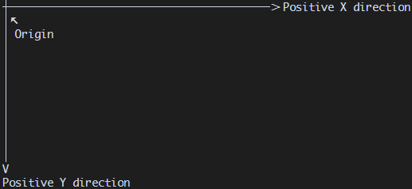

# 文档信息

1. 更新日期：2026年4月10日
2. 本文档旨在为模组开发者提供完整的规范化指引与教程，涵盖模组结构、最佳实践及常见问题。

# 文档导航

- [README](../../README-i18n/README-zh-cn.md)
- [API 规范与查询](./API.md)
- [富文本指令](./RICH_TEXT.md)

# 目录

- [模组放置目录](#模组放置目录模组放置目录)
- [模组目录结构](#模组目录结构)
- [模组配置文件](#模组配置文件)
  - [目录结构](#目录结构1)
  - [命名空间](#命名空间)
  - [package.json](#packagejson)
  - [game.json](#packagejson)
  - [注册表格式](#注册表格式)
  - [UID](#uid)
- [模组脚本规范](#模组脚本规范)
  - [目录结构](#目录结构2)
  - [规范要求](#规范要求)
  - [沙箱限制](#沙箱限制禁用-api)
  - [不建议使用的 API](#不建议使用的-api)
  - [入口脚本规范](#入口脚本规范)
  - [辅助脚本规范](#辅助脚本规范)
- [模组资源目录](#模组资源目录)
  - [目录结构](#目录结构3)
  - [语言文件](#语言文件)
  - [其它资源文件](#其它资源文件)
- [附录](#附录)
  - [物理按键语义映射表](#物理按键语义映射表)

---

# 模组放置目录

所有 MOD 文件必须放置在宿主执行目录下的 `data/mod/` 目录中，按命名空间组织。

```text
宿主执行目录/
└─ data/
    └─ mod/
        └─ <namespace>/    -- 命名空间
            └─ *           -- 该模组的所有文件
```

---

# 模组目录结构

一个合规的模组必须遵循以下目录结构，否则宿主将无法识别和加载该模组。

```text
<namespace>/               -- 模组命名空间/根目录
├─ package.json            -- 模组包信息（名称、作者、版本等）
├─ game.json               -- 模组游戏信息（配置、入口、权限等）
├─ scripts/                -- 脚本目录
│  ├─ main.lua             -- 脚本入口文件
│  └─ function/            -- 辅助脚本目录
│     └─ *.lua             -- 辅助脚本
└─ assets/                 -- 资源目录
   ├─ lang/                -- 语言资源目录
   │  ├─ en_us.json        -- 英语（美国）
   │  ├─ zh_cn.json        -- 简体中文
   │  └─ *.json            -- 其它语言文件
   └─ *                    -- 其它资源（图片、字体、音频等）
```

> 注：`package.json`、`game.json` 的具体字段含义请参考后续章节。

---

# 模组配置文件

## 目录结构<font style="opacity:0;">1</font>

```text
<namespace>/               -- 模组命名空间/根目录
├─ package.json            -- 模组包信息（名称、作者、版本等）
└─ game.json               -- 模组游戏信息（配置、入口、权限等）
```

## 命名空间

- 模组根目录为 `<namespace>/`，`<namespace>` 即为该模组的命名空间。
- 命名空间在全局必须唯一，宿主将优先加载首个遇到的同名命名空间模组。
- 命名空间仅允许包含以下字符：小写字母 `a-z`、大写字母 `A-Z`、数字 `0-9`、下划线 `_`。

## `package.json`

> 注：
> - `key` 表示语言键，需配合语言文件使用。
> - `image` 表示图片路径，相对于 `assets/` 目录。

该文件用于声明模组的基本信息，格式如下：

```json
{
  "package": string,                -- 包名
  "introduction": string | key,     -- 包简介
  "author": string | key,           -- 作者信息
  "name": string | key,             -- 游戏显示名称
  "description": string | key,      -- 游戏简短描述
  "detail": string | key,           -- 游戏详细描述
  "icon": Array | string | image,   -- 图标
  "banner": Array | string | image  -- 横幅
}
```

**字段说明**

| 字段 | 类型 | 说明 |
| --- | --- | --- |
| `package` | <font color="#92cddc">string</font> | 包名，用于区分不同模组，全局唯一。仅允许字符串。 |
| `introduction` | <font color="#92cddc">string</font> \| <font color="#92cddc">key</font> | 包简介，在模组列表中展示，由开发者编写。可填写字符串或语言键。 |
| `author` | <font color="#92cddc">string</font> \| <font color="#92cddc">key</font> | 作者名称。可填写字符串或语言键。 |
| `name` | <font color="#92cddc">string</font> \| <font color="#92cddc">key</font> | 游戏显示名称，在游戏列表中展示。可填写字符串或语言键。 |
| `description` | <font color="#92cddc">string</font> \| <font color="#92cddc">key</font> | 游戏简短描述，建议一句话概括玩法或目标。可填写字符串或语言键。 |
| `detail` | <font color="#92cddc">string</font> \| <font color="#92cddc">key</font> | 游戏详细描述，建议包含：游戏目标、核心机制、操作方式、特殊警告（如与原版差异）等。可填写字符串或语言键。 |
| `icon` | <font color="#92cddc">Array</font> \| <font color="#92cddc">string</font> \| <font color="#92cddc">image</font> | 图标，在模组列表中展示。具体要求见 其它-[头图与图标](#图标和头图) |
| `banner` | <font color="#92cddc">Array</font> \| <font color="#92cddc">string</font> \| <font color="#92cddc">image</font> | 横幅，在模组详情页展示。具体要求见 其它-[头图与图标](#图标和头图) |

## `game.json`

> 注：
> - `key` 表示语言键。
> - `path` 表示脚本路径，相对于 `scripts/` 目录。

该文件用于声明游戏的核心配置，格式如下：

```json
{
  "api": Array | int,                -- 支持的 API 版本范围
  "entry": path,                     -- 入口脚本路径
  "save": boolean,                   -- 是否支持存档
  "best_none": string | key | null,  -- 最佳记录占位文本（null 表示禁用）
  "min_width": int,                  -- 最小终端宽度（字符行数）
  "min_height": int,                 -- 最小终端高度（字符列数）
  "write": boolean,                  -- 是否请求直写权限
  "actions": object,                 -- 按键动作映射表
  "runtime": {
    "target_fps": int                -- 目标帧率
  }
}
```

**字段说明**

| 字段 | 类型 | 说明 |
| --- | --- | --- |
| `api` | <font color="#92cddc">Array</font> \| <font color="#92cddc">int</font> | 支持的 API 版本。数组格式 `[min, max]` 表示支持从 `min` 到 `max` 的版本（含端点）；整数表示仅支持该单一版本。若版本不符合宿主要求，模组将不被加载并抛出异常。 |
| `entry` | <font color="#92cddc">path</font> | 入口脚本路径，相对于 `scripts/` 目录。若路径错误，模组将不被加载并抛出异常。 |
| `save` | <font color="#92cddc">boolean</font> | 是否支持存档。`true` 表示需要实现声明式 API `save_game(state)`；`false` 则忽略相关调用。 |
| `best_none` | <font color="#92cddc">string</font> \| <font color="#92cddc">key</font> \| <font color="#92cddc">null</font> | 无最佳记录时显示的文本。若不为 `null`，需实现声明式 API `save_best_score(state)`；若为 `null`，表示不启用最佳记录功能，相关调用被忽略。 |
| `min_width` | <font color="#92cddc">int</font> | 游戏所需的最小终端宽度（字符列数）。终端尺寸不足时会显示提示。值≦0为无限制。 |
| `min_height` | <font color="#92cddc">int</font> | 游戏所需的最小终端高度（字符行数）。终端尺寸不足时会显示提示。值≦0为无限制。 |
| `write` | <font color="#92cddc">boolean</font> | 是否请求直写权限。`true` 表示模组需要文件写入权限，加载时会向用户申请；`false` 表示不需要权限，所有直写请求将被宿主忽略。<font color="red">直写操作为高风险操作，请最大程度避免使用！</font> |
| `actions` | <font color="#92cddc">object</font> | 按键动作映射表，格式见下方「注册表格式」。宿主会将物理按键映射为语义化动作。 |
| `runtime` | <font color="#92cddc">object</font> | 运行时设置。 |
| `runtime.target_fps` | <font color="#92cddc">int</font> | 目标帧率，支持 `30`、`60`、`120`。其它值将被忽略并回退为 `60`。实际帧率受机器性能影响，该值为上限。 |

## 注册表格式

> 注：
> - `#` 表示自定义或可变内容。
> - `[]` 表示字段可重复或扩展。
> - `<>` 表示类型约束。
> - `key` 表示按键映射名，具体按键映射见 附录-[物理按键语义映射表](#物理按键语义映射表)。

```json
"actions": {
  [#action]: key | Array<key>
}
```

**示例**：

```json
"actions": {
  "jump": "space",
  "move": ["up", "down", "left", "right"]
}
```

> 每个动作可绑定单个按键或多个按键（数组形式）。宿主会将按键事件转换为动作事件，通过 `handle_event` 传递给脚本（事件类型 `action`）。

## UID

UID 是宿主为每个模组生成的唯一标识码，用于区分不同模组。

**构成格式**：`mod_game_{编码}`

**编码生成规则**：

1. 将模组的 `命名空间`、`包名（package）`、`作者（author）` 按顺序拼接成一个字符串。
2. 对该字符串进行哈希运算，然后使用 Base64 编码。
3. 取编码结果的前 16 位字符作为最终编码。

> 上述过程可用以下伪代码表示：
> ```
> encoding = base64(hash(namespace + package + author)).substring(0, 16)
> uid = "mod_game_" + encoding
> ```

**稳定性**：只要 `命名空间`、`包名`、`作者` 三者保持不变，生成的 UID 就不会改变。这确保了模组在不同环境中的一致性识别。

---

# 模组脚本规范

## 目录结构<font style="opacity:0;">2</font>

```text
<namespace>/               -- 模组命名空间/根目录
└─ scripts/                -- 脚本目录（必须）
   ├─ main.lua             -- 脚本入口文件（必须）
   └─ function/            -- 辅助脚本目录（可选）
      └─ *.lua             -- 辅助脚本
```

## 规范要求

1. 所有脚本文件必须放置在 `scripts/` 目录下，且仅支持 `.lua` 扩展名。
2. 入口脚本建议直接放在 `scripts/` 目录下，默认文件名为 `main.lua`（由 `game.json` 中的 `entry` 字段指定，可自定义）。
3. 辅助脚本必须存放在 `scripts/function/` 目录下，用于组织可复用的模块化代码。

## 沙箱限制（禁用 API）

以下 Lua 内置 API 在脚本中**严格禁止使用**，宿主沙箱会阻止其执行：

- `os.execute`
- `os.remove`
- `os.rename`
- `os.exit`
- `io.*`（所有输入输出函数）
- `debug.*`（所有调试函数）

## 不建议使用的 API

为保证游戏性能和宿主稳定性，以下 API 不建议在脚本中使用，推荐使用宿主提供的替代方案：

| 不建议使用的 API | 推荐替代方案 |
| --- | --- |
| `require` | 使用直用式 API `load_function` 加载辅助 |
| `dofile` | 使用 `load_function` |
| `loadfile` | 使用 `load_function` |
| `while true do ... end`（死循环） | 依赖宿主每帧调用的声明式 API `handle_event` 实现循环逻辑 |
| `math.random` | 使用直用式 API `random_*` 系列函数（可复现、更安全） |
| `print` | 使用直用式 API `debug_*`（输出到日志文件） |

## 入口脚本规范

入口脚本（即 `game.json` 中 `entry` 字段指定的入口文件）必须满足以下要求：

1. **必须实现**以下四个声明式 API：
   - `init_game(state)`
   - `handle_event(state, event)`
   - `render(state)`
   - `exit_game(state)`

2. **至少存在一条可执行路径**能够调用直用式 API `request_exit()`，以确保游戏能够正常退出。

3. 其余游戏逻辑（如状态管理、事件响应、画面绘制、辅助函数调用等）由开发者自行编写，宿主不做额外限制。

## 辅助脚本规范

辅助脚本必须返回一个 Lua 表，表中可包含变量和函数。示例：

### 导出辅助函数和变量

`scripts/function/hello.lua`

```lua
local M = {}

M.name = "Function"

M.sayHello = function() -- 一种函数方式
    debug_log("Hello")
end

function M.sayAny(text) -- 另一种函数方式
    debug_log(text)
end

return M
```

### 在入口脚本中引用

`scripts/main.lua`

```lua
local hello = load_function("hello.lua")   -- 注意：路径相对于 function/ 目录

debug_log(hello.name)      -- 日志输出 "Function"
hello.sayHello()           -- 日志输出 "Hello"
hello.sayAny("tui game")   -- 日志输出 "tui game"
```

> 注：`load_function` 的参数为相对于 `scripts/function/` 的路径.

---

# 模组资源目录

## 目录结构<font style="opacity:0;">3</font>

```text
<namespace>/               -- 模组命名空间/根目录
└─ assets/                 -- 资源目录
   ├─ lang/                -- 语言资源目录
   │  ├─ en_us.json        -- 英语（美国）
   │  ├─ zh_cn.json        -- 简体中文
   │  └─ *.json            -- 其它语言文件
   └─ *                    -- 其它资源（图片、字体、音频等）
```

## 语言文件

### 文件规范

- 所有语言文件必须存放在 `assets/lang/` 目录下。
- **`en_us.json` 必须提供**，作为默认回退语言。当宿主请求的语言模组未实现时，会自动使用 `en_us.json` 中的对应键值；若该键在 `en_us.json` 中也不存在，则返回 `[missing-i18n-key:key]`。
- **`zh_cn.json` 建议提供**（软规范）。由于仓库作者来自中文社区，提供简体中文支持有助于本地化体验，但非强制。
- 其它语言文件请按照 `{语言代码}.json` 的命名规则创建，确保宿主能够根据用户选择的语言正确加载。宿主支持的语言扩展详见 `LANGUAGE.md`。

### 键值规范

> 注：
> - `#` 表示自定义或可变内容。
> - `[]` 表示字段可重复或扩展。

语言文件采用键值对结构，键可使用点号 `.` 进行语义化分隔，值必须为字符串。字符串中可包含：
- **动态变量**：使用 `{变量名}` 占位符，运行时由脚本传入实际值。
- **富文本标记**：支持宿主定义的富文本格式（如颜色、样式等），具体语法参见`RICH_TEXT.md`。

**结构示例**：

```json
{
  "[#key]": "string"
}
```

**完整示例**：

```json
{
  "game.title": "推箱子",
  "game.score": "当前得分：{score}",
  "game.hint": "<color=green>按 R 键重新开始</color>"
}
```

## 其它资源文件

### 支持的类型

| 类别 | 支持格式 | 说明 |
| --- | --- | --- |
| 文本文件 | `json`, `yaml`, `toml`, `csv`, `xml`, `txt` | 可通过 `read_*` 系列 API 读取并自动解析 |
| 二进制文件 | 任意格式 | 通过 `read_bytes` 读取为 Lua 字符串，需自行解析 |
| 图像文件 | `png`, `jpg`, `jpeg` | 用于 `icon`、`banner` 等字段，支持图片路径引用 |

> 注：其它资源文件可放置在 `assets/` 下的任意子目录中，使用 API 时需提供相对于 `assets/` 的路径。

---

# 其它

## 图标与头图

### 图标

图标用于在模组列表中展示，显示区域为 **4 行 × 8 列**（终端字符）。

**支持参数类型**：数组 / 字符串 / 图片

#### 数组

- 传递一个二维数组，最多包含 4 个子数组，每个子数组最多包含 8 个元素。
- **行数处理**：
  - 若子数组不足 4 行，宿主会在上下交替补充空行补齐至 4 行（**先上后下**）。
  - 若子数组超过 4 行，仅保留前 4 行。
- **列数处理**：
  - 若子数组内元素不足 8 个，宿主会在左右交替补充空格补齐至 8 个元素（**先右后左**）。
  - 若子数组内元素超过 8 个，仅保留前 8 个。
- 完成上述填充后，已填写的图标元素会被**居中显示**。
- **推荐写法**：将所有元素左对齐，剩余对齐与填充工作交由宿主完成。

#### 字符串

- 传递一个单行字符串，使用 `\n` 表示换行。
- 宿主会根据 `\n` 将字符串拆分为二维数组，后续处理规则与数组一致。
- **不推荐使用**：可读性极差，有时会被误识别为图片路径。

#### 图片

- 填写相对于 `assets/` 目录的路径。
- 建议图片比例为 **1:1**。
- 宿主会根据图片比例生成一个 1:1 的比例框进行截取，然后将图片符号化并染色。
- **不推荐使用**：生成效果通常严重偏离预期，仅作为功能扩展保留。

#### 默认值

- 若该字段不填写或传递空数组，将使用默认图标，见附录 [默认图标](#默认图标)。

---

### 头图

头图用于在模组详情的详细信息展示，显示区域为 **13 行 × 86 列**（终端字符）。

**支持参数类型**：数组 / 字符串 / 图片

#### 数组

- 传递一个二维数组，最多包含 13 个子数组，每个子数组最多包含 86 个元素。
- **行数处理**：
  - 若子数组不足 13 行，宿主会在上下交替补充空行补齐至 13 行（**先上后下**）。
  - 若子数组超过 13 行，仅保留前 13 行。
- **列数处理**：
  - 若子数组内元素不足 86 个，宿主会在左右交替补充空格补齐至 86 个元素（**先左后右**）。
  - 若子数组内元素超过 86 个，仅保留前 86 个。
- 完成上述填充后，已填写的头图元素会被**居中显示**。
- **推荐写法**：将所有元素左对齐，剩余对齐与填充工作交由宿主完成。

#### 字符串

- 传递一个单行字符串，使用 `\n` 表示换行。
- 宿主会根据 `\n` 将字符串拆分为二维数组，后续处理规则与数组一致。
- **不推荐使用**：可读性极差，有时会被误识别为图片路径。

#### 图片

- 填写相对于 `assets/` 目录的路径。
- 建议图片比例为 **13:43**。
- 宿主会生成一个最大可被 13×43 整除的比例框进行截取，然后将图片符号化并染色。
- **不推荐使用**：生成效果通常严重偏离预期，仅作为功能扩展保留。

#### 默认值

- 若该字段不填写或传递空数组，将使用默认头图，见附录 [默认头图](#默认头图)。

---

## 绘制坐标

绘制原点位于终端的**左上角**。坐标系定义如下：

- **X 轴**：水平向右为正方向
- **Y 轴**：垂直向下为正方向

示意图如下：



---

## `introduction` / `description` / `detail` 展示位置

各字段在界面中的展示位置如下：

- **`introduction`**：展示于**模组列表**的详细信息区域，用于描述整个模组包的概要信息。
- **`description`**：展示于**游戏列表**的详细信息区域，用于说明游戏的玩法或基本规则。
- **`detail`**：展示于**游戏列表**的详细信息区域，用于提供游戏的详细说明。

示意图如下：

  


---

# 附录

## 物理按键语义映射表

> 键盘监听基于 `crossterm` 与 `rdev` 两库联合实现，尽可能覆盖绝大多数按键的检测。为确保兼容性，建议优先使用显式声明的键位，避免因特殊键无法匹配而导致输入失效。
>
> 当前版本**不支持组合键**（如 `Ctrl+C`、`Shift+A` 等）。所有与 `Shift` 键组合的输入，其语义仍会被解析为对应的单键（例如 `Shift + A` 映射为 `A`）。

### 字母键（小写）
| 物理按键 | 返回值 |
|----------|--------|
| `A` ~ `Z` | `a` ~ `z` |

### 字母键（大写）
| 物理按键 | 返回值 |
|----------|--------|
| `Shift` + `A` ~ `Z` | `A` ~ `Z` |

### 数字键（主键盘）
| 物理按键 | 返回值 |
|----------|--------|
| `0` ~ `9` | `0` ~ `9` |

### 数字键（Shift 组合 / 符号上档）
| 物理按键 | 返回值 |
|----------|--------|
| `Shift` + `1` | `!` |
| `Shift` + `2` | `@` |
| `Shift` + `3` | `#` |
| `Shift` + `4` | `$` |
| `Shift` + `5` | `%` |
| `Shift` + `6` | `^` |
| `Shift` + `7` | `&` |
| `Shift` + `8` | `*` |
| `Shift` + `9` | `(` |
| `Shift` + `0` | `)` |

### 符号键（无 Shift）
| 物理按键 | 返回值 |
|----------|--------|
| ``` ` ``` | ``` ` ``` |
| `-` | `-` |
| `=` | `=` |
| `[` | `[` |
| `]` | `]` |
| `\` | `\` |
| `;` | `;` |
| `'` | `'` |
| `,` | `,` |
| `.` | `.` |
| `/` | `/` |

### 符号键（Shift 组合）
| 物理按键 | 返回值 |
|----------|--------|
| `Shift` + ``` ` ``` | `~` |
| `Shift` + `-` | `_` |
| `Shift` + `=` | `+` |
| `Shift` + `[` | `{` |
| `Shift` + `]` | `}` |
| `Shift` + `\` | `\`| |
| `Shift` + `;` | `:` |
| `Shift` + `'` | `"` |
| `Shift` + `,` | `<` |
| `Shift` + `.` | `>` |
| `Shift` + `/` | `?` |

### 功能键（F1 ~ F12）
| 物理按键 | 返回值 |
|----------|--------|
| `F1` ~ `F12` | `f1` ~ `f12` |

### 导航键
| 物理按键 | 返回值 |
|----------|--------|
| `↑` | `up` |
| `↓` | `down` |
| `←` | `left` |
| `→` | `right` |
| `Home` | `home` |
| `End` | `end` |
| `PageUp` | `pageup` |
| `PageDown` | `pagedown` |

### 编辑键
| 物理按键 | 返回值 |
|----------|--------|
| `Enter` | `enter` |
| `Backspace` | `backspace` |
| `Delete` | `del` |
| `Insert` | `ins` |
| `Tab` | `tab` |
| `Shift` + `Tab` | `back_tab` |
| `Space` | `space` |

### 修饰键
| 物理按键 | 返回值 |
|----------|--------|
| `左 Ctrl` | `left_ctrl` |
| `右 Ctrl` | `right_ctrl` |
| `左 Shift` | `left_shift` |
| `右 Shift` | `right_shift` |
| `左 Alt` | `left_alt` |
| `右 Alt` | `right_alt` |
| `左 Meta` (Win / Cmd) | `left_meta` |
| `右 Meta` (Win / Cmd)| `right_meta` |

### 锁定键
| 物理按键 | 返回值 |
|----------|--------|
| `CapsLock` | `capslock` |
| `NumLock` | `numlock` |
| `ScrollLock` | `scrolllock` |

### 系统功能键
| 物理按键 | 返回值 |
|----------|--------|
| `Esc` | `esc` |
| `PrintScreen` | `printscreen` |
| `Pause` | `pause` |
| `Menu` | `menu` |

### 小键盘
| 物理按键 | 返回值 |
|----------|--------|
| 小键盘 `0` ~ `9` | `0` ~ `9` |
| 小键盘 `+` | `+` |
| 小键盘 `-` | `-` |
| 小键盘 `*` | `*` |
| 小键盘 `/` | `/` |
| 小键盘 `Del` | `del` |
| 小键盘 `Enter` | `enter` |

### 未知键
| 物理按键 | 返回值 |
|----------|--------|
| 无法识别的按键 | `key(扫描码)` |

---

## 默认图标

**代码**

```json
[
  "████████", 
  "██ ██ ██",
  "   ██   ",
  "  ████  "
]
```

**样图**


## 默认头图

**代码**

```json
[
  "`7MMM.     ,MMF' .g8\"\"8q. `7MM\"\"\"Yb.   ",
  "  MMMb    dPMM .dP'    `YM. MM    `Yb. ",
  "  M YM   ,M MM dM'      `MM MM     `Mb ",
  "  M  Mb  M' MM MM        MM MM      MM ",
  "  M  YM.P'  MM MM.      ,MP MM     ,MP ",
  "  M  `YM'   MM `Mb.    ,dP' MM    ,dP' ",
  ".JML. `'  .JMML. `\"bmmd\"' .JMMmmmdP'   ",
]
```

**样图**


---

# 模组最小示例

> 该部分是纯文本展示，可查看仓库的 examples/ 目录了解详细代码

## 结构
```text
宿主执行目录/data/mod/
└─ example/
   ├─ package.json
   ├─ game.json
   ├─ scripts/
   │  ├─ main.lua
   │  └─ function/
   │     └─ helper.lua
   └─ assets/
      ├─ lang/
      │  ├─ en_us.json
      │  └─ zh_cn.json
      └─ json/
         └─ word.json
```

## 文件

### `package.json`

```json
{
  "package": "example",
  "introduction": "example.introduction",
  "author": "TUI GAME",
  "name": "example.name",
  "description": "example.description",
  "detail": "example.detail",
  "icon": [],
  "banner": []
}
```