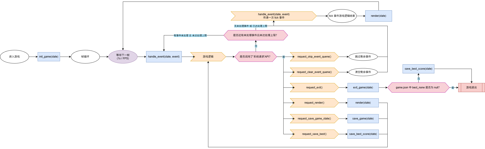
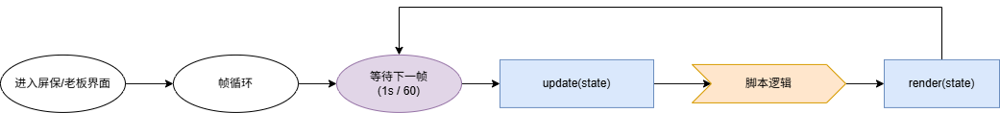

# API 规范与查询

# 文档信息

1. 更新日期：2026年5月13日
2. API 版本：**7**
3. 本文档定义了脚本与宿主之间的交互接口规范，所有实现须遵循其中约定的函数签名、参数类型及行为准则，以确保兼容性与正确性。
4. 适用于——游戏包、屏保包、老板包

# 文档导航

- [README](../../README-i18n/README-zh-cn.md)
- [游戏包制作规范](GAME.md)
- [富文本指令](./RICH_TEXT.md)

# 目录

- [语义歧义消除](#语义歧义消除)
- [声明式 API](#声明式-api)
  - [API 列表](#api-列表)
  - [执行流程](#执行流程)
  - [数据格式](#数据格式)
  - [事件类型](#事件类型)
  - [注意事项](#注意事项)
- [直用式 API](#直用式-api)
  - [系统请求](#系统请求)
  - [内容绘制](#内容绘制)
  - [内容尺寸计算](#内容尺寸计算)
  - [布局定位计算](#布局定位计算)
  - [数据读取](#数据读取)
  - [数据写入](#数据写入)
  - [表处理工具](#表处理工具)
  - [辅助脚本加载](#辅助脚本加载)
  - [时间处理](#时间处理)
  - [随机数](#随机数)
  - [调试信息](#调试信息)
- [附录](#附录)
  - [特定参数](#特定参数)
    - [锚点 anchor](#锚点-anchor)
    - [颜色 color](#颜色-color)
    - [对齐 align](#对齐-align)
    - [文本样式 style](#文本样式-style)
    - [自动换行 warp](#自动换行-warp)
  - [调试输出目录](#调试输出目录)
  - [表转换格式](#表转换格式)
- [快速查询](#快速查询)
- [异常和警告速查表](#异常和警告速查表)

---

# 语义歧义消除

| 名称                | 方向        | 位置                                  | 适用场景            |
| ------------------- | ----------- | ------------------------------------- | ------------------- |
| **声明式 API 参数** | 宿主 → 脚本 | 宿主通过函数参数传入脚本              | 声明式 API 的参数   |
| **传递值**          | 脚本 → 宿主 | 脚本通过 `return` 将值返回给宿主      | 声明式 API 的传递值 |
| **直用式 API 参数** | 脚本 → 宿主 | 甲苯通过函数参数传入宿主              | 直用式 API 的参数   |
| **返回值**          | 宿主 → 脚本 | 直用式 API 的调用结果，宿主返回给脚本 | 直用式 API 的返回值 |

---

# 声明式 API

<div style="color: red;"><b>该部分包含的部分 API 必须在入口脚本中完整实现，否则脚本将无法被宿主接收或运行。</b></div>

**声明式 API 要求您在脚本中重写以下函数，并按照规范接收参数并传递(return)对应的值。**

## API 列表

| 老板包重写需求                          | 屏保包重写需求                          | 游戏包重写需求                                                              | 函数名                          | 作用说明         | 参数名                                                                                           | 参数说明                                           | 传递值类型                                               | 传递值说明                                                       | 宿主调用时机                                |
| -------------------------------- | -------------------------------- | -------------------------------------------------------------------- | ---------------------------- | ------------ | --------------------------------------------------------------------------------------------- | ---------------------------------------------- | --------------------------------------------------- | ----------------------------------------------------------- | ------------------------------------- |
| <font color="#7f7f7f">不需要</font> | <font color="#7f7f7f">不需要</font> | <font color="red">必须重写</font>                                        | `init_game(state)`           | 游戏脚本的初始化     | `state` - <font color="#92cddc">table</font> \| <font color="#92cddc">nil</font>              | 继续游戏时传入上次保存的 `state`；新游戏时传入 `nil`。             | `state` - <font color="#92cddc">table</font>        | 传递初始化后的游戏状态。宿主会将其作为当前帧数据保存，并用于后续 `handle_event` 和 `render`。 | 游戏首次启动时调用一次。                          |
| <font color="#7f7f7f">不需要</font> | <font color="#7f7f7f">不需要</font> | <font color="red">必须重写</font>                                        | `handle_event(state, event)` | 游戏事件逻辑处理     | `state` - <font color="#92cddc">table</font><br> `event` - <font color="#92cddc">table</font> | `state`：宿主临时存储的游戏上一帧数据；<br>`event`：宿主解析后的事件信息。 | `state` - <font color="#92cddc">table</font>        | 传递更新后的游戏状态。宿主会用其替换当前帧数据。                                    | 游戏运行时，每帧对事件队列中的每个事件依次调用。              |
| <font color="red">必须重写</font>    | <font color="red">必须重写</font>    | <font color="#7f7f7f">不需要</font>                                     | `updata(state)`              | 附加包逻辑处理      | `state` - <font color="#92cddc">table</font>                                                  | `state`：宿主临时存储的上一帧数据。                          | `state` - <font color="#92cddc">table</font>        | 传递更新后的数据状态。宿主会用其替换当前帧数据。                                    | 宿主运行时，每帧对事件队列中的每个事件依次调用。              |
| <font color="red">必须重写</font>    | <font color="red">必须重写</font>    | <font color="red">必须重写</font>                                        | `render(state)`              | 游戏画面绘制       | `state` - <font color="#92cddc">table</font>                                                  | 宿主临时存储的游戏当前帧数据。                                | <font color="#7f7f7f">无</font>                      | <font color="#7f7f7f">无传递值</font>                           | 游戏运行时，每帧在所有事件处理完成后调用一次，脚本也可以手动调用。     |
| <font color="#7f7f7f">不需要</font> | <font color="#7f7f7f">不需要</font> | <font color="red">必须重写</font>                                        | `exit_game(state)`           | 游戏退出前的最后一次处理 | `state` - <font color="#92cddc">table</font>                                                  | 宿主临时存储的游戏当前帧数据。                                | `state` - <font color="#92cddc">table</font>        | 传递修改后的 `state`，可供后续 `save_best_score` 使用。                   | 脚本调用 `request_exit()` 后，宿主在退出前调用一次。   |
| <font color="#7f7f7f">不需要</font> | <font color="#7f7f7f">不需要</font> | 当 `game.json` 中 `best_none` 不为 `null` 时<font color="red">必须重写</font> | `save_best_score(state)`     | 向宿主传递游戏最佳记录  | `state` - <font color="#92cddc">table</font>                                                  | 宿主临时存储的游戏当前帧数据。                                | `best_string` - <font color="#92cddc">string</font> | 传递最佳记录文本 `best_string` 字符串。                                 | 宿主在 `exit_game` 之后自动调用（若需要），脚本也可手动调用。 |
| <font color="#7f7f7f">不需要</font> | <font color="#7f7f7f">不需要</font> | 当 `game.json` 中 `save` 为 `true` 时<font color="red">必须重写</font>       | `save_game(state)`           | 保存游戏存档       | `state` - <font color="#92cddc">table</font>                                                  | 宿主临时存储的游戏当前帧数据。                                | `state` - <font color="#92cddc">table</font>        | 传递用于长期存储的 `state`。**注意**：此传递值仅用于存档，当前游戏会继续使用传入的原 `state`。   | 由脚本手动调用，宿主不会自动调用。                     |

---

## 执行流程

**游戏包**
宿主与脚本运行链如下图所示：



**老板包** 与 **屏保包**
宿主与脚本运行链如下图所示：



---

## 数据格式

> 注：
>
> - `#` 表示自定义或可变内容.
> - `[]` 表示该字段可重复出现或扩展。

### `state` 数据格式

```lua
{
  [#key] = "#value"
}
```

- `state` 可以是任意可序列化的数据结构。
- 宿主仅负责存储与传递 `state`，不解析其内部内容。

### `event` 数据格式

```lua
{
  type = "#type",
  [#name] = "#value"
}
```

- `event` 的数据结构由宿主定义并传递。
- `type` 字段决定了事件的类型，具体取值及对应的扩展字段见下文『声明式 API -[事件类型](#事件类型)』。

---

## 事件类型

宿主会根据运行时环境产生以下类型的事件，脚本应据此进行相应逻辑处理。

### 1. `action`

```lua
{
  type = "action",
  name = "#registered_key",
  status = "press" | "release"
}
```

**作用**：  
宿主根据 `game.json` 中的 `actions` 配置，将物理按键映射为语义化动作事件。
适用于自定义动作按键的处理。

**status 字段**:
- `press` 按键按下
- `release` 按键松开

### 2. `key`

```lua
{
  type = "key",
  name = "#enter"
}
```

**作用**：  
宿主输出原始按键事件。适用于处理未在 `actions` 中注册的按键。

### 3. `resize`

```lua
{
  type = "resize",
  width = int,
  height = int
}
```

**作用**：  
通知脚本终端显示区域的宽度或高度发生变化。
可用于响应式重新布局。

### 4. `tick`

```lua
{
  type = "tick",
  dt_ms = int
}
```

**作用**：  
通知脚本时间推进，`dt_ms` 表示距离上一个 `tick` 事件的时间差（毫秒）。

### 5. `focus_gained`

```lua
{
  type = "focus_gained"
}
```

**作用**：  
通知脚本终端获得焦点。

### 6. `focus_lost`

```lua
{
  type = "focus_lost"
}
```

**作用**：  
通知脚本终端失去焦点。

---

## 注意事项

### 一、实现要求

1. **游戏包必须实现的函数**：`init_game`、`handle_event`、`render`、`exit_game` 四个 API **不可缺少**。
2. **游戏包按需实现的函数**：
   - 当 `game.json` 中 `best_none` 不为 `null` 时，**必须实现** `save_best_score`。
   - 当 `game.json` 中 `save` 为 `true` 时，**必须实现** `save_game`。
1. **老板包必须实现的函数**：`updata`、`render` 两个 API **不可缺少**。
2. **屏保包必须实现的函数**：`updata`、`render` 两个 API **不可缺少**。

### 二、返回值规范

| 函数                           | 传递值要求                      |
| ---------------------------- | -------------------------- |
| `init_game(state)`           | **必须传递** `state` 表         |
| `handle_event(state, event)` | **必须传递** `state` 表         |
| `updata(state)`              | **必须传递** `state` 表         |
| `exit_game(state)`           | **必须传递** `state` 表         |
| `render(state)`              | 无传递值                       |
| `save_best_score(state)`     | **必须传递** `best_string` 字符串 |
| `save_game(state)`           | **必须传递** `state` 表         |

### 三、宿主职责与限制

1. 宿主仅负责**事件的交流**与 **`state` 的存储/恢复**，**不对事件或 `state` 进行任何游戏逻辑处理**。所有游戏逻辑（状态更新、事件响应、画面绘制等）均需由脚本自身实现。
2. `save_game` 传递的 `state` 仅用于**持久化存档**，当前游戏的运行会使用传入的原始 `state` 继续游戏帧的循环。

### 四、事件队列规则

1. 每帧处理的事件队列数量上限为 **256** 个。超出该数量的事件将推迟至**下一帧**继续处理（该限制不适用于 `tick` 事件）。
2. 每帧的事件队列末尾**必定包含**一个 `tick` 事件。

---

# 直用式 API

**直用式 API 要求您在脚本中直接调用以下函数，无需重写，并按照规范传入参数及接收返回值。**

<font color="red"><b>脚本中必须至少存在一条可执行路径能够调用 request_exit()，否则游戏将无法正常退出。</b></font>

> 注：
>
> - `[` 表示参数可选，如需跳过参数，填写 `nil` 占位。
> - `*` 表示特定参数，需参考相关提示填写。
> - 多返回值以多个独立值返回，而非表。

---

## 系统请求

> 注：`request_skip_event_queue` 和 `request_clear_event_queue` 不会影响队尾的 `tick` 事件。`tick` 事件在每个帧循环中**必定**会被传入，详细流程见『声明式 API -[执行流程](#执行流程)』。

|            老板包是否可用             |            屏保包是否可用             |           游戏包是否可用            | 可达性                              | 函数名                           | 作用                                         | 参数                             | 返回值                                                                                                                            |
| :----------------------------: | :----------------------------: | :--------------------------: | -------------------------------- | ----------------------------- | ------------------------------------------ | ------------------------------ | ------------------------------------------------------------------------------------------------------------------------------ |
| <font color="#7f7f7f">否</font> | <font color="#7f7f7f">否</font> | <font color="green">是</font> | <font color="#7f7f7f">无要求</font> | `get_launch_mode()`           | 获取本次游戏的启动模式。                               | <font color="#7f7f7f">无</font> | `status` - <font color="#92cddc">"new"</font> \| <font color="#92cddc">"continue"</font>：`"new"` 表示新游戏，`"continue"` 表示继续已有存档。  |
| <font color="#7f7f7f">否</font> | <font color="#7f7f7f">否</font> | <font color="green">是</font> | <font color="#7f7f7f">无要求</font> | `get_best_score()`            | 获取游戏存储的最佳记录数据。                             | <font color="#7f7f7f">无</font> | `data` - <font color="#92cddc">string</font> \| <font color="#92cddc">nil</font>：存储的最佳记录字符串，宿主返回脚本所传递的 best_string，若不存在返回 nil。 |
| <font color="#7f7f7f">否</font> | <font color="#7f7f7f">否</font> | <font color="green">是</font> | <font color="red">至少一条可达</font>  | `request_exit()`              | 向宿主发送退出游戏请求。                               | <font color="#7f7f7f">无</font> | <font color="#7f7f7f">无</font>                                                                                                 |
| <font color="#7f7f7f">否</font> | <font color="#7f7f7f">否</font> | <font color="green">是</font> | <font color="#7f7f7f">无要求</font> | `request_skip_event_queue()`  | 向宿主发送跳过尚未处理的事件队列请求。                        | <font color="#7f7f7f">无</font> | <font color="#7f7f7f">无</font>                                                                                                 |
| <font color="#7f7f7f">否</font> | <font color="#7f7f7f">否</font> | <font color="green">是</font> | <font color="#7f7f7f">无要求</font> | `request_clear_event_queue()` | 向宿主发送清空尚未处理的事件队列请求。                        | <font color="#7f7f7f">无</font> | <font color="#7f7f7f">无</font>                                                                                                 |
| <font color="#7f7f7f">否</font> | <font color="#7f7f7f">否</font> | <font color="green">是</font> | <font color="#7f7f7f">无要求</font> | `request_render()`            | 请求宿主调用 `render(state)` 以重绘当前界面。            | <font color="#7f7f7f">无</font> | <font color="#7f7f7f">无</font>                                                                                                 |
| <font color="#7f7f7f">否</font> | <font color="#7f7f7f">否</font> | <font color="green">是</font> | <font color="#7f7f7f">无要求</font> | `request_save_best_score()`   | 请求宿主调用 `save_best_score(state)` 以保存当前最佳记录。 | <font color="#7f7f7f">无</font> | <font color="#7f7f7f">无</font>                                                                                                 |
| <font color="#7f7f7f">否</font> | <font color="#7f7f7f">否</font> | <font color="green">是</font> | <font color="#7f7f7f">无要求</font> | `request_save_game()`         | 请求宿主调用 `save_game(state)` 以保存当前游戏存档。       | <font color="#7f7f7f">无</font> | <font color="#7f7f7f">无</font>                                                                                                 |

---

## 内容绘制

> 注：
>
> 1. `color` 类型见『附录-[颜色 color](#颜色-color)』。
> 2. `align` 类型见『附录-[对齐 align](#对齐-align)』。
> 3. `style` 类型见『附录-[文本样式 style](#文本样式-style)』。
> 4. `warp` 类型见『附录-[自动换行 warp](#自动换行-warp)』。
> 5. 宽度、高度参数均以**终端字符数**为单位（宽度为列数，高度为行数）。
> 6. 所有绘制操作的基准点均为**内容的左上角**，即绘制内容将从指定的 (x, y) 坐标处开始向右、向下延伸。
> 7. 绘制坐标详细见『游戏包制作规范及教程-其它-[绘制坐标](GAME.md#绘制坐标)』。
> 8. `[wrap_width` 参数含义为到达指定长度后的文本会**自动换行**（可与 `*[align` 参数搭配），默认无限制。

|           老板包是否可用            |           屏保包是否可用            |           游戏包是否可用            | 函数名                                                                                 | 作用                       | 参数                                                                                                                                                                                                                                                                                                                                                                                                                                                                                                                          | 返回值                                                                                                                                                                                      |                                |
| :--------------------------: | :--------------------------: | :--------------------------: | ----------------------------------------------------------------------------------- | ------------------------ | --------------------------------------------------------------------------------------------------------------------------------------------------------------------------------------------------------------------------------------------------------------------------------------------------------------------------------------------------------------------------------------------------------------------------------------------------------------------------------------------------------------------------- | ---------------------------------------------------------------------------------------------------------------------------------------------------------------------------------------- | ------------------------------ |
| <font color="green">是</font> | <font color="green">是</font> | <font color="green">是</font> | `canvas_clear()`                                                                    | 清空当前帧的画布。                | <font color="#7f7f7f">无</font>                                                                                                                                                                                                                                                                                                                                                                                                                                                                                              | <font color="#7f7f7f">无</font>                                                                                                                                                           |                                |
| <font color="green">是</font> | <font color="green">是</font> | <font color="green">是</font> | `canvas_eraser(x, y, width, height)`                                                | 清空画布指定区域。                | `x` - <font color="#92cddc">int</font>：横轴坐标。<br>`y` - <font color="#92cddc">int</font>：纵轴坐标。<br>`width` - <font color="#92cddc">int</font>：区域宽度。<br>`height` - <font color="#92cddc">int</font>：区域高度。                                                                                                                                                                                                                                                                                                                       | <font color="#7f7f7f">无</font>                                                                                                                                                           |                                |
| <font color="green">是</font> | <font color="green">是</font> | <font color="green">是</font> | `canvas_draw_text(x, y, text, *[fg, *[bg, *[style, *[align, [wrap_width)`           | 在画布指定位置绘制字符串。            | `x` - <font color="#92cddc">int</font>：横轴坐标。<br>`y` - <font color="#92cddc">int</font>：纵轴坐标。<br>`text` - <font color="#92cddc">string</font>：绘制的字符串。<br>`*[fg` - <font color="#92cddc">color</font>：可选，字符颜色。<br>`*[bg` - <font color="#92cddc">color</font>：可选，背景颜色。<br>`*[style` - <font color="#92cddc">style</font> \| <font color="#92cddc">Array</font>：可选，文本样式。填写数组标识应用多个样式。<br>`*[align` - <font color="#92cddc">align</font>：可选，换行内容对齐方式。<br>`[wrap_width` - <font color="#92cddc">warp</font>：可选，换行宽度。             | <font color="#7f7f7f">无</font>                                                                                                                                                           |                                |
| <font color="green">是</font> | <font color="green">是</font> | <font color="green">是</font> | `canvas_draw_rich_text(x, y, rich_text, *[fg, *[bg, *[style, *[align, [wrap_width)` | 在画布指定位置绘制富文本字符串。         | `x` - <font color="#92cddc">int</font>：横轴坐标。<br>`y` - <font color="#92cddc">int</font>：纵轴坐标。<br>`rich_text` - <font color="#92cddc">string</font>：绘制的富文本字符串。<br>`*[fg` - <font color="#92cddc">color</font>：可选，默认字符颜色。<br>`*[bg` - <font color="#92cddc">color</font>：可选，默认背景颜色。<br>`*[style` - <font color="#92cddc">style</font> \| <font color="#92cddc">Array</font>：可选，文本样式。填写数组标识应用多个样式。<br>`*[align` - <font color="#92cddc">align</font>：可选，换行内容对齐方式。<br>`[wrap_width` - <font color="#92cddc">warp</font>：可选，换行宽度。 | <font color="#92cddc">Array</font>：可选，默认文本样式。填写数组标识应用多个样式。<br>`*[align` - <font color="#92cddc">align</font>：可选，换行内容对齐方式。<br>`[wrap_width` - <font color="#92cddc">align</font>：可选，换行宽度。 | <font color="#7f7f7f">无</font> |
| <font color="green">是</font> | <font color="green">是</font> | <font color="green">是</font> | `canvas_fill_rect(x, y, width, height, [char, *[fg, *[bg)`                          | 从指定位置绘制矩形，并使用指定字符填充。     | `x` - <font color="#92cddc">int</font>：横轴坐标。<br>`y` - <font color="#92cddc">int</font>：纵轴坐标。<br>`width` - <font color="#92cddc">int</font>：矩形宽度。<br>`height` - <font color="#92cddc">int</font>：矩形高度。<br>`[char` - <font color="#92cddc">char</font>：可选，用于填充的单个字符。<br>`*[fg` - <font color="#92cddc">color</font>：可选，字符颜色。<br>`*[bg` - <font color="#92cddc">color</font>：可选，背景颜色。                                                                                                                                          | <font color="#7f7f7f">无</font>                                                                                                                                                           |                                |
| <font color="green">是</font> | <font color="green">是</font> | <font color="green">是</font> | `canvas_border_rect(x, y, width, height, [char_list, *[fg, *[bg)`                   | 从指定位置绘制矩形边框，并使用指定字符作为边框。 | `x` - <font color="#92cddc">int</font>：横轴坐标。<br>`y` - <font color="#92cddc">int</font>：纵轴坐标。<br>`width` - <font color="#92cddc">int</font>：矩形宽度。<br>`height` - <font color="#92cddc">int</font>：矩形高度。<br>`[char_list` - <font color="#92cddc">table</font>：可选，边框字符配置表，结构见下文。<br>`*[fg` - <font color="#92cddc">color</font>：可选，字符颜色。<br>`*[bg` - <font color="#92cddc">color</font>：可选，背景颜色。                                                                                                                                | <font color="#7f7f7f">无</font>                                                                                                                                                           |                                |

**`[char_list` 格式**

```lua
{
  top = char,           -- 上边框
  top_right = char,     -- 右上角
  right = char,         -- 右边框
  bottom_right = char,  -- 右下角
  bottom = char,        -- 下边框
  bottom_left = char,   -- 左下角
  left = char,          -- 左边框
  top_left = char       -- 左上角
}
```

> 若 `char_list` 未提供或字段缺失，对应位置的边框将不绘制（留空）。

---

## 内容尺寸计算

> 注：
>
> 1. `warp` 类型见『附录-[自动换行 warp](#自动换行-warp)』。
> 2. 宽度、高度返回值均以**终端字符数**为单位（宽度为列数，高度为行数）。
> 3. 所有计算操作的基准点均为**内容的左上角**，即计算内容将从指定的 (x, y) 坐标处开始向右、向下延伸。
> 4. 绘制坐标详细见『文档-[绘制坐标](GAME.md#绘制坐标)』。

|           老板包是否可用            |           屏保包是否可用            |           游戏包是否可用            | 函数名                                            | 作用                    | 参数                                                                                                                          | 返回值                                                                                                       |
| :--------------------------: | :--------------------------: | :--------------------------: | ---------------------------------------------- | --------------------- | --------------------------------------------------------------------------------------------------------------------------- | --------------------------------------------------------------------------------------------------------- |
| <font color="green">是</font> | <font color="green">是</font> | <font color="green">是</font> | `get_text_size(text, [wrap_width)`             | 计算字符串在终端中所占的宽度和高度。    | `text` - <font color="#92cddc">string</font>：要测量的字符串。<br>`[wrap_width` - <font color="#92cddc">warp</font>：可选，换行宽度。         | `width` - <font color="#92cddc">int</font>：文字所占宽度。<br>`height` - <font color="#92cddc">int</font>：文字所占高度。 |
| <font color="green">是</font> | <font color="green">是</font> | <font color="green">是</font> | `get_text_width(text, [wrap_width)`            | 计算字符串在终端中所占的宽度。       | `text` - <font color="#92cddc">string</font>：要测量的字符串。<br>`[wrap_width` - <font color="#92cddc">warp</font>：可选，换行宽度。         | `width` - <font color="#92cddc">int</font>：文字所占宽度。                                                        |
| <font color="green">是</font> | <font color="green">是</font> | <font color="green">是</font> | `get_text_height(text, [wrap_width)`           | 计算字符串在终端中所占的高度。       | `text` - <font color="#92cddc">string</font>：要测量的字符串。<br>`[wrap_width` - <font color="#92cddc">warp</font>：可选，换行宽度。         | `height` - <font color="#92cddc">int</font>：文字所占高度。                                                       |
| <font color="green">是</font> | <font color="green">是</font> | <font color="green">是</font> | `get_rich_text_size(rich_text, [wrap_width)`   | 计算富文本字符串在终端中所占的宽度和高度。 | `rich_text` - <font color="#92cddc">string</font>：要测量的富文本字符串。<br>`[wrap_width` - <font color="#92cddc">warp</font>：可选，换行宽度。 | `width` - <font color="#92cddc">int</font>：文字所占宽度。<br>`height` - <font color="#92cddc">int</font>：文字所占高度。 |
| <font color="green">是</font> | <font color="green">是</font> | <font color="green">是</font> | `get_rich_text_width(rich_text, [wrap_width)`  | 计算富文本字符串在终端中所占的宽度。    | `rich_text` - <font color="#92cddc">string</font>：要测量的富文本字符串。<br>`[wrap_width` - <font color="#92cddc">warp</font>：可选，换行宽度。 | `width` - <font color="#92cddc">int</font>：文字所占宽度。                                                        |
| <font color="green">是</font> | <font color="green">是</font> | <font color="green">是</font> | `get_rich_text_height(rich_text, [wrap_width)` | 计算富文本字符串在终端中所占的高度。    | `rich_text` - <font color="#92cddc">string</font>：要测量的富文本字符串。<br>`[wrap_width` - <font color="#92cddc">warp</font>：可选，换行宽度。 | `height` - <font color="#92cddc">int</font>：文字所占高度。                                                       |
| <font color="green">是</font> | <font color="green">是</font> | <font color="green">是</font> | `get_terminal_size()`                          | 获取当前终端的宽度和高度。         | <font color="#7f7f7f">无</font>                                                                                              | `width` - <font color="#92cddc">int</font>：终端宽度。<br>`height` - <font color="#92cddc">int</font>：终端高度。     |

---

## 布局定位计算

> 注：
>
> 1. `x_anchor` 和 `y_anchor` 类型见『附录-[锚点 anchor](#锚点-anchor)』。
> 2. 宽度、高度参数均以**终端字符数**为单位（宽度为列数，高度为行数）。
> 3. 所有计算操作的基准点均为**内容的左上角**，即计算内容将从指定的 (x, y) 坐标处开始向右、向下延伸。
> 4. 绘制坐标详细见『游戏包制作规范及教程-[绘制坐标](GAME.md#绘制坐标)』。

|           老板包是否可用            |           屏保包是否可用            |           游戏包是否可用            | 函数名                                                                       | 作用                               | 参数                                                                                                                                                                                                                                                                                                                                                      | 返回值                                                                                                |
| :--------------------------: | :--------------------------: | :--------------------------: | ------------------------------------------------------------------------- | -------------------------------- | ------------------------------------------------------------------------------------------------------------------------------------------------------------------------------------------------------------------------------------------------------------------------------------------------------------------------------------------------------- | -------------------------------------------------------------------------------------------------- |
| <font color="green">是</font> | <font color="green">是</font> | <font color="green">是</font> | `resolve_x(*x_anchor, width, [offset_x)`                                  | 根据水平锚点、内容宽度和偏移量，计算起始 X 坐标。       | `*x_anchor` - <font color="#92cddc">x_anchor</font>：水平锚点。<br>`width` - <font color="#92cddc">int</font>：内容宽度。<br>`[offset_x` - <font color="#92cddc">int</font>：可选，水平偏移量。                                                                                                                                                                               | `x` - <font color="#92cddc">int</font>：起始 X 坐标。                                                    |
| <font color="green">是</font> | <font color="green">是</font> | <font color="green">是</font> | `resolve_y(*y_anchor, height, [offset_y)`                                 | 根据垂直锚点、内容高度和偏移量，计算起始 Y 坐标。       | `*y_anchor` - <font color="#92cddc">y_anchor</font>：垂直锚点。<br>`height` - <font color="#92cddc">int</font>：内容高度。<br>`[offset_y` - <font color="#92cddc">int</font>：可选，垂直偏移量。                                                                                                                                                                              | `y` - <font color="#92cddc">int</font>：起始 Y 坐标。                                                    |
| <font color="green">是</font> | <font color="green">是</font> | <font color="green">是</font> | `resolve_rect(*x_anchor, *y_anchor, width, height, [offset_x, [offset_y)` | 根据水平和垂直锚点、宽高及偏移量，计算矩形的起始 X、Y 坐标。 | `*x_anchor` - <font color="#92cddc">x_anchor</font>：水平锚点。<br>`*y_anchor` - <font color="#92cddc">y_anchor</font>：垂直锚点。<br>`width` - <font color="#92cddc">int</font>：矩形宽度。<br>`height` - <font color="#92cddc">int</font>：矩形高度。<br>`[offset_x` - <font color="#92cddc">int</font>：可选，水平偏移量。<br>`[offset_y` - <font color="#92cddc">int</font>：可选，垂直偏移量。 | `x` - <font color="#92cddc">int</font>：起始 X 坐标。<br>`y` - <font color="#92cddc">int</font>：起始 Y 坐标。 |

---

## 数据读取

> 注：
>
> 1. 本章节中所有 `path` 参数均相对于游戏资源包中的 `assets/` 目录。
> 2. 请注意返回值的数据类型，避免解析错误。
> 3. 所有文件的路径可不写后缀，API 会自动补充后缀并做文件类型检查，不符合规范的文件类型会被宿主拒绝读取。

|           老板包是否可用            |           屏保包是否可用            |           游戏包是否可用            | 函数名                          | 作用                                 | 参数                                                                                                                      | 返回值                                                      |
| :--------------------------: | :--------------------------: | :--------------------------: | ---------------------------- | ---------------------------------- | ----------------------------------------------------------------------------------------------------------------------- | -------------------------------------------------------- |
| <font color="green">是</font> | <font color="green">是</font> | <font color="green">是</font> | `translate(key, [parameter)` | 读取当前游戏资源包中指定语言键对应的本地化字符串。          | `key` - <font color="#92cddc">string</font>：语言键；<br />`[parameter` - <font color="#92cddc">table</font>：动态变量替换表，结构见下文。。 | `value` - <font color="#92cddc">string</font>：对应的本地化字符串。 |
| <font color="green">是</font> | <font color="green">是</font> | <font color="green">是</font> | `read_text(path)`            | 读取资源包中指定路径的 `.txt` 文本文件。           | `path` - <font color="#92cddc">string</font>：相对于 `assets/` 的路径。                                                         | `data` - <font color="#92cddc">string</font>：文件文本内容。     |
| <font color="green">是</font> | <font color="green">是</font> | <font color="green">是</font> | `read_json(path)`            | 读取资源包中指定路径的 `.json` 文件，并解析为 Lua 表。 | `path` - <font color="#92cddc">string</font>：相对于 `assets/` 的路径。                                                         | `data` - <font color="#92cddc">table</font>：解析后的 Lua 表。  |
| <font color="green">是</font> | <font color="green">是</font> | <font color="green">是</font> | `read_xml(path)`             | 读取资源包中指定路径的 `.xml` 文件，并解析为 Lua 表。  | `path` - <font color="#92cddc">string</font>：相对于 `assets/` 的路径。                                                         | `data` - <font color="#92cddc">table</font>：解析后的 Lua 表。  |
| <font color="green">是</font> | <font color="green">是</font> | <font color="green">是</font> | `read_yaml(path)`            | 读取资源包中指定路径的 `.yaml` 文件，并解析为 Lua 表。 | `path` - <font color="#92cddc">string</font>：相对于 `assets/` 的路径。                                                         | `data` - <font color="#92cddc">table</font>：解析后的 Lua 表。  |
| <font color="green">是</font> | <font color="green">是</font> | <font color="green">是</font> | `read_toml(path)`            | 读取资源包中指定路径的 `.toml` 文件，并解析为 Lua 表。 | `path` - <font color="#92cddc">string</font>：相对于 `assets/` 的路径。                                                         | `data` - <font color="#92cddc">table</font>：解析后的 Lua 表。  |
| <font color="green">是</font> | <font color="green">是</font> | <font color="green">是</font> | `read_csv(path)`             | 读取资源包中指定路径的 `.csv` 文件，并解析为 Lua 表。  | `path` - <font color="#92cddc">string</font>：相对于 `assets/` 的路径。                                                         | `data` - <font color="#92cddc">table</font>：解析后的 Lua 表。  |
| <font color="green">是</font> | <font color="green">是</font> | <font color="green">是</font> | `read_json_string(path)`     | 读取资源包中指定路径的 `.json` 文件，直接返回读取内容。   | `path` - <font color="#92cddc">string</font>：相对于 `assets/` 的路径。                                                         | `data` - <font color="#92cddc">string</font>：读取文件的原文字符串。 |
| <font color="green">是</font> | <font color="green">是</font> | <font color="green">是</font> | `read_xml_string(path)`      | 读取资源包中指定路径的 `.xml` 文件，直接返回读取内容。    | `path` - <font color="#92cddc">string</font>：相对于 `assets/` 的路径。                                                         | `data` - <font color="#92cddc">string</font>：读取文件的原文字符串。 |
| <font color="green">是</font> | <font color="green">是</font> | <font color="green">是</font> | `read_yaml_string(path)`     | 读取资源包中指定路径的 `.yaml` 文件，直接返回读取内容。   | `path` - <font color="#92cddc">string</font>：相对于 `assets/` 的路径。                                                         | `data` - <font color="#92cddc">string</font>：读取文件的原文字符串。 |
| <font color="green">是</font> | <font color="green">是</font> | <font color="green">是</font> | `read_toml_string(path)`     | 读取资源包中指定路径的 `.toml` 文件，直接返回读取内容。   | `path` - <font color="#92cddc">string</font>：相对于 `assets/` 的路径。                                                         | `data` - <font color="#92cddc">string</font>：读取文件的原文字符串。 |
| <font color="green">是</font> | <font color="green">是</font> | <font color="green">是</font> | `read_csv_string(path)`      | 读取资源包中指定路径的 `.csv` 文件，直接返回读取内容。    | `path` - <font color="#92cddc">string</font>：相对于 `assets/` 的路径。                                                         | `data` - <font color="#92cddc">string</font>：读取文件的原文字符串。 |

> 注：
>
> - `#` 表示自定义或可变内容.
> - `[]` 表示该字段可重复出现或扩展。

**`[parameter` 格式**

```lua
{
  [#key] = #value,
  ...
}
```

> 若 `parameter` 未提供或字段缺失，对应的动态变量不会被替换（输出原始字符串）。

---

## 数据写入

> 注：
>
> 1. 本章节中所有 `path` 参数均相对于游戏资源包中的 `assets/` 目录。
> 2. 所有 `write_*` 函数的 `content` 参数均为 `string` 类型。
> 3. 所有 `write_*` 函数仅为语义命名，实际写入并不会做结构检查。
> 4. 所有 `write_*` 函数均为高风险直写操作。仅当 `game.json` 中 `write` 字段为 `true` 且用户授予游戏包“完全信任权限”时，直写操作才会被执行；否则所有直写请求将被宿主忽略。
> 5. 无论直写操作是否执行，每次调用都会在 `tui_log.txt` 中记录，供用户安全检查。
> 6. 所有文件的路径可不写后缀，API 会自动补充后缀并做文件类型检查，不符合规范的文件类型会被宿主拒绝写入。

<font color="red"><b>直写操作不可撤回！</b></font>
<font color="red"><b>直写操作不可撤回！</b></font>
<font color="red"><b>直写操作不可撤回！</b></font>

<font color="red"><b>直写操作均为高风险操作，请最大程度避免使用！</b></font>

|            老板包是否可用             |            屏保包是否可用             |           游戏包是否可用            | 风险等级                         | 函数名                         | 作用                  | 参数                                                                                                                   | 返回值                                                                     |
| :----------------------------: | :----------------------------: | :--------------------------: | ---------------------------- | --------------------------- | ------------------- | -------------------------------------------------------------------------------------------------------------------- | ----------------------------------------------------------------------- |
| <font color="#7f7f7f">否</font> | <font color="#7f7f7f">否</font> | <font color="green">是</font> | <font color="red">高风险</font> | `write_text(path, content)` | 写入文本文件到资源包指定路径。     | `path` - <font color="#92cddc">string</font>：文件路径。<br>`content` - <font color="#92cddc">string</font>：要写入的文本内容。      | `bool` - <font color="#92cddc">boolean</font>：`true` 写入成功，`false` 写入失败。 |
| <font color="#7f7f7f">否</font> | <font color="#7f7f7f">否</font> | <font color="green">是</font> | <font color="red">高风险</font> | `write_json(path, content)` | 写入 JSON 文件到资源包指定路径。 | `path` - <font color="#92cddc">string</font>：文件路径。<br>`content` - <font color="#92cddc">string</font>：要写入的 JSON 字符串。 | `bool` - <font color="#92cddc">boolean</font>：`true` 写入成功，`false` 写入失败。 |
| <font color="#7f7f7f">否</font> | <font color="#7f7f7f">否</font> | <font color="green">是</font> | <font color="red">高风险</font> | `write_xml(path, content)`  | 写入 XML 文件到资源包指定路径。  | `path` - <font color="#92cddc">string</font>：文件路径。<br>`content` - <font color="#92cddc">string</font>：要写入的 XML 字符串。  | `bool` - <font color="#92cddc">boolean</font>：`true` 写入成功，`false` 写入失败。 |
| <font color="#7f7f7f">否</font> | <font color="#7f7f7f">否</font> | <font color="green">是</font> | <font color="red">高风险</font> | `write_yaml(path, content)` | 写入 YAML 文件到资源包指定路径。 | `path` - <font color="#92cddc">string</font>：文件路径。<br>`content` - <font color="#92cddc">string</font>：要写入的 YAML 字符串。 | `bool` - <font color="#92cddc">boolean</font>：`true` 写入成功，`false` 写入失败。 |
| <font color="#7f7f7f">否</font> | <font color="#7f7f7f">否</font> | <font color="green">是</font> | <font color="red">高风险</font> | `write_toml(path, content)` | 写入 TOML 文件到资源包指定路径。 | `path` - <font color="#92cddc">string</font>：文件路径。<br>`content` - <font color="#92cddc">string</font>：要写入的 TOML 字符串。 | `bool` - <font color="#92cddc">boolean</font>：`true` 写入成功，`false` 写入失败。 |
| <font color="#7f7f7f">否</font> | <font color="#7f7f7f">否</font> | <font color="green">是</font> | <font color="red">高风险</font> | `write_csv(path, content)`  | 写入 CSV 文件到资源包指定路径。  | `path` - <font color="#92cddc">string</font>：文件路径。<br>`content` - <font color="#92cddc">string</font>：要写入的 CSV 字符串。  | `bool` - <font color="#92cddc">boolean</font>：`true` 写入成功，`false` 写入失败。 |

---

## 表处理工具

> 注：
>
> 1. 该部分 API 用于将表转换为各种数据格式的字符串，或进行表的深拷贝操作。
> 2. 转换结果主要用于调试输出、数据交换或持久化存储。
> 3. 转换函数对表格式有严格要求，详细见『附录-[表转换格式](#表转换格式)』。

|           老板包是否可用            |           屏保包是否可用            |           游戏包是否可用            | 函数名                    | 作用                     | 参数                                                  | 返回值                                                          |
| :--------------------------: | :--------------------------: | :--------------------------: | ---------------------- | ---------------------- | --------------------------------------------------- | ------------------------------------------------------------ |
| <font color="green">是</font> | <font color="green">是</font> | <font color="green">是</font> | `table_to_json(table)` | 将 Lua 表转换为 JSON 格式字符串。 | `table` - <font color="#92cddc">table</font>：要转换的表。 | `json_str` - <font color="#92cddc">string</font>：JSON 格式字符串。 |
| <font color="green">是</font> | <font color="green">是</font> | <font color="green">是</font> | `table_to_yaml(table)` | 将 Lua 表转换为 YAML 格式字符串。 | `table` - <font color="#92cddc">table</font>：要转换的表。 | `yaml_str` - <font color="#92cddc">string</font>：YAML 格式字符串。 |
| <font color="green">是</font> | <font color="green">是</font> | <font color="green">是</font> | `table_to_toml(table)` | 将 Lua 表转换为 TOML 格式字符串。 | `table` - <font color="#92cddc">table</font>：要转换的表。 | `toml_str` - <font color="#92cddc">string</font>：TOML 格式字符串。 |
| <font color="green">是</font> | <font color="green">是</font> | <font color="green">是</font> | `table_to_csv(table)`  | 将 Lua 表转换为 CSV 格式字符串。  | `table` - <font color="#92cddc">table</font>：要转换的表。 | `csv_str` - <font color="#92cddc">string</font>：CSV 格式字符串。   |
| <font color="green">是</font> | <font color="green">是</font> | <font color="green">是</font> | `table_to_xml(table)`  | 将 Lua 表转换为 XML 格式字符串。  | `table` - <font color="#92cddc">table</font>：要转换的表。 | `xml_str` - <font color="#92cddc">string</font>：XML 格式字符串。   |
| <font color="green">是</font> | <font color="green">是</font> | <font color="green">是</font> | `deep_copy(table)`     | 深拷贝一个 Lua 表，返回全新的独立副本。 | `table` - <font color="#92cddc">table</font>：要拷贝的表。 | `new_table` - <font color="#92cddc">table</font>：深拷贝后的新表。    |

---

## 辅助脚本加载

> 注：辅助脚本的具体编写与使用请参考『游戏包制作规范及教程-其它-[辅助脚本规范](GAME.md#辅助脚本规范)』。

|           老板包是否可用            |           屏保包是否可用            |           游戏包是否可用            | 函数名                   | 作用                                      | 参数                                                                  | 返回值                                                              |
| :--------------------------: | :--------------------------: | :--------------------------: | --------------------- | --------------------------------------- | ------------------------------------------------------------------- | ---------------------------------------------------------------- |
| <font color="green">是</font> | <font color="green">是</font> | <font color="green">是</font> | `load_function(path)` | 加载指定路径的 Lua 辅助脚本，返回脚本中定义的所有变量和函数（以表形式）。 | `path` - <font color="#92cddc">string</font>：相对于 `function/` 目录的路径。 | `functions` - <font color="#92cddc">table</font>：包含脚本中所有变量和函数的表。 |

---

## 时间处理

> 注：
>
> 1. 计时器创建后处于 `init` 状态，需调用 `timer_start` 或 `timer_restart` 才会启动。计时器结束后状态变为 `completed`，不会自动删除，需手动调用 `timer_kill` 清理。
> 2. `timer_reset` 将计时器重置为 `init` 状态（已过时间归零）；`timer_restart` 相当于 reset + start。
> 3. 查询 `init` 状态的计时器，`elapsed` 返回 0；查询 `completed` 状态的计时器，`remaining` 返回 0。
> 4. 所有脚本创建的计时器会在游戏退出后被删除。
> 5. 每个游戏运行时最多同时存在 64 个计时器。

|           老板包是否可用            |           屏保包是否可用            |           游戏包是否可用            | 是否启动计时器                        | 函数名                                                               | 作用                                      | 参数                                                                                                                                                                                                                                                                                                                                                                    | 返回值                                                                                                                                                                                                                                                              |
| :--------------------------: | :--------------------------: | :--------------------------: | ------------------------------ | ----------------------------------------------------------------- | --------------------------------------- | --------------------------------------------------------------------------------------------------------------------------------------------------------------------------------------------------------------------------------------------------------------------------------------------------------------------------------------------------------------------- | ---------------------------------------------------------------------------------------------------------------------------------------------------------------------------------------------------------------------------------------------------------------- |
| <font color="green">是</font> | <font color="green">是</font> | <font color="green">是</font> | <font color="#7f7f7f">否</font> | `running_time()`                                                  | 获取从游戏启动到当前时刻经过的总时长。                     | <font color="#7f7f7f">无</font>                                                                                                                                                                                                                                                                                                                                        | `time` - <font color="#92cddc">int</font>：已运行总时长（毫秒）。                                                                                                                                                                                                            |
| <font color="green">是</font> | <font color="green">是</font> | <font color="green">是</font> | <font color="#7f7f7f">否</font> | `timer_create(delay_ms, [note)`                                   | 创建一个持续 `delay_ms` 毫秒的计时器（初始状态为 `init`）。 | `delay_ms` - <font color="#92cddc">int</font>：计时时长（毫秒）。<br>`[note` - <font color="#92cddc">string</font>：可选，计时器备注信息。                                                                                                                                                                                                                                                  | `id` - <font color="#92cddc">string</font>：计时器唯一标识 ID。                                                                                                                                                                                                           |
| <font color="green">是</font> | <font color="green">是</font> | <font color="green">是</font> | <font color="red">是</font>     | `timer_start(id)`                                                 | 启动指定 ID 的计时器。                           | `id` - <font color="#92cddc">string</font>：计时器 ID。                                                                                                                                                                                                                                                                                                                    | <font color="#7f7f7f">无</font>                                                                                                                                                                                                                                   |
| <font color="green">是</font> | <font color="green">是</font> | <font color="green">是</font> | <font color="#7f7f7f">否</font> | `timer_pause(id)`                                                 | 暂停指定 ID 的计时器。                           | `id` - <font color="#92cddc">string</font>：计时器 ID。                                                                                                                                                                                                                                                                                                                    | <font color="#7f7f7f">无</font>                                                                                                                                                                                                                                   |
| <font color="green">是</font> | <font color="green">是</font> | <font color="green">是</font> | <font color="#7f7f7f">否</font> | `timer_resume(id)`                                                | 恢复暂停的计时器，从暂停点继续计时。                      | `id` - <font color="#92cddc">string</font>：计时器 ID。                                                                                                                                                                                                                                                                                                                    | <font color="#7f7f7f">无</font>                                                                                                                                                                                                                                   |
| <font color="green">是</font> | <font color="green">是</font> | <font color="green">是</font> | <font color="#7f7f7f">否</font> | `timer_reset(id)`                                                 | 重置指定 ID 的计时器。                           | `id` - <font color="#92cddc">string</font>：计时器 ID。                                                                                                                                                                                                                                                                                                                    | <font color="#7f7f7f">无</font>                                                                                                                                                                                                                                   |
| <font color="green">是</font> | <font color="green">是</font> | <font color="green">是</font> | <font color="red">是</font>     | `timer_restart(id)`                                               | 重置并立即启动指定 ID 的计时器。                      | `id` - <font color="#92cddc">string</font>：计时器 ID。                                                                                                                                                                                                                                                                                                                    | <font color="#7f7f7f">无</font>                                                                                                                                                                                                                                   |
| <font color="green">是</font> | <font color="green">是</font> | <font color="green">是</font> | <font color="#7f7f7f">否</font> | `timer_kill(id)`                                                  | 删除指定 ID 的计时器。                           | `id` - <font color="#92cddc">string</font>：计时器 ID。                                                                                                                                                                                                                                                                                                                    | <font color="#7f7f7f">无</font>                                                                                                                                                                                                                                   |
| <font color="green">是</font> | <font color="green">是</font> | <font color="green">是</font> | <font color="#7f7f7f">否</font> | `set_timer_note(id, note)`                                        | 修改指定 ID 计时器的备注信息。                       | `id` - <font color="#92cddc">string</font>：计时器 ID。<br>`note` - <font color="#92cddc">string</font>：新的备注信息。                                                                                                                                                                                                                                                            | <font color="#7f7f7f">无</font>                                                                                                                                                                                                                                   |
| <font color="green">是</font> | <font color="green">是</font> | <font color="green">是</font> | <font color="#7f7f7f">否</font> | `get_timer_list()`                                                | 获取所有计时器的信息列表。                           | <font color="#7f7f7f">无</font>                                                                                                                                                                                                                                                                                                                                        | `timers` - <font color="#92cddc">table</font>：计时器信息表，结构见下文。                                                                                                                                                                                                      |
| <font color="green">是</font> | <font color="green">是</font> | <font color="green">是</font> | <font color="#7f7f7f">否</font> | `get_timer_info(id)`                                              | 获取指定 ID 计时器的详细信息。                       | `id` - <font color="#92cddc">string</font>：计时器 ID。                                                                                                                                                                                                                                                                                                                    | `timer` - <font color="#92cddc">table</font> 计时器信息表，结构见下文。                                                                                                                                                                                                       |
| <font color="green">是</font> | <font color="green">是</font> | <font color="green">是</font> | <font color="#7f7f7f">否</font> | `get_timer_status(id)`                                            | 获取指定 ID 计时器的当前状态。                       | `id` - <font color="#92cddc">string</font>：计时器 ID。                                                                                                                                                                                                                                                                                                                    | `status` - <font color="#92cddc">"init"</font> \| <font color="#92cddc">"running"</font> \| <font color="#92cddc">"pause"</font> \| <font color="#92cddc">"completed"</font>：<br>`"init"` 初始状态，未启动；<br>`"running"` 正在运行；<br>`"pause"` 已暂停；<br>`"completed"` 已结束。 |
| <font color="green">是</font> | <font color="green">是</font> | <font color="green">是</font> | <font color="#7f7f7f">否</font> | `get_timer_elapsed(id)`                                           | 获取指定 ID 计时器的已过时间。                       | `id` - <font color="#92cddc">string</font>：计时器 ID。                                                                                                                                                                                                                                                                                                                    | `time` - <font color="#92cddc">int</font>：已过时间（毫秒）。                                                                                                                                                                                                              |
| <font color="green">是</font> | <font color="green">是</font> | <font color="green">是</font> | <font color="#7f7f7f">否</font> | `get_timer_remaining(id)`                                         | 获取指定 ID 计时器的剩余时间。                       | `id` - <font color="#92cddc">string</font>：计时器 ID。                                                                                                                                                                                                                                                                                                                    | `time` - <font color="#92cddc">int</font>：剩余时间（毫秒）。                                                                                                                                                                                                              |
| <font color="green">是</font> | <font color="green">是</font> | <font color="green">是</font> | <font color="#7f7f7f">否</font> | `get_timer_duration(id)`                                          | 获取指定 ID 计时器的总时长。                        | `id` - <font color="#92cddc">string</font>：计时器 ID。                                                                                                                                                                                                                                                                                                                    | `time` - <font color="#92cddc">int</font>：总时长（毫秒）。                                                                                                                                                                                                               |
| <font color="green">是</font> | <font color="green">是</font> | <font color="green">是</font> | <font color="#7f7f7f">否</font> | `is_timer_completed(id)`                                          | 检查指定 ID 的计时器是否已结束。                      | `id` - <font color="#92cddc">string</font>：计时器 ID。                                                                                                                                                                                                                                                                                                                    | `bool` - <font color="#92cddc">boolean</font>：`true` 已结束，`false` 未结束 。                                                                                                                                                                                           |
| <font color="green">是</font> | <font color="green">是</font> | <font color="green">是</font> | <font color="#7f7f7f">否</font> | `is_timer_exists(id)`                                             | 检查指定 ID 的计时器是否存在。                       | `id` - <font color="#92cddc">string</font>：计时器 ID。                                                                                                                                                                                                                                                                                                                    | `bool` - <font color="#92cddc">boolean</font>：`true` 存在，`false` 不存在。                                                                                                                                                                                             |
| <font color="green">是</font> | <font color="green">是</font> | <font color="green">是</font> | <font color="#7f7f7f">否</font> | `now()`                                                           | 获取当前现实世界的时间戳。                           | <font color="#7f7f7f">无</font>                                                                                                                                                                                                                                                                                                                                        | `timestamp` - <font color="#92cddc">int</font>：已当前时间戳。                                                                                                                                                                                                           |
| <font color="green">是</font> | <font color="green">是</font> | <font color="green">是</font> | <font color="#7f7f7f">否</font> | `get_current_year()`                                              | 获取当前年份。                                 | <font color="#7f7f7f">无</font>                                                                                                                                                                                                                                                                                                                                        | `year` - <font color="#92cddc">int</font>：当前年份。                                                                                                                                                                                                                  |
| <font color="green">是</font> | <font color="green">是</font> | <font color="green">是</font> | <font color="#7f7f7f">否</font> | `get_current_month()`                                             | 获取当前月份。                                 | <font color="#7f7f7f">无</font>                                                                                                                                                                                                                                                                                                                                        | `month` - <font color="#92cddc">int</font>：当前月份（1–12）。                                                                                                                                                                                                           |
| <font color="green">是</font> | <font color="green">是</font> | <font color="green">是</font> | <font color="#7f7f7f">否</font> | `get_current_day()`                                               | 获取当前日期（月中第几天）。                          | <font color="#7f7f7f">无</font>                                                                                                                                                                                                                                                                                                                                        | `day` - <font color="#92cddc">int</font>：当前日期（1–31）。                                                                                                                                                                                                             |
| <font color="green">是</font> | <font color="green">是</font> | <font color="green">是</font> | <font color="#7f7f7f">否</font> | `get_current_hour()`                                              | 获取当前小时（24 小时制）。                         | <font color="#7f7f7f">无</font>                                                                                                                                                                                                                                                                                                                                        | `hour` - <font color="#92cddc">int</font>：当前小时（0–23）。                                                                                                                                                                                                            |
| <font color="green">是</font> | <font color="green">是</font> | <font color="green">是</font> | <font color="#7f7f7f">否</font> | `get_current_minute()`                                            | 获取当前分钟。                                 | <font color="#7f7f7f">无</font>                                                                                                                                                                                                                                                                                                                                        | `minute` - <font color="#92cddc">int</font>：当前分钟（0–59）。                                                                                                                                                                                                          |
| <font color="green">是</font> | <font color="green">是</font> | <font color="green">是</font> | <font color="#7f7f7f">否</font> | `get_current_second()`                                            | 获取当前秒数。                                 | <font color="#7f7f7f">无</font>                                                                                                                                                                                                                                                                                                                                        | `second` - <font color="#92cddc">int</font>：当前秒数（0–59）。                                                                                                                                                                                                          |
| <font color="green">是</font> | <font color="green">是</font> | <font color="green">是</font> | <font color="#7f7f7f">否</font> | `timestamp_to_date(timestamp, [format)`                           | 将时间戳转换为格式化的日期时间字符串。                     | `timestamp` - <font color="#92cddc">int</font>：时间戳。<br>`[format` - <font color="#92cddc">string</font>：可选，格式化模板，默认 `"{year}-{month}-{day} {hour}:{minute}:{second}"`。                                                                                                                                                                                                 | `date_str` - <font color="#92cddc">string</font>：格式化后的日期字符串。                                                                                                                                                                                                     |
| <font color="green">是</font> | <font color="green">是</font> | <font color="green">是</font> | <font color="#7f7f7f">否</font> | `date_to_timestamp([year, [month, [day, [hour, [minute, [second)` | 将日期字符串解析为时间戳。                           | `[year` - <font color="#92cddc">int</font>: 可选，年，默认为2000年。<br>`[month` - <font color="#92cddc">int</font>: 可选，月，默认为1月。<br>`[day` - <font color="#92cddc">int</font>: 可选，日，默认为1日。<br>`[hour` - <font color="#92cddc">int</font>: 可选，时，默认为0时。<br>`[minute` - <font color="#92cddc">int</font>: 可选，分，默认为0分。<br>`[second` - <font color="#92cddc">int</font>: 可选，秒，默认为0秒。 | `timestamp` - <font color="#92cddc">int</font>：时间戳。                                                                                                                                                                                                              |

### `timers` 数据格式

```lua
{
  {
    id = "string",      -- 计时器 ID
    note = "string",    -- 备注信息
    status = "init | running | pause | completed",  -- 状态
    elapsed = int,      -- 已过时间（毫秒）
    remaining = int,    -- 剩余时间（毫秒）
    duration = int      -- 总时长（毫秒）
  },
  ...
}
```

- 若无计时器，`timers` 为空表 `{}`。

### `timer` 数据格式

```lua
{
  id = "string",      -- 计时器 ID
  note = "string",    -- 备注信息
  status = "init | running | pause | completed",  -- 状态
  elapsed = int,      -- 已过时间（毫秒）
  remaining = int,    -- 剩余时间（毫秒）
  duration = int      -- 总时长（毫秒）
}
```

---

## 随机数

> 注：
>
> 1. 为保证随机数的安全性与可复现性，建议使用下文提供的 API 生成随机数。
> 2. 若未使用 `random_create` 或 `random_float_create` 构建的生成器，则默认使用宿主提供的随机数生成器，该随机数生成器结果不可复现。
> 3. 参数使用不存在的随机数生成器 ID 会抛出异常。
> 4. `random` 系列函数只能使用整数类型生成器，`random_float` 只能使用浮点数类型生成器，类型不匹配时会抛出异常。
> 5. 所有脚本构建的随机数生成器会在游戏退出后被删除。

|           老板包是否可用            |           屏保包是否可用            |           游戏包是否可用            | 函数名                                | 作用                           | 参数                                                                                                                                                                    | 返回值                                                                                       |
| :--------------------------: | :--------------------------: | :--------------------------: | ---------------------------------- | ---------------------------- | --------------------------------------------------------------------------------------------------------------------------------------------------------------------- | ----------------------------------------------------------------------------------------- |
| <font color="green">是</font> | <font color="green">是</font> | <font color="green">是</font> | `random([id)`                      | 生成区间 $[0, 2^{31}-1]$ 内的随机整数。 | `[id` - <font color="#92cddc">string</font>：可选，随机数生成器 ID。                                                                                                             | `number` - <font color="#92cddc">int</font>：随机整数。                                         |
| <font color="green">是</font> | <font color="green">是</font> | <font color="green">是</font> | `random(max, [id)`                 | 生成区间 $[0, max]$ 内的随机整数。      | `max` - <font color="#92cddc">int</font>：区间上限（包含）。<br>`[id` - <font color="#92cddc">string</font>：可选，随机数生成器 ID。                                                       | `number` - <font color="#92cddc">int</font>：随机整数。                                         |
| <font color="green">是</font> | <font color="green">是</font> | <font color="green">是</font> | `random(min, max, [id)`            | 生成区间 $[min, max]$ 内的随机整数。    | `min` - <font color="#92cddc">int</font>：区间下限（包含）。<br>`max` - <font color="#92cddc">int</font>：区间上限（包含）。<br>`[id` - <font color="#92cddc">string</font>：可选，随机数生成器 ID。 | `number` - <font color="#92cddc">int</font>：随机整数。                                         |
| <font color="green">是</font> | <font color="green">是</font> | <font color="green">是</font> | `random_float([id)`                | 生成区间 $[0, 1)$ 内的随机浮点数。       | `[id` - <font color="#92cddc">string</font>：可选，随机数生成器 ID。                                                                                                             | `number` - <font color="#92cddc">double</font>：随机浮点数。                                     |
| <font color="green">是</font> | <font color="green">是</font> | <font color="green">是</font> | `random_create(seed, [note)`       | 创建一个整数随机数生成器。                | `seed` - <font color="#92cddc">string</font>：随机种子。<br>`[note` - <font color="#92cddc">string</font>：可选，备注信息。                                                          | `id` - <font color="#92cddc">string</font>：生成器 ID。                                        |
| <font color="green">是</font> | <font color="green">是</font> | <font color="green">是</font> | `random_float_create(seed, [note)` | 创建一个浮点数随机数生成器。               | `seed` - <font color="#92cddc">string</font>：随机种子。<br>`[note` - <font color="#92cddc">string</font>：可选，备注信息。                                                          | `id` - <font color="#92cddc">string</font>：生成器 ID。                                        |
| <font color="green">是</font> | <font color="green">是</font> | <font color="green">是</font> | `random_reset_step(id)`            | 重置指定随机数生成器的步进数（步进数归零）。       | `id` - <font color="#92cddc">string</font>：生成器 ID。                                                                                                                    | <font color="#7f7f7f">无</font>                                                            |
| <font color="green">是</font> | <font color="green">是</font> | <font color="green">是</font> | `random_kill(id)`                  | 删除指定随机数生成器。                  | `id` - <font color="#92cddc">string</font>：生成器 ID。                                                                                                                    | <font color="#7f7f7f">无</font>                                                            |
| <font color="green">是</font> | <font color="green">是</font> | <font color="green">是</font> | `set_random_note(id, note)`        | 修改指定随机数生成器的备注信息。             | `id` - <font color="#92cddc">string</font>：生成器 ID。<br>`note` - <font color="#92cddc">string</font>：新的备注信息。                                                            | <font color="#7f7f7f">无</font>                                                            |
| <font color="green">是</font> | <font color="green">是</font> | <font color="green">是</font> | `get_random_list()`                | 获取所有已创建的随机数生成器信息列表。          | <font color="#7f7f7f">无</font>                                                                                                                                        | `randoms` - <font color="#92cddc">table</font>：信息列表，结构见下文。                                |
| <font color="green">是</font> | <font color="green">是</font> | <font color="green">是</font> | `get_random_info(id)`              | 获取指定随机数生成器的详细信息。             | `id` - <font color="#92cddc">string</font>：生成器 ID。                                                                                                                    | `random` - <font color="#92cddc">table</font>：信息表，结构见下文。                                  |
| <font color="green">是</font> | <font color="green">是</font> | <font color="green">是</font> | `get_random_step(id)`              | 获取指定随机数生成器的当前步进数。            | `id` - <font color="#92cddc">string</font>：生成器 ID。                                                                                                                    | `step` - <font color="#92cddc">int</font>：步进数。                                            |
| <font color="green">是</font> | <font color="green">是</font> | <font color="green">是</font> | `get_random_seed(id)`              | 获取指定随机数生成器的种子。               | `id` - <font color="#92cddc">string</font>：生成器 ID。                                                                                                                    | `seed` - <font color="#92cddc">string</font>：种子字符串。                                       |
| <font color="green">是</font> | <font color="green">是</font> | <font color="green">是</font> | `get_random_type(id)`              | 获取指定随机数生成器的类型（整数或浮点数）。       | `id` - <font color="#92cddc">string</font>：生成器 ID。                                                                                                                    | `type` - <font color="#92cddc">"int"</font> \| <font color="#92cddc">"float"</font>：类型标识。 |

### `randoms` 数据格式

```lua
{
  {
    id = "string",   -- 生成器 ID
    note = "string", -- 备注信息
    seed = "string", -- 种子
    step = int,      -- 当前步进数
    type = "int | float"  -- 类型
  },
  ...
}
```

- 若无随机数生成器，`randoms` 为空表 `{}`。

### `random` 数据格式

```lua
{
  id = "string",   -- 生成器 ID
  note = "string", -- 备注信息
  seed = "string", -- 种子
  step = int,      -- 当前步进数
  type = "int | float"  -- 类型
}
```

---

## 调试信息

> 注：
>
> 1. 该部分的部分 API 仅在游戏开启调试模式（debug 模式）时可用，否则调用将被宿主忽略。
> 2. `info` 数据格式中 `key` 数据类型含义为填写语言键。
> 3. `info` 数据格式中 `image` 数据类型含义为相对于assets/的图片路径。
> 4. `任意` 类型会被强制转换为 `string` 类型打印。
> 5. 详细调试输出见『附录-[调试输出目录](#调试输出目录)』。

|            老板包是否可用             |            屏保包是否可用             |            游戏包是否可用             | 是否需要调试模式                       | 函数名                           | 作用                      | 参数                                                                                                          | 返回值                                                                |
| :----------------------------: | :----------------------------: | :----------------------------: | ------------------------------ | ----------------------------- | ----------------------- | ----------------------------------------------------------------------------------------------------------- | ------------------------------------------------------------------ |
|  <font color="green">是</font>  |  <font color="green">是</font>  |  <font color="green">是</font>  | <font color="red">是</font>     | `debug_log(message)`          | 在日志文件中写入一条调试信息。         | `message` - <font color="#92cddc">任意</font>：要写入的信息。                                                         | <font color="#7f7f7f">无</font>                                     |
|  <font color="green">是</font>  |  <font color="green">是</font>  |  <font color="green">是</font>  | <font color="red">是</font>     | `debug_warn(message)`         | 在日志文件中写入一条警告信息。         | `message` - <font color="#92cddc">任意</font>：要写入的警告信息。                                                       | <font color="#7f7f7f">无</font>                                     |
|  <font color="green">是</font>  |  <font color="green">是</font>  |  <font color="green">是</font>  | <font color="red">是</font>     | `debug_error(message)`        | 在日志文件中写入一条异常信息。         | `message` - <font color="#92cddc">任意</font>：要写入的异常信息。                                                       | <font color="#7f7f7f">无</font>                                     |
|  <font color="green">是</font>  |  <font color="green">是</font>  |  <font color="green">是</font>  | <font color="red">是</font>     | `debug_print(title, message)` | 在日志文件中写入一条带自定义标题的调试信息。  | `title` - <font color="#92cddc">string</font>：日志标题。 <br>`message` - <font color="#92cddc">任意</font>：要写入的信息。 | <font color="#7f7f7f">无</font>                                     |
|  <font color="green">是</font>  |  <font color="green">是</font>  |  <font color="green">是</font>  | <font color="red">是</font>     | `clear_debug_log()`           | 清空游戏日志文件。               | <font color="#7f7f7f">无</font>                                                                              | <font color="#7f7f7f">无</font>                                     |
| <font color="#7f7f7f">否</font> | <font color="#7f7f7f">否</font> |  <font color="green">是</font>  | <font color="red">是</font>     | `get_game_uid()`              | 获取当前游戏包在宿主中的唯一标识符（UID）。 | <font color="#7f7f7f">无</font>                                                                              | `game_uid` - <font color="#92cddc">string</font>：游戏包 UID。          |
| <font color="#7f7f7f">否</font> |  <font color="green">是</font>  | <font color="#7f7f7f">否</font> | <font color="red">是</font>     | `get_saver_uid()`             | 获取当前屏保包在宿主中的唯一标识符（UID）。 | <font color="#7f7f7f">无</font>                                                                              | `saver_uid` - <font color="#92cddc">string</font>：屏保包 UID。         |
|  <font color="green">是</font>  | <font color="#7f7f7f">否</font> | <font color="#7f7f7f">否</font> | <font color="red">是</font>     | `get_boss_uid()`              | 获取当前老板包在宿主中的唯一标识符（UID）。 | <font color="#7f7f7f">无</font>                                                                              | `boss_uid` - <font color="#92cddc">string</font>：老板包 UID。          |
| <font color="#7f7f7f">否</font> | <font color="#7f7f7f">否</font> |  <font color="green">是</font>  | <font color="red">是</font>     | `get_game_info()`             | 获取当前游戏包的完整元信息。          | <font color="#7f7f7f">无</font>                                                                              | `game_info` - <font color="#92cddc">table</font>：游戏包元信息表，结构见下文。    |
| <font color="#7f7f7f">否</font> |  <font color="green">是</font>  | <font color="#7f7f7f">否</font> | <font color="red">是</font>     | `get_saver_info()`            | 获取当前游戏包的完整元信息。          | <font color="#7f7f7f">无</font>                                                                              | `saver_info` - <font color="#92cddc">table</font>：游戏包元信息表，结构见下文。   |
|  <font color="green">是</font>  | <font color="#7f7f7f">否</font> | <font color="#7f7f7f">否</font> | <font color="red">是</font>     | `get_boss_info()`             | 获取当前游戏包的完整元信息。          | <font color="#7f7f7f">无</font>                                                                              | `boss_info` - <font color="#92cddc">table</font>：游戏包元信息表，结构见下文。    |
| <font color="#7f7f7f">否</font> | <font color="#7f7f7f">否</font> |  <font color="green">是</font>  | <font color="#7f7f7f">否</font> | `get_key([action)`            | 获取按键动作注册表信息。            | `[action` - <font color="#92cddc">string</font>：可选，动作，不填写时返回所有动作信息。                                         | `action_value` - <font color="#92cddc">table</font>：动作的按键信息，结构见下文。 |

### 日志输出格式

- `debug_log(message)` 输出格式：`[日志] message`
- `debug_warn(message)` 输出格式：`[警告] message`
- `debug_error(message)` 输出格式：`[异常] message`
- `debug_print(title, message)` 输出格式：`[title] message`

### `game_info` 数据格式

```lua
{
  uid = string,                    -- 游戏包在宿主的唯一标识 ID
  package = string,                -- 包名
  package_name = string | key,     -- 游戏包显示名称
  introduction = string | key,     -- 包简介
  author = string | key,           -- 作者
  game_name = string | key,        -- 游戏显示名称
  description = string | key,      -- 游戏简短描述
  detail = string | key,           -- 游戏详细描述
  version = string,                -- 包版本号
  icon = Array | string | image,   -- 图标
  banner = Array | string | image, -- 横幅
  api = Array | int,               -- 支持的API版本
  entry = path,                    -- 入口脚本路径
  save = boolean,                  -- 是否支持保存
  best_none = string | key | null, -- 最佳记录字段配置
  min_width = int,                 -- 最小宽度（终端字符列数）
  min_height = int,                -- 最小高度（终端字符行数）
  write = boolean,                 -- 是否允许写入文件
  case_sensitive = boolean,        -- 按键是否区分大小写
  actions = table,                 -- 按键动作注册表
  runtime = {
    target_fps = int               -- 目标帧率
    afk_time = int,                -- 低资源运行时间阈值
  }
}
```

### `saver_info` 数据格式

```lua
{
  uid = string,                    -- 屏保包在宿主的唯一标识 ID
  api = Array | int,               -- 支持的API版本
  entry = path,                    -- 入口脚本路径
  package = string,                -- 包名
  package_name = string | key,     -- 屏保包显示名称
  saver_name = string | key,       -- 屏保界面显示名称
  author = string | key,           -- 作者
  version = string,                -- 包版本号
  introduction = string | key,     -- 包简介
  icon = Array | string | image,   -- 图标
  banner = Array | string | image, -- 横幅
}
```

### `boss_info` 数据格式

```lua
{
  uid = string,                    -- 老板包在宿主的唯一标识 ID
  api = Array | int,               -- 支持的API版本
  entry = path,                    -- 入口脚本路径
  package = string,                -- 包名
  package_name = string | key,     -- 老板包显示名称
  boss_name = string | key,        -- 老板界面显示名称
  author = string | key,           -- 作者
  version = string,                -- 包版本号
  introduction = string | key,     -- 包简介
  icon = Array | string | image,   -- 图标
  banner = Array | string | image, -- 横幅
}
```

### `action_value` 数据格式

**多键**

```lua
{
  action = {                      -- 动作
    key = Array | string,         -- 原始物理按键
    key_name = string,            -- 动作含义
    key_user = Array | string,    -- 用户自定义物理按键
    key_display = {               -- 物理按键显示文本
	  key  = Array | string,    -- 原始物理按键
	  key_user = Array | string -- 用户自定义物理按键
    }
  },
  ...
}
```

**单键**

```lua
{
  key = Array | string,         -- 原始物理按键
  key_name = string,            -- 动作含义
  key_user = Array | string,    -- 用户自定义物理按键
  key_display = {               -- 物理按键显示文本
    key  = Array | string,    -- 原始物理按键
    key_user = Array | string -- 用户自定义物理按键
  }
}
```

- 若无对应的按键语义键，`action_value` 为空表 `{}`。

---

# 附录

## 特定参数

### 锚点 `anchor`

> 注：
>
> 1. 以下常量的值与含义对应。
> 2. 常量值以变量的形式传递。

#### 水平锚点 `x_anchor`

| 常量            | 值  | 作用         |
| --------------- | --- | ------------ |
| `ANCHOR_LEFT`   | `0` | 水平左对齐   |
| `ANCHOR_CENTER` | `1` | 水平居中对齐 |
| `ANCHOR_RIGHT`  | `2` | 水平右对齐   |

#### 垂直锚点 `y_anchor`

| 常量              | 值   | 作用     |
| --------------- | --- | ------ |
| `ANCHOR_TOP`    | `0` | 垂直顶部对齐 |
| `ANCHOR_MIDDLE` | `1` | 垂直居中对齐 |
| `ANCHOR_BOTTOM` | `2` | 垂直底部对齐 |

---

### 颜色 `color`

#### 预定义颜色名称

> 注：
>
> 1. 以下颜色值为逻辑名称，实际显示效果取决于终端的颜色映射。
> 2. 常量值以字符串的形式传递。

| 常量                    | 值   | 颜色   |
| :-------------------- | :-- | ---- |
| BLACK                 | 0   | 黑色   |
| RED                   | 1   | 红色   |
| GREEN                 | 2   | 绿色   |
| YELLOW                | 3   | 黄色   |
| BLUE                  | 4   | 蓝色   |
| MAGENTA               | 5   | 品红色  |
| CYAN                  | 6   | 青色   |
| WHITE                 | 7   | 白色   |
| GRAY / GREY           | 8   | 淡灰色  |
| DARK_RED              | 9   | 亮红色  |
| DARK_GREEN            | 10  | 亮绿色  |
| DARK_YELLOW           | 11  | 亮黄色  |
| DARK_BLUE             | 12  | 亮蓝色  |
| DARK_MAGENTA          | 13  | 亮品红色 |
| DARK_CYAN             | 14  | 亮青色  |
| DARK_GRAY / DARK_GREY | 15  | 深灰色  |

#### 自定义颜色格式

> 注：值以字符串的形式传递。

| 格式         | 示例              | 注意事项                                                                   |
| ------------ | ----------------- | -------------------------------------------------------------------------- |
| `rgb(r,g,b)` | `rgb(255,128,64)` | 标准 RGB 颜色，括号内为 0–255 的整数值。**请勿在字母与括号之间添加空格**。 |
| `#rrggbb`    | `#ff8040`         | 十六进制颜色表示（6 位）。**不支持 `#rgb` 缩写格式**。                     |

---

### 文本样式 `style`

> 注：
>
> 1. 以下常量的值与含义对应。
> 2. 常量值以变量的形式传递。

| 常量          | 值   | 样式  |
| ----------- | --- | --- |
| `NORMAL`    | `0` | 默认  |
| `BOLD`      | `1` | 加粗  |
| `ITALIC`    | `2` | 斜体  |
| `UNDERLINE` | `3` | 下划线 |
| `STRIKE`    | `4` | 删除线 |
| `BLINK`     | `5` | 闪烁  |
| `REVERSE`   | `6` | 反转  |
| `HIDDEN`    | `7` | 隐藏  |
| `DIM`       | `8` | 暗淡  |

---
### 对齐 `align`

> 注：
>
> 1. 以下常量的值与含义对应。
> 2. 常量值以变量的形式传递。
> 3. 建议搭配 `warp_width`(`warp`) 参数使用。

| 常量             | 值   | 作用        |
| -------------- | --- | --------- |
| `ALIGN_LEFT`   | `0` | 相对第一行左对齐  |
| `ALIGN_CENTER` | `1` | 相对第一行居中对齐 |
| `ALIGN__RIGHT` | `2` | 相对第一行右对齐  |

---

### 自动换行 `warp`

> 注：
>
> 1. 常量值以变量的形式传递。
> 2. 建议搭配 `align` 参数使用。

**nil**
填写 `nil` 参数表示对文本宽度不做任何特殊处理。

**int**
填写大于 0 的正整数，限制最大行宽，并对超出文本自动换行。

**WINDOW**
填写常量 `WINDOW` 参数表示到达终端边缘自动换行，或表示限制列高为从起始 y 轴至终端底部。

**table**
```lua
{
  warp_width = int | WINDOW | nil,  -- 最大行宽
  warp_height = int | WINDOW | nil, -- 最大列高
  text_overflow = string,           -- 超出文本替换文本
}
```

| 字段              | 参数类型                                                                                                        | 作用             |
| --------------- | ----------------------------------------------------------------------------------------------------------- | -------------- |
| `warp_width`    | <font color="#92cddc">int</font><br><font color="#92cddc">WINDOW</font><br><font color="#92cddc">nil</font> | 限制最大行宽         |
| `warp_height`   | <font color="#92cddc">int</font><br><font color="#92cddc">WINDOW</font><br><font color="#92cddc">nil</font> | 限制最大列高         |
| `text_overflow` | <font color="#92cddc">string</font>                                                                         | 用于将超出文本替换为展示文本 |

> `text_overflow` 参数支持富文本，使用 `canvas_darw_rich_text` API 时直接填写内容即可，无需额外声明，使用 `canvas_draw_text` API 时富文本指令不会被解析。

---

## 调试输出目录

> 注：以下日志文件均位于宿主运行目录下的 `./data/log/` 中。

### 游戏日志 `[uid].txt`

> 类型：<font color="purple">脚本警告</font>

**包含内容：**

- 调试信息 API 的输出。
- 部分 API 的警告信息。

> 注：该日志仅在开启 Debug 模式时输出。

### 官方日志 `tui_log.txt`

> 类型：<font color="red">宿主异常</font>，<font color="orange">宿主警告</font>

**包含内容：**

- 所有启动、运行异常。
- 直写操作请求（无论是否执行，均记录）。
- 宿主自身的异常信息。

---

## 表转换格式

### `json`

任意普通对象 / 数组 / 嵌套表

```lua
{
  name = "demo",
  score = 100,
  items = { "a", "b" }
}
```

### `yaml`

任意普通对象 / 数组 / 嵌套表

```lua
{
  name = "demo",
  score = 100
}
```

### `toml`

以对象为主的嵌套表

```lua
{
  app = {
    name = "demo",
    version = "1.0"
  },
  window = {
    width = 80,
    height = 24
  }
}
```

### `csv`

二维数组

```lua
{
  { "name", "score" },
  { "alice", 100 },
  { "bob", 80 }
}
```

### `xml`

对象 + 数组的层级表

```lua
{
  player = {
    name = "hero",
    hp = 100
  },
  items = { "potion", "sword" }
}
```

---

# 快速查询

## 声明式 API

|            屏保包是否可用             |            老板包是否可用             |            游戏包是否可用             | 重写要求                              | 函数                           | 作用      | 参数                                                                                           | 传递值                                                 | 主条目定位               |
| :----------------------------: | :----------------------------: | :----------------------------: | --------------------------------- | ---------------------------- | ------- | -------------------------------------------------------------------------------------------- | --------------------------------------------------- | ------------------- |
| <font color="#7f7f7f">否</font> | <font color="#7f7f7f">否</font> |  <font color="green">是</font>  | <font color="red">必须重写</font>     | `init_game(state)`           | 初始化游戏   | `state` - <font color="#92cddc">table</font> \| <font color="#92cddc">nil</font>             | `state` - <font color="#92cddc">table</font>        | [声明式 API](#声明式-api) |
| <font color="#7f7f7f">否</font> | <font color="#7f7f7f">否</font> |  <font color="green">是</font>  | <font color="red">必须重写</font>     | `handle_event(state, event)` | 处理事件    | `state` - <font color="#92cddc">table</font><br>`event` - <font color="#92cddc">table</font> | `state` - <font color="#92cddc">table</font>        | [声明式 API](#声明式-api) |
|  <font color="green">是</font>  |  <font color="green">是</font>  | <font color="#7f7f7f">否</font> | <font color="red">必须重写</font>     | `updata(state)`              | 附加包逻辑处理 | `state` - <font color="#92cddc">table</font>                                                 | `state` - <font color="#92cddc">table</font>        | [声明式 API](#声明式-api) |
|  <font color="green">是</font>  |  <font color="green">是</font>  |  <font color="green">是</font>  | <font color="red">必须重写</font>     | `render(state)`              | 绘制画面    | `state` - <font color="#92cddc">table</font>                                                 | <font color="#7f7f7f">无</font>                      | [声明式 API](#声明式-api) |
| <font color="#7f7f7f">否</font> | <font color="#7f7f7f">否</font> |  <font color="green">是</font>  | <font color="red">必须重写</font>     | `exit_game(state)`           | 退出前处理   | `state` - <font color="#92cddc">table</font>                                                 | `state` - <font color="#92cddc">table</font>        | [声明式 API](#声明式-api) |
| <font color="#7f7f7f">否</font> | <font color="#7f7f7f">否</font> |  <font color="green">是</font>  | <font color="#fac08f">条件重写</font> | `save_best_score(state)`     | 传递最佳记录  | `state` - <font color="#92cddc">table</font>                                                 | `best_string` - <font color="#92cddc">string</font> | [声明式 API](#声明式-api) |
| <font color="#7f7f7f">否</font> | <font color="#7f7f7f">否</font> |  <font color="green">是</font>  | <font color="#fac08f">条件重写</font> | `save_game(state)`           | 保存存档    | `state` - <font color="#92cddc">table</font>                                                 | `state` - <font color="#92cddc">table</font>        | [声明式 API](#声明式-api) |

## 直用式 API

|            屏保包是否可用             |            老板包是否可用             |           游戏包是否可用            | 风险等级                             | 函数                                                                         | 作用                  | 参数                                                                                                                                                                                                                                                                                                                                                                                                                            | 返回值                                                                                       | 主条目定位             |
| :----------------------------: | :----------------------------: | :--------------------------: | -------------------------------- | -------------------------------------------------------------------------- | ------------------- | ----------------------------------------------------------------------------------------------------------------------------------------------------------------------------------------------------------------------------------------------------------------------------------------------------------------------------------------------------------------------------------------------------------------------------- | ----------------------------------------------------------------------------------------- | ----------------- |
| <font color="#7f7f7f">否</font> | <font color="#7f7f7f">否</font> | <font color="green">是</font> | <font color="#7f7f7f">无风险</font> | `get_launch_mode()`                                                        | 获取启动模式              | <font color="#7f7f7f">无</font>                                                                                                                                                                                                                                                                                                                                                                                                | `status` - <font color="#92cddc">"new"</font> \| <font color="#92cddc">"continue"</font>  | [系统请求](#系统请求)     |
| <font color="#7f7f7f">否</font> | <font color="#7f7f7f">否</font> | <font color="green">是</font> | <font color="#7f7f7f">无风险</font> | `get_best_score()`                                                         | 读取最佳记录              | <font color="#7f7f7f">无</font>                                                                                                                                                                                                                                                                                                                                                                                                | `data` - <font color="#92cddc">string</font> \| <font color="#92cddc">nil</font>          | [系统请求](#系统请求)     |
| <font color="#7f7f7f">否</font> | <font color="#7f7f7f">否</font> | <font color="green">是</font> | <font color="#7f7f7f">无风险</font> | `request_exit()`                                                           | 请求退出                | <font color="#7f7f7f">无</font>                                                                                                                                                                                                                                                                                                                                                                                                | <font color="#7f7f7f">无</font>                                                            | [系统请求](#系统请求)     |
| <font color="#7f7f7f">否</font> | <font color="#7f7f7f">否</font> | <font color="green">是</font> | <font color="#7f7f7f">无风险</font> | `request_skip_event_queue()`                                               | 跳过事件队列              | <font color="#7f7f7f">无</font>                                                                                                                                                                                                                                                                                                                                                                                                | <font color="#7f7f7f">无</font>                                                            | [系统请求](#系统请求)     |
| <font color="#7f7f7f">否</font> | <font color="#7f7f7f">否</font> | <font color="green">是</font> | <font color="#7f7f7f">无风险</font> | `request_clear_event_queue()`                                              | 清空事件队列              | <font color="#7f7f7f">无</font>                                                                                                                                                                                                                                                                                                                                                                                                | <font color="#7f7f7f">无</font>                                                            | [系统请求](#系统请求)     |
| <font color="#7f7f7f">否</font> | <font color="#7f7f7f">否</font> | <font color="green">是</font> | <font color="#7f7f7f">无风险</font> | `request_render()`                                                         | 请求重绘                | <font color="#7f7f7f">无</font>                                                                                                                                                                                                                                                                                                                                                                                                | <font color="#7f7f7f">无</font>                                                            | [系统请求](#系统请求)     |
| <font color="#7f7f7f">否</font> | <font color="#7f7f7f">否</font> | <font color="green">是</font> | <font color="#7f7f7f">无风险</font> | `request_save_best_score()`                                                | 保存最佳记录              | <font color="#7f7f7f">无</font>                                                                                                                                                                                                                                                                                                                                                                                                | <font color="#7f7f7f">无</font>                                                            | [系统请求](#系统请求)     |
| <font color="#7f7f7f">否</font> | <font color="#7f7f7f">否</font> | <font color="green">是</font> | <font color="#7f7f7f">无风险</font> | `request_save_game()`                                                      | 保存游戏存档              | <font color="#7f7f7f">无</font>                                                                                                                                                                                                                                                                                                                                                                                                | <font color="#7f7f7f">无</font>                                                            | [系统请求](#系统请求)     |
|  <font color="green">是</font>  |  <font color="green">是</font>  | <font color="green">是</font> | <font color="#7f7f7f">无风险</font> | `canvas_clear()`                                                           | 清空画布                | <font color="#7f7f7f">无</font>                                                                                                                                                                                                                                                                                                                                                                                                | <font color="#7f7f7f">无</font>                                                            | [内容绘制](#内容绘制)     |
|  <font color="green">是</font>  |  <font color="green">是</font>  | <font color="green">是</font> | <font color="#7f7f7f">无风险</font> | `canvas_eraser(x, y, width, height)`                                       | 清空画布区域              | `x` - <font color="#92cddc">int</font><br>`y` - <font color="#92cddc">int</font><br>`width` - <font color="#92cddc">int</font><br>`height` - <font color="#92cddc">int</font>                                                                                                                                                                                                                                                 | <font color="#7f7f7f">无</font>                                                            | [内容绘制](#内容绘制)     |
|  <font color="green">是</font>  |  <font color="green">是</font>  | <font color="green">是</font> | <font color="#7f7f7f">无风险</font> | `canvas_draw_text(x, y, text, *[fg, *[bg, *[style, *[align, [wrap_width)`  | 绘制文本                | `x` - <font color="#92cddc">int</font><br>`y` - <font color="#92cddc">int</font><br>`text` - <font color="#92cddc">string</font><br>`*[fg` - <font color="#92cddc">color</font><br>`*[bg` - <font color="#92cddc">color</font><br>`*[style` - <font color="#92cddc">style</font> \| <font color="#92cddc">Array</font><br>`*[align` - <font color="#92cddc">align</font><br>`[wrap_width` - <font color="#92cddc">warp</font> | <font color="#7f7f7f">无</font>                                                            | [内容绘制](#内容绘制)     |
|  <font color="green">是</font>  |  <font color="green">是</font>  | <font color="green">是</font> | <font color="#7f7f7f">无风险</font> | `canvas_draw_rich_text(x, y, rich_text, *[fg, *[bg, *[align, [wrap_width)` | 绘制富文本               | `x` - <font color="#92cddc">int</font><br>`y` - <font color="#92cddc">int</font><br>`rich_text` - <font color="#92cddc">string</font><br>`*[fg` - <font color="#92cddc">color</font><br>`*[bg` - <font color="#92cddc">color</font><br>`*[align` - <font color="#92cddc">align</font><br>`[wrap_width` - <font color="#92cddc">warp</font>                                                                                    | <font color="#7f7f7f">无</font>                                                            | [内容绘制](#内容绘制)     |
|  <font color="green">是</font>  |  <font color="green">是</font>  | <font color="green">是</font> | <font color="#7f7f7f">无风险</font> | `canvas_fill_rect(x, y, width, height, [char, *[fg, *[bg)`                 | 填充矩形                | `x` - <font color="#92cddc">int</font><br>`y` - <font color="#92cddc">int</font><br>`width` - <font color="#92cddc">int</font><br>`height` - <font color="#92cddc">int</font><br>`[char` - <font color="#92cddc">string</font><br>`*[fg` - <font color="#92cddc">color</font><br>`*[bg` - <font color="#92cddc">color</font>                                                                                                  | <font color="#7f7f7f">无</font>                                                            | [内容绘制](#内容绘制)     |
|  <font color="green">是</font>  |  <font color="green">是</font>  | <font color="green">是</font> | <font color="#7f7f7f">无风险</font> | `canvas_border_rect(x, y, width, height, [char_list, *[fg, *[bg)`          | 绘制矩形边框              | `x` - <font color="#92cddc">int</font><br>`y` - <font color="#92cddc">int</font><br>`width` - <font color="#92cddc">int</font><br>`height` - <font color="#92cddc">int</font><br>`[char_list` - <font color="#92cddc">table</font><br>`*[fg` - <font color="#92cddc">color</font><br>`*[bg` - <font color="#92cddc">color</font>                                                                                              | <font color="#7f7f7f">无</font>                                                            | [内容绘制](#内容绘制)     |
|  <font color="green">是</font>  |  <font color="green">是</font>  | <font color="green">是</font> | <font color="#7f7f7f">无风险</font> | `get_text_size(text, [wrap_width)`                                         | 测量文本尺寸              | `text` - <font color="#92cddc">string</font><br>`[wrap_width` - <font color="#92cddc">warp</font>                                                                                                                                                                                                                                                                                                                             | `width` - <font color="#92cddc">int</font><br>`height` - <font color="#92cddc">int</font> | [内容尺寸计算](#内容尺寸计算) |
|  <font color="green">是</font>  |  <font color="green">是</font>  | <font color="green">是</font> | <font color="#7f7f7f">无风险</font> | `get_text_width(text, [wrap_width)`                                        | 测量文本宽度              | `text` - <font color="#92cddc">string</font><br>`[wrap_width` - <font color="#92cddc">warp</font>                                                                                                                                                                                                                                                                                                                              | `width` - <font color="#92cddc">int</font>                                                | [内容尺寸计算](#内容尺寸计算) |
|  <font color="green">是</font>  |  <font color="green">是</font>  | <font color="green">是</font> | <font color="#7f7f7f">无风险</font> | `get_text_height(text, [wrap_width)`                                       | 测量文本高度              | `text` - <font color="#92cddc">string</font><br>`[wrap_width` - <font color="#92cddc">warp</font>                                                                                                                                                                                                                                                                                                                              | `height` - <font color="#92cddc">int</font>                                               | [内容尺寸计算](#内容尺寸计算) |
|  <font color="green">是</font>  |  <font color="green">是</font>  | <font color="green">是</font> | <font color="#7f7f7f">无风险</font> | `get_rich_text_size(rich_text, [wrap_width)`                               | 测量富文本尺寸             | `rich_text` - <font color="#92cddc">string</font><br>`[wrap_width` - <font color="#92cddc">warp</font>                                                                                                                                                                                                                                                                                                                         | `width` - <font color="#92cddc">int</font><br>`height` - <font color="#92cddc">int</font> | [内容尺寸计算](#内容尺寸计算) |
|  <font color="green">是</font>  |  <font color="green">是</font>  | <font color="green">是</font> | <font color="#7f7f7f">无风险</font> | `get_rich_text_width(rich_text, [wrap_width)`                              | 测量富文本宽度             | `rich_text` - <font color="#92cddc">string</font><br>`[wrap_width` - <font color="#92cddc">warp</font>                                                                                                                                                                                                                                                                                                                         | `width` - <font color="#92cddc">int</font>                                                | [内容尺寸计算](#内容尺寸计算) |
|  <font color="green">是</font>  |  <font color="green">是</font>  | <font color="green">是</font> | <font color="#7f7f7f">无风险</font> | `get_rich_text_height(rich_text, [wrap_width)`                             | 测量富文本高度             | `rich_text` - <font color="#92cddc">string</font><br>`[wrap_width` - <font color="#92cddc">warp</font>                                                                                                                                                                                                                                                                                                                         | `height` - <font color="#92cddc">int</font>                                               | [内容尺寸计算](#内容尺寸计算) |
|  <font color="green">是</font>  |  <font color="green">是</font>  | <font color="green">是</font> | <font color="#7f7f7f">无风险</font> | `get_terminal_size()`                                                      | 获取终端尺寸              | <font color="#7f7f7f">无</font>                                                                                                                                                                                                                                                                                                                                                                                                | `width` - <font color="#92cddc">int</font><br>`height` - <font color="#92cddc">int</font> | [内容尺寸计算](#内容尺寸计算) |
|  <font color="green">是</font>  |  <font color="green">是</font>  | <font color="green">是</font> | <font color="#7f7f7f">无风险</font> | `resolve_x(*x_anchor, width, [offset_x)`                                   | 计算 X 坐标             | `*x_anchor` - <font color="#92cddc">x_anchor</font><br>`width` - <font color="#92cddc">int</font><br>`[offset_x` - <font color="#92cddc">int</font>                                                                                                                                                                                                                                                                           | `x` - <font color="#92cddc">int</font>                                                    | [布局定位计算](#布局定位计算) |
|  <font color="green">是</font>  |  <font color="green">是</font>  | <font color="green">是</font> | <font color="#7f7f7f">无风险</font> | `resolve_y(*y_anchor, height, [offset_y)`                                  | 计算 Y 坐标             | `*y_anchor` - <font color="#92cddc">y_anchor</font><br>`height` - <font color="#92cddc">int</font><br>`[offset_y` - <font color="#92cddc">int</font>                                                                                                                                                                                                                                                                          | `y` - <font color="#92cddc">int</font>                                                    | [布局定位计算](#布局定位计算) |
|  <font color="green">是</font>  |  <font color="green">是</font>  | <font color="green">是</font> | <font color="#7f7f7f">无风险</font> | `resolve_rect(*x_anchor, *y_anchor, width, height, [offset_x, [offset_y)`  | 计算矩形位置              | `*x_anchor` - <font color="#92cddc">x_anchor</font><br>`*y_anchor` - <font color="#92cddc">y_anchor</font><br>`width` - <font color="#92cddc">int</font><br>`height` - <font color="#92cddc">int</font><br>`[offset_x` - <font color="#92cddc">int</font><br>`[offset_y` - <font color="#92cddc">int</font>                                                                                                                   | `x` - <font color="#92cddc">int</font><br>`y` - <font color="#92cddc">int</font>          | [布局定位计算](#布局定位计算) |
|  <font color="green">是</font>  |  <font color="green">是</font>  | <font color="green">是</font> | <font color="#7f7f7f">无风险</font> | `translate(key)`                                                           | 解析文本键               | `key` - <font color="#92cddc">string</font>                                                                                                                                                                                                                                                                                                                                                                                   | `value` - <font color="#92cddc">string</font>                                             | [数据读取](#数据读取)     |
|  <font color="green">是</font>  |  <font color="green">是</font>  | <font color="green">是</font> | <font color="#7f7f7f">无风险</font> | `read_text(path)`                                                          | 读取文本文件              | `path` - <font color="#92cddc">string</font>                                                                                                                                                                                                                                                                                                                                                                                  | `data` - <font color="#92cddc">string</font>                                              | [数据读取](#数据读取)     |
|  <font color="green">是</font>  |  <font color="green">是</font>  | <font color="green">是</font> | <font color="#7f7f7f">无风险</font> | `read_json(path)`                                                          | 读取 JSON 文件，并解析      | `path` - <font color="#92cddc">string</font>                                                                                                                                                                                                                                                                                                                                                                                  | `data` - <font color="#92cddc">table</font>                                               | [数据读取](#数据读取)     |
|  <font color="green">是</font>  |  <font color="green">是</font>  | <font color="green">是</font> | <font color="#7f7f7f">无风险</font> | `read_xml(path)`                                                           | 读取 XML 文件，并解析       | `path` - <font color="#92cddc">string</font>                                                                                                                                                                                                                                                                                                                                                                                  | `data` - <font color="#92cddc">table</font>                                               | [数据读取](#数据读取)     |
|  <font color="green">是</font>  |  <font color="green">是</font>  | <font color="green">是</font> | <font color="#7f7f7f">无风险</font> | `read_yaml(path)`                                                          | 读取 YAML 文件，并解析      | `path` - <font color="#92cddc">string</font>                                                                                                                                                                                                                                                                                                                                                                                  | `data` - <font color="#92cddc">table</font>                                               | [数据读取](#数据读取)     |
|  <font color="green">是</font>  |  <font color="green">是</font>  | <font color="green">是</font> | <font color="#7f7f7f">无风险</font> | `read_toml(path)`                                                          | 读取 TOML 文件，并解析      | `path` - <font color="#92cddc">string</font>                                                                                                                                                                                                                                                                                                                                                                                  | `data` - <font color="#92cddc">table</font>                                               | [数据读取](#数据读取)     |
|  <font color="green">是</font>  |  <font color="green">是</font>  | <font color="green">是</font> | <font color="#7f7f7f">无风险</font> | `read_csv(path)`                                                           | 读取 CSV 文件，并解析       | `path` - <font color="#92cddc">string</font>                                                                                                                                                                                                                                                                                                                                                                                  | `data` - <font color="#92cddc">table</font>                                               | [数据读取](#数据读取)     |
|  <font color="green">是</font>  |  <font color="green">是</font>  | <font color="green">是</font> | <font color="#7f7f7f">无风险</font> | `read_json_string(path)`                                                   | 读取 JSON 文件，不解析      | `path` - <font color="#92cddc">string</font>                                                                                                                                                                                                                                                                                                                                                                                  | `data` - <font color="#92cddc">string</font>                                              | [数据读取](#数据读取)     |
|  <font color="green">是</font>  |  <font color="green">是</font>  | <font color="green">是</font> | <font color="#7f7f7f">无风险</font> | `read_xml_string(path)`                                                    | 读取 XML 文件，不解析       | `path` - <font color="#92cddc">string</font>                                                                                                                                                                                                                                                                                                                                                                                  | `data` - <font color="#92cddc">string</font>                                              | [数据读取](#数据读取)     |
|  <font color="green">是</font>  |  <font color="green">是</font>  | <font color="green">是</font> | <font color="#7f7f7f">无风险</font> | `read_yaml_string(path)`                                                   | 读取 YAML 文件，不解析      | `path` - <font color="#92cddc">string</font>                                                                                                                                                                                                                                                                                                                                                                                  | `data` - <font color="#92cddc">string</font>                                              | [数据读取](#数据读取)     |
|  <font color="green">是</font>  |  <font color="green">是</font>  | <font color="green">是</font> | <font color="#7f7f7f">无风险</font> | `read_toml_string(path)`                                                   | 读取 TOML 文件，不解析      | `path` - <font color="#92cddc">string</font>                                                                                                                                                                                                                                                                                                                                                                                  | `data` - <font color="#92cddc">string</font>                                              | [数据读取](#数据读取)     |
|  <font color="green">是</font>  |  <font color="green">是</font>  | <font color="green">是</font> | <font color="#7f7f7f">无风险</font> | `read_csv_string(path)`                                                    | 读取 CSV 文件，不解析       | `path` - <font color="#92cddc">string</font>                                                                                                                                                                                                                                                                                                                                                                                  | `data` - <font color="#92cddc">string</font>                                              | [数据读取](#数据读取)     |
| <font color="#7f7f7f">否</font> | <font color="#7f7f7f">否</font> | <font color="green">是</font> | <font color="red">高风险</font>     | `write_text(path, content)`                                                | 写入文本文件              | `path` - <font color="#92cddc">string</font><br>`content` - <font color="#92cddc">string</font>                                                                                                                                                                                                                                                                                                                               | `bool` - <font color="#92cddc">boolean</font>                                             | [数据写入](#数据写入)     |
| <font color="#7f7f7f">否</font> | <font color="#7f7f7f">否</font> | <font color="green">是</font> | <font color="red">高风险</font>     | `write_json(path, content)`                                                | 写入 JSON 文件          | `path` - <font color="#92cddc">string</font><br>`content` - <font color="#92cddc">string</font>                                                                                                                                                                                                                                                                                                                               | `bool` - <font color="#92cddc">boolean</font>                                             | [数据写入](#数据写入)     |
| <font color="#7f7f7f">否</font> | <font color="#7f7f7f">否</font> | <font color="green">是</font> | <font color="red">高风险</font>     | `write_xml(path, content)`                                                 | 写入 XML 文件           | `path` - <font color="#92cddc">string</font><br>`content` - <font color="#92cddc">string</font>                                                                                                                                                                                                                                                                                                                               | `bool` - <font color="#92cddc">boolean</font>                                             | [数据写入](#数据写入)     |
| <font color="#7f7f7f">否</font> | <font color="#7f7f7f">否</font> | <font color="green">是</font> | <font color="red">高风险</font>     | `write_yaml(path, content)`                                                | 写入 YAML 文件          | `path` - <font color="#92cddc">string</font><br>`content` - <font color="#92cddc">string</font>                                                                                                                                                                                                                                                                                                                               | `bool` - <font color="#92cddc">boolean</font>                                             | [数据写入](#数据写入)     |
| <font color="#7f7f7f">否</font> | <font color="#7f7f7f">否</font> | <font color="green">是</font> | <font color="red">高风险</font>     | `write_toml(path, content)`                                                | 写入 TOML 文件          | `path` - <font color="#92cddc">string</font><br>`content` - <font color="#92cddc">string</font>                                                                                                                                                                                                                                                                                                                               | `bool` - <font color="#92cddc">boolean</font>                                             | [数据写入](#数据写入)     |
| <font color="#7f7f7f">否</font> | <font color="#7f7f7f">否</font> | <font color="green">是</font> | <font color="red">高风险</font>     | `write_csv(path, content)`                                                 | 写入 CSV 文件           | `path` - <font color="#92cddc">string</font><br>`content` - <font color="#92cddc">string</font>                                                                                                                                                                                                                                                                                                                               | `bool` - <font color="#92cddc">boolean</font>                                             | [数据写入](#数据写入)     |
|  <font color="green">是</font>  |  <font color="green">是</font>  | <font color="green">是</font> | <font color="#7f7f7f">无风险</font> | `table_to_json(table)`                                                     | 表转 JSON             | `table` - <font color="#92cddc">table</font>                                                                                                                                                                                                                                                                                                                                                                                  | `json_str` - <font color="#92cddc">string</font>                                          | [表处理工具](#表处理工具)   |
|  <font color="green">是</font>  |  <font color="green">是</font>  | <font color="green">是</font> | <font color="#7f7f7f">无风险</font> | `table_to_yaml(table)`                                                     | 表转 YAML             | `table` - <font color="#92cddc">table</font>                                                                                                                                                                                                                                                                                                                                                                                  | `yaml_str` - <font color="#92cddc">string</font>                                          | [表处理工具](#表处理工具)   |
|  <font color="green">是</font>  |  <font color="green">是</font>  | <font color="green">是</font> | <font color="#7f7f7f">无风险</font> | `table_to_toml(table)`                                                     | 表转 TOML             | `table` - <font color="#92cddc">table</font>                                                                                                                                                                                                                                                                                                                                                                                  | `toml_str` - <font color="#92cddc">string</font>                                          | [表处理工具](#表处理工具)   |
|  <font color="green">是</font>  |  <font color="green">是</font>  | <font color="green">是</font> | <font color="#7f7f7f">无风险</font> | `table_to_csv(table)`                                                      | 表转 CSV              | `table` - <font color="#92cddc">table</font>                                                                                                                                                                                                                                                                                                                                                                                  | `csv_str` - <font color="#92cddc">string</font>                                           | [表处理工具](#表处理工具)   |
|  <font color="green">是</font>  |  <font color="green">是</font>  | <font color="green">是</font> | <font color="#7f7f7f">无风险</font> | `table_to_xml(table)`                                                      | 表转 XML              | `table` - <font color="#92cddc">table</font>                                                                                                                                                                                                                                                                                                                                                                                  | `xml_str` - <font color="#92cddc">string</font>                                           | [表处理工具](#表处理工具)   |
|  <font color="green">是</font>  |  <font color="green">是</font>  | <font color="green">是</font> | <font color="#7f7f7f">无风险</font> | `deep_copy(table)`                                                         | 深拷贝表                | `table` - <font color="#92cddc">table</font>                                                                                                                                                                                                                                                                                                                                                                                  | `new_table` - <font color="#92cddc">table</font>                                          | [表处理工具](#表处理工具)   |
|  <font color="green">是</font>  |  <font color="green">是</font>  | <font color="green">是</font> | <font color="#7f7f7f">无风险</font> | `load_function(path)`                                                      | 加载辅助脚本              | `path` - <font color="#92cddc">string</font>                                                                                                                                                                                                                                                                                                                                                                                  | `functions` - <font color="#92cddc">table</font>                                          | [辅助脚本加载](#辅助脚本加载) |
|  <font color="green">是</font>  |  <font color="green">是</font>  | <font color="green">是</font> | <font color="#7f7f7f">无风险</font> | `running_time()`                                                           | 获取运行时长              | <font color="#7f7f7f">无</font>                                                                                                                                                                                                                                                                                                                                                                                                | `time` - <font color="#92cddc">int</font>                                                 | [时间处理](#时间处理)     |
|  <font color="green">是</font>  |  <font color="green">是</font>  | <font color="green">是</font> | <font color="#7f7f7f">无风险</font> | `timer_create(delay_ms, [note)`                                            | 创建计时器               | `delay_ms` - <font color="#92cddc">int</font><br>`[note` - <font color="#92cddc">string</font>                                                                                                                                                                                                                                                                                                                                | `id` - <font color="#92cddc">string</font>                                                | [时间处理](#时间处理)     |
|  <font color="green">是</font>  |  <font color="green">是</font>  | <font color="green">是</font> | <font color="#7f7f7f">无风险</font> | `timer_start(id)`                                                          | 启动计时器               | `id` - <font color="#92cddc">string</font>                                                                                                                                                                                                                                                                                                                                                                                    | <font color="#7f7f7f">无</font>                                                            | [时间处理](#时间处理)     |
|  <font color="green">是</font>  |  <font color="green">是</font>  | <font color="green">是</font> | <font color="#7f7f7f">无风险</font> | `timer_pause(id)`                                                          | 暂停计时器               | `id` - <font color="#92cddc">string</font>                                                                                                                                                                                                                                                                                                                                                                                    | <font color="#7f7f7f">无</font>                                                            | [时间处理](#时间处理)     |
|  <font color="green">是</font>  |  <font color="green">是</font>  | <font color="green">是</font> | <font color="#7f7f7f">无风险</font> | `timer_resume(id)`                                                         | 恢复计时器               | `id` - <font color="#92cddc">string</font>                                                                                                                                                                                                                                                                                                                                                                                    | <font color="#7f7f7f">无</font>                                                            | [时间处理](#时间处理)     |
|  <font color="green">是</font>  |  <font color="green">是</font>  | <font color="green">是</font> | <font color="#7f7f7f">无风险</font> | `timer_reset(id)`                                                          | 重置计时器               | `id` - <font color="#92cddc">string</font>                                                                                                                                                                                                                                                                                                                                                                                    | <font color="#7f7f7f">无</font>                                                            | [时间处理](#时间处理)     |
|  <font color="green">是</font>  |  <font color="green">是</font>  | <font color="green">是</font> | <font color="#7f7f7f">无风险</font> | `timer_restart(id)`                                                        | 重启计时器               | `id` - <font color="#92cddc">string</font>                                                                                                                                                                                                                                                                                                                                                                                    | <font color="#7f7f7f">无</font>                                                            | [时间处理](#时间处理)     |
|  <font color="green">是</font>  |  <font color="green">是</font>  | <font color="green">是</font> | <font color="#7f7f7f">无风险</font> | `timer_kill(id)`                                                           | 删除计时器               | `id` - <font color="#92cddc">string</font>                                                                                                                                                                                                                                                                                                                                                                                    | <font color="#7f7f7f">无</font>                                                            | [时间处理](#时间处理)     |
|  <font color="green">是</font>  |  <font color="green">是</font>  | <font color="green">是</font> | <font color="#7f7f7f">无风险</font> | `set_timer_note(id, note)`                                                 | 设置计时器备注             | `id` - <font color="#92cddc">string</font><br>`note` - <font color="#92cddc">string</font>                                                                                                                                                                                                                                                                                                                                    | <font color="#7f7f7f">无</font>                                                            | [时间处理](#时间处理)     |
|  <font color="green">是</font>  |  <font color="green">是</font>  | <font color="green">是</font> | <font color="#7f7f7f">无风险</font> | `get_timer_list()`                                                         | 获取所有计时器             | <font color="#7f7f7f">无</font>                                                                                                                                                                                                                                                                                                                                                                                                | `timers` - <font color="#92cddc">table</font>                                             | [时间处理](#时间处理)     |
|  <font color="green">是</font>  |  <font color="green">是</font>  | <font color="green">是</font> | <font color="#7f7f7f">无风险</font> | `get_timer_info(id)`                                                       | 获取计时器信息             | `id` - <font color="#92cddc">string</font>                                                                                                                                                                                                                                                                                                                                                                                    | `timer` - <font color="#92cddc">table</font>                                              | [时间处理](#时间处理)     |
|  <font color="green">是</font>  |  <font color="green">是</font>  | <font color="green">是</font> | <font color="#7f7f7f">无风险</font> | `get_timer_status(id)`                                                     | 获取计时器状态             | `id` - <font color="#92cddc">string</font>                                                                                                                                                                                                                                                                                                                                                                                    | `status` - <font color="#92cddc">string</font>                                            | [时间处理](#时间处理)     |
|  <font color="green">是</font>  |  <font color="green">是</font>  | <font color="green">是</font> | <font color="#7f7f7f">无风险</font> | `get_timer_elapsed(id)`                                                    | 获取已过时间              | `id` - <font color="#92cddc">string</font>                                                                                                                                                                                                                                                                                                                                                                                    | `time` - <font color="#92cddc">int</font>                                                 | [时间处理](#时间处理)     |
|  <font color="green">是</font>  |  <font color="green">是</font>  | <font color="green">是</font> | <font color="#7f7f7f">无风险</font> | `get_timer_remaining(id)`                                                  | 获取剩余时间              | `id` - <font color="#92cddc">string</font>                                                                                                                                                                                                                                                                                                                                                                                    | `time` - <font color="#92cddc">int</font>                                                 | [时间处理](#时间处理)     |
|  <font color="green">是</font>  |  <font color="green">是</font>  | <font color="green">是</font> | <font color="#7f7f7f">无风险</font> | `get_timer_duration(id)`                                                   | 获取总时长               | `id` - <font color="#92cddc">string</font>                                                                                                                                                                                                                                                                                                                                                                                    | `time` - <font color="#92cddc">int</font>                                                 | [时间处理](#时间处理)     |
|  <font color="green">是</font>  |  <font color="green">是</font>  | <font color="green">是</font> | <font color="#7f7f7f">无风险</font> | `is_timer_completed(id)`                                                   | 检查是否结束              | `id` - <font color="#92cddc">string</font>                                                                                                                                                                                                                                                                                                                                                                                    | `bool` - <font color="#92cddc">boolean</font>                                             | [时间处理](#时间处理)     |
|  <font color="green">是</font>  |  <font color="green">是</font>  | <font color="green">是</font> | <font color="#7f7f7f">无风险</font> | `is_timer_exists(id)`                                                      | 检查计时器存在             | `id` - <font color="#92cddc">string</font>                                                                                                                                                                                                                                                                                                                                                                                    | `bool` - <font color="#92cddc">boolean</font>                                             | [时间处理](#时间处理)     |
|  <font color="green">是</font>  |  <font color="green">是</font>  | <font color="green">是</font> | <font color="#7f7f7f">无风险</font> | `now()`                                                                    | 获取当前时间戳             | <font color="#7f7f7f">无</font>                                                                                                                                                                                                                                                                                                                                                                                                | `timestamp` - <font color="#92cddc">int</font>                                            | [时间处理](#时间处理)     |
|  <font color="green">是</font>  |  <font color="green">是</font>  | <font color="green">是</font> | <font color="#7f7f7f">无风险</font> | `get_current_year()`                                                       | 获取当前年份              | <font color="#7f7f7f">无</font>                                                                                                                                                                                                                                                                                                                                                                                                | `year` - <font color="#92cddc">int</font>                                                 | [时间处理](#时间处理)     |
|  <font color="green">是</font>  |  <font color="green">是</font>  | <font color="green">是</font> | <font color="#7f7f7f">无风险</font> | `get_current_month()`                                                      | 获取当前月份              | <font color="#7f7f7f">无</font>                                                                                                                                                                                                                                                                                                                                                                                                | `month` - <font color="#92cddc">int</font>                                                | [时间处理](#时间处理)     |
|  <font color="green">是</font>  |  <font color="green">是</font>  | <font color="green">是</font> | <font color="#7f7f7f">无风险</font> | `get_current_day()`                                                        | 获取当前日期              | <font color="#7f7f7f">无</font>                                                                                                                                                                                                                                                                                                                                                                                                | `day` - <font color="#92cddc">int</font>                                                  | [时间处理](#时间处理)     |
|  <font color="green">是</font>  |  <font color="green">是</font>  | <font color="green">是</font> | <font color="#7f7f7f">无风险</font> | `get_current_hour()`                                                       | 获取当前小时              | <font color="#7f7f7f">无</font>                                                                                                                                                                                                                                                                                                                                                                                                | `hour` - <font color="#92cddc">int</font>                                                 | [时间处理](#时间处理)     |
|  <font color="green">是</font>  |  <font color="green">是</font>  | <font color="green">是</font> | <font color="#7f7f7f">无风险</font> | `get_current_minute()`                                                     | 获取当前分钟              | <font color="#7f7f7f">无</font>                                                                                                                                                                                                                                                                                                                                                                                                | `minute` - <font color="#92cddc">int</font>                                               | [时间处理](#时间处理)     |
|  <font color="green">是</font>  |  <font color="green">是</font>  | <font color="green">是</font> | <font color="#7f7f7f">无风险</font> | `get_current_second()`                                                     | 获取当前秒数              | <font color="#7f7f7f">无</font>                                                                                                                                                                                                                                                                                                                                                                                                | `second` - <font color="#92cddc">int</font>                                               | [时间处理](#时间处理)     |
|  <font color="green">是</font>  |  <font color="green">是</font>  | <font color="green">是</font> | <font color="#7f7f7f">无风险</font> | `timestamp_to_date(timestamp, [format)`                                    | 时间戳转日期              | `timestamp` - <font color="#92cddc">int</font><br>`[format` - <font color="#92cddc">string</font>                                                                                                                                                                                                                                                                                                                             | `date_str` - <font color="#92cddc">string</font>                                          | [时间处理](#时间处理)     |
|  <font color="green">是</font>  |  <font color="green">是</font>  | <font color="green">是</font> | <font color="#7f7f7f">无风险</font> | `date_to_timestamp([year, [month, [day, [hour, [minute, [second)`          | 日期转时间戳              | `[year` - <font color="#92cddc">int</font><br>`[month` - <font color="#92cddc">int</font><br>`[day` - <font color="#92cddc">int</font><br>`[hour` - <font color="#92cddc">int</font><br>`[minute` - <font color="#92cddc">int</font><br>`[second` - <font color="#92cddc">int</font>                                                                                                                                          | `timestamp` - <font color="#92cddc">int</font>                                            | [时间处理](#时间处理)     |
|  <font color="green">是</font>  |  <font color="green">是</font>  | <font color="green">是</font> | <font color="#7f7f7f">无风险</font> | `random([id)`                                                              | 随机整数 $[0,2^{31}-1]$ | `[id` - <font color="#92cddc">string</font>                                                                                                                                                                                                                                                                                                                                                                                   | `number` - <font color="#92cddc">int</font>                                               | [随机数](#随机数)       |
|  <font color="green">是</font>  |  <font color="green">是</font>  | <font color="green">是</font> | <font color="#7f7f7f">无风险</font> | `random(max, [id)`                                                         | 随机整数 $[0,max]$      | `max` - <font color="#92cddc">int</font><br>`[id` - <font color="#92cddc">string</font>                                                                                                                                                                                                                                                                                                                                       | `number` - <font color="#92cddc">int</font>                                               | [随机数](#随机数)       |
|  <font color="green">是</font>  |  <font color="green">是</font>  | <font color="green">是</font> | <font color="#7f7f7f">无风险</font> | `random(min, max, [id)`                                                    | 随机整数 $[min,max]$    | `min` - <font color="#92cddc">int</font><br>`max` - <font color="#92cddc">int</font><br>`[id` - <font color="#92cddc">string</font>                                                                                                                                                                                                                                                                                           | `number` - <font color="#92cddc">int</font>                                               | [随机数](#随机数)       |
|  <font color="green">是</font>  |  <font color="green">是</font>  | <font color="green">是</font> | <font color="#7f7f7f">无风险</font> | `random_float([id)`                                                        | 随机浮点数 $[0,1)$       | `[id` - <font color="#92cddc">string</font>                                                                                                                                                                                                                                                                                                                                                                                   | `number` - <font color="#92cddc">double</font>                                            | [随机数](#随机数)       |
|  <font color="green">是</font>  |  <font color="green">是</font>  | <font color="green">是</font> | <font color="#7f7f7f">无风险</font> | `random_create(seed, [note)`                                               | 创建整数生成器             | `seed` - <font color="#92cddc">string</font><br>`[note` - <font color="#92cddc">string</font>                                                                                                                                                                                                                                                                                                                                 | `id` - <font color="#92cddc">string</font>                                                | [随机数](#随机数)       |
|  <font color="green">是</font>  |  <font color="green">是</font>  | <font color="green">是</font> | <font color="#7f7f7f">无风险</font> | `random_float_create(seed, [note)`                                         | 创建浮点生成器             | `seed` - <font color="#92cddc">string</font><br>`[note` - <font color="#92cddc">string</font>                                                                                                                                                                                                                                                                                                                                 | `id` - <font color="#92cddc">string</font>                                                | [随机数](#随机数)       |
|  <font color="green">是</font>  |  <font color="green">是</font>  | <font color="green">是</font> | <font color="#7f7f7f">无风险</font> | `random_reset_step(id)`                                                    | 重置步进数               | `id` - <font color="#92cddc">string</font>                                                                                                                                                                                                                                                                                                                                                                                    | <font color="#7f7f7f">无</font>                                                            | [随机数](#随机数)       |
|  <font color="green">是</font>  |  <font color="green">是</font>  | <font color="green">是</font> | <font color="#7f7f7f">无风险</font> | `random_kill(id)`                                                          | 删除生成器               | `id` - <font color="#92cddc">string</font>                                                                                                                                                                                                                                                                                                                                                                                    | <font color="#7f7f7f">无</font>                                                            | [随机数](#随机数)       |
|  <font color="green">是</font>  |  <font color="green">是</font>  | <font color="green">是</font> | <font color="#7f7f7f">无风险</font> | `set_random_note(id, note)`                                                | 设置生成器备注             | `id` - <font color="#92cddc">string</font><br>`note` - <font color="#92cddc">string</font>                                                                                                                                                                                                                                                                                                                                    | <font color="#7f7f7f">无</font>                                                            | [随机数](#随机数)       |
|  <font color="green">是</font>  |  <font color="green">是</font>  | <font color="green">是</font> | <font color="#7f7f7f">无风险</font> | `get_random_list()`                                                        | 获取所有生成器             | <font color="#7f7f7f">无</font>                                                                                                                                                                                                                                                                                                                                                                                                | `randoms` - <font color="#92cddc">table</font>                                            | [随机数](#随机数)       |
|  <font color="green">是</font>  |  <font color="green">是</font>  | <font color="green">是</font> | <font color="#7f7f7f">无风险</font> | `get_random_info(id)`                                                      | 获取生成器信息             | `id` - <font color="#92cddc">string</font>                                                                                                                                                                                                                                                                                                                                                                                    | `random` - <font color="#92cddc">table</font>                                             | [随机数](#随机数)       |
|  <font color="green">是</font>  |  <font color="green">是</font>  | <font color="green">是</font> | <font color="#7f7f7f">无风险</font> | `get_random_step(id)`                                                      | 获取步进数               | `id` - <font color="#92cddc">string</font>                                                                                                                                                                                                                                                                                                                                                                                    | `step` - <font color="#92cddc">int</font>                                                 | [随机数](#随机数)       |
|  <font color="green">是</font>  |  <font color="green">是</font>  | <font color="green">是</font> | <font color="#7f7f7f">无风险</font> | `get_random_seed(id)`                                                      | 获取种子                | `id` - <font color="#92cddc">string</font>                                                                                                                                                                                                                                                                                                                                                                                    | `seed` - <font color="#92cddc">string</font>                                              | [随机数](#随机数)       |
|  <font color="green">是</font>  |  <font color="green">是</font>  | <font color="green">是</font> | <font color="#7f7f7f">无风险</font> | `get_random_type(id)`                                                      | 获取生成器类型             | `id` - <font color="#92cddc">string</font>                                                                                                                                                                                                                                                                                                                                                                                    | `type` - <font color="#92cddc">"int"</font> \| <font color="#92cddc">"float"</font>       | [随机数](#随机数)       |
|  <font color="green">是</font>  |  <font color="green">是</font>  | <font color="green">是</font> | <font color="#7f7f7f">无风险</font> | `debug_log(message)`                                                       | 调试日志                | `message` - <font color="#92cddc">任意</font>                                                                                                                                                                                                                                                                                                                                                                                   | <font color="#7f7f7f">无</font>                                                            | [调试信息](#调试信息)     |
|  <font color="green">是</font>  |  <font color="green">是</font>  | <font color="green">是</font> | <font color="#7f7f7f">无风险</font> | `debug_warn(message)`                                                      | 警告日志                | `message` - <font color="#92cddc">任意</font>                                                                                                                                                                                                                                                                                                                                                                                   | <font color="#7f7f7f">无</font>                                                            | [调试信息](#调试信息)     |
|  <font color="green">是</font>  |  <font color="green">是</font>  | <font color="green">是</font> | <font color="#7f7f7f">无风险</font> | `debug_error(message)`                                                     | 异常日志                | `message` - <font color="#92cddc">任意</font>                                                                                                                                                                                                                                                                                                                                                                                   | <font color="#7f7f7f">无</font>                                                            | [调试信息](#调试信息)     |
|  <font color="green">是</font>  |  <font color="green">是</font>  | <font color="green">是</font> | <font color="#7f7f7f">无风险</font> | `debug_print(title, message)`                                              | 自定义日志               | `title` - <font color="#92cddc">string</font><br>`message` - <font color="#92cddc">任意</font>                                                                                                                                                                                                                                                                                                                                  | <font color="#7f7f7f">无</font>                                                            | [调试信息](#调试信息)     |
|  <font color="green">是</font>  |  <font color="green">是</font>  | <font color="green">是</font> | <font color="#7f7f7f">无风险</font> | `clear_debug_log()`                                                        | 清空游戏日志              | <font color="#7f7f7f">无</font>                                                                                                                                                                                                                                                                                                                                                                                                | <font color="#7f7f7f">无</font>                                                            | [调试信息](#调试信息)     |
| <font color="#7f7f7f">否</font> | <font color="#7f7f7f">否</font> | <font color="green">是</font> | <font color="#7f7f7f">无风险</font> | `get_game_uid()`                                                           | 获取游戏包 UID           | <font color="#7f7f7f">无</font>                                                                                                                                                                                                                                                                                                                                                                                                | `uid` - <font color="#92cddc">string</font>                                               | [调试信息](#调试信息)     |
| <font color="#7f7f7f">否</font> | <font color="#7f7f7f">否</font> | <font color="green">是</font> | <font color="#7f7f7f">无风险</font> | `get_game_info()`                                                          | 获取游戏包元信息            | <font color="#7f7f7f">无</font>                                                                                                                                                                                                                                                                                                                                                                                                | `info` - <font color="#92cddc">table</font>                                               | [调试信息](#调试信息)     |
| <font color="#7f7f7f">否</font> | <font color="#7f7f7f">否</font> | <font color="green">是</font> | <font color="#7f7f7f">无风险</font> | `get_key([key)`                                                            | 获取自定义按键信息           | `[key` - <font color="#92cddc">string</font>                                                                                                                                                                                                                                                                                                                                                                                  | `key_value` - <font color="#92cddc">table</font>                                          | [调试信息](#调试信息)     |

---

# 异常和警告速查表

> 注：
>
> 1. 异常会输出日志，并终止宿主和脚本的运行
> 2. 警告仅输出日志，不会终止宿主和脚本的运行
