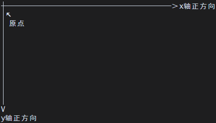

# 老板包制作规范

# 文档信息

1. 更新日期：2026年5月13日
2. 本文档旨在为老板包开发者提供完整的规范化指引与教程，涵盖老板包结构、最佳实践及常见问题。

---

# 文档导航

- [README](../../README-i18n/README-zh-cn.md)
- [API 规范与查询](./API.md)
- [富文本指令](./RICH_TEXT.md)

---

# 目录

- [老板包放置目录](#老板包放置目录)
- [老板包目录结构](#老板包目录结构)
- [老板包配置文件](#老板包配置文件)
  - [目录结构](#目录结构1)
  - [命名空间](#命名空间)
  - [package.json](#packagejson)
  - [game.json](#gamejson)
  - [注册表格式](#注册表格式)
  - [UID](#uid)
- [老板包脚本规范](#老板包脚本规范)
  - [目录结构](#目录结构2)
  - [规范要求](#规范要求)
  - [沙箱限制](#沙箱限制禁用-api)
  - [不建议使用的 API](#不建议使用的-api)
  - [入口脚本规范](#入口脚本规范)
  - [辅助脚本规范](#辅助脚本规范)
- [老板包资源目录](#老板包资源目录)
  - [目录结构](#目录结构3)
  - [语言文件](#语言文件)
  - [其它资源文件](#其它资源文件)
- [其它](#其它)
  - [图标与头图](#图标与头图)
  - [绘制坐标](#绘制坐标)
- [附录](#附录)
  - [默认图标](#默认图标)

---

# 老板包制作注意事项

- **每个老板包仅限实现一个屏保界面**（由配置层面约束）。
- **包与包之间完全独立**：不支持共享依赖，也不允许跨包调用。
- **老板界面仅用于装饰性暂停，不具备任何实际功能，不可替代真正的工作环境。**
- **老板界面帧率锁定为 24 FPS。*

---

# 老板包放置目录

所有老板包文件必须放置在宿主执行目录下的 `data/boss/` 目录中，按命名空间组织。

```text
宿主执行目录/
└─ data/
    └─ boss/
        └─ <namespace>/    -- 命名空间
            └─ *           -- 该老板包的所有文件
```

---

# 老板包目录结构

一个合规的老板包必须遵循以下目录结构，缺少部分内容宿主将无法识别和加载该老板包。

```text
<namespace>/               -- 老板包命名空间/根目录
├─ package.json            -- 老板包信息（名称、作者、版本、入口等）
├─ scripts/                -- 脚本目录
│  ├─ main.lua             -- 脚本入口文件
│  └─ function/            -- 辅助脚本目录
│     └─ *.lua             -- 辅助脚本
└─ assets/                 -- 资源目录
   ├─ lang/                -- 语言资源目录
   │  ├─ en_us.json        -- 英语（美国）
   │  ├─ zh_cn.json        -- 简体中文
   │  └─ *.json            -- 其它语言文件
   └─ *                    -- 其它资源
```

---

# 老板包配置文件

## 目录结构<font style="opacity:0;">1</font>

```text
<namespace>/               -- 老板包命名空间/根目录
└─ package.json            -- 老板包信息
```

## 命名空间

- 老板包根目录为 `<namespace>/`，`<namespace>` 即为该老板包的命名空间。
- 命名空间在全局必须唯一，宿主将优先加载首个遇到的同名命名空间老板包。
- 命名空间仅允许包含以下字符：小写字母 `a-z`、大写字母 `A-Z`、数字 `0-9`、下划线 `_`。

## `package.json`

> 注：
> 
> - `key` 表示语言键，需配合语言文件使用。
> - `image` 表示图片路径，相对于 `assets/` 目录。

该文件用于声明老板包的基本信息，格式如下：

```json
{
  "api": int | Array,               -- 支持的 API 版本范围
  "entry": path,                    -- 入口脚本路径
  "package": string,                -- 包名
  "package_name": string | key,     -- 老板包显示名称
  "boss_name": string | key,        -- 老板界面显示名称
  "author": string | key,           -- 作者
  "version": string,                -- 包版本号
  "introduction": string | key,     -- 老板包简介
  "icon": Array | string | image,   -- 图标
  "banner": Array | string | image  -- 横幅
}
```

**字段说明**

| 字段             | 类型                                                                                                              | 说明                                                                      |
| -------------- | --------------------------------------------------------------------------------------------------------------- | ----------------------------------------------------------------------- |
| `api`          | <font color="#92cddc">Array</font> \| <font color="#92cddc">int</font>                                          | 支持的 API 版本。数组格式 $[min, max]$ 表示支持从 `min` 到 `max` 的版本（含端点）；整数表示仅支持该单一版本。 |
| `entry`        | <font color="#92cddc">path</font>                                                                               | 入口脚本路径，相对于 `scripts/` 目录。                                               |
| `package`      | <font color="#92cddc">string</font>                                                                             | 包名，用于区分不同老板包，包内全局唯一。仅允许字符串。                                             |
| `package_name` | <font color="#92cddc">string</font> \| <font color="#92cddc">key</font>                                         | 老板包显示名称，在老板包列表展示的包名。可填写字符串或语言键。                                         |
| `boss_name`    | <font color="#92cddc">string</font> \| <font color="#92cddc">key</font>                                         | 老板界面展示名称，在老板包设置列表中展示。可填写字符串或语言键。                                        |
| `author`       | <font color="#92cddc">string</font> \| <font color="#92cddc">key</font>                                         | 作者名称。可填写字符串或语言键。                                                        |
| `version`      | <font color="#92cddc">string</font>                                                                             | 老板包版本号，由作者自行定义。推荐格式：主版本号.次版本号。仅允许字符串。                                   |
| `introduction` | <font color="#92cddc">string</font> \| <font color="#92cddc">key</font>                                         | 老板包简介，在老板包列表中展示。可填写字符串或语言键。                                             |
| `icon`         | <font color="#92cddc">Array</font> \| <font color="#92cddc">string</font> \| <font color="#92cddc">image</font> | 图标，在老板包列表中展示。具体要求见『其它-[头图与图标](#图标和头图)』。                                 |
| `banner`       | <font color="#92cddc">Array</font> \| <font color="#92cddc">string</font> \| <font color="#92cddc">image</font> | 横幅，在老板包详情页展示。具体要求见『其它-[头图与图标](#图标和头图)』。                                 |

## UID

UID 是宿主为每个游戏包生成的唯一标识码，用于内部区分不同游戏包，是最终的识别 ID。

**构成格式**：`boss_{编码}`

**编码生成规则**：

1. 将老板包的 `来源（source）`、`命名空间（namespace）`、`包名（package）`、`老板界面显示名称（boss_name）`、`作者（author）`、`入口（entry）` 按特定格式拼接成一个字符串。
2. 对该字符串进行特定运算编码。

上述过程可用以下伪代码表示：
```python
encoding = function(source + namespace + package + boss_name + author + entry)
uid = "boss_" + encoding
```

**稳定性**：只要 `来源`、`命名空间`、`包名`、`游戏名`、`作者`、`入口` 保持不变，生成的 UID 就不会改变。

**符号**：由`0-9` `a-z` `A-Z`组成。

---

# 老板包脚本规范

## 目录结构<font style="opacity:0;">2</font>

```text
<namespace>/               -- 老板包命名空间/根目录
└─ scripts/                -- 脚本目录
   ├─ main.lua             -- 脚本入口文件
   └─ function/            -- 辅助脚本目录
      └─ *.lua             -- 辅助脚本
```

## 规范要求

1. 所有脚本文件必须放在 `scripts/` 目录下，且仅支持 `.lua` 扩展名。
2. 入口脚本建议直接放在 `scripts/` 目录下，由 `package.json` 中的 `entry` 字段指定，可自定义。
3. 辅助脚本必须放在 `scripts/function/` 目录下，用于组织可复用的模块化代码。

## 沙箱限制（禁用 API）

以下 Lua 内置 API 在脚本中**严格禁止使用**，宿主沙箱会阻止其执行：

- `os`库
- `io`库
- `debug`库
- `package`库
- `coroutine`库
- `bit`库
- `debug`库
- `dofile` API
- `loadfile` API
- `loadstring` API

## 不建议使用的 API

为保证游戏性能和宿主稳定性，以下 Lua 内置 API 不建议在脚本中使用，推荐使用宿主提供的替代方案：

| 不建议使用的 API | 推荐替代方案 | 说明 |
| --- | --- | --- |
| `math.random` | 直用式 API `random_*` 系列函数 | 支持可复现的随机序列，更安全可控 |

## 修改行为的 API

以下 Lua 内置 API 的输出重定向至日志文件：

| API      | 修改说明                          |
| -------- | ----------------------------- |
| `print`  | 输出内容写入日志文件，且需要开启调试模式          |
| `assert` | 断言信息写入日志文件，且需要开启调试模式（断言本身不需要） |
| `error`  | 错误信息写入日志文件，且需要开启调试模式（错误本身不需要） |

> 建议使用直用式 API `debug_*` 系列函数。

## 脚本运行规范

脚本中**禁止编写可能引发死循环或脚本卡死的代码**，例如：

```lua
while true do
  -- 无跳出条件的循环
end
```

宿主会对脚本执行**超时保护机制**。当检测到脚本执行时间过长时，将强制中断脚本运行，以保护宿主线程的稳定性。

> 使用直用式 API `updata`，宿主会以帧为单位循环调用该函数，脚本无需自行编写死循环。

## 入口脚本规范

入口脚本必须满足以下要求：

1. **必须实现**以下两个声明式 API：
	- `updata(state)`
	- `render(state)`
2. 其余脚本逻辑（如状态管理、画面绘制、辅助函数调用等）由开发者自行编写，宿主不做额外限制。

## 辅助脚本规范

> 加载脚本使用直用式 API `load_function` 函数。

辅助脚本必须返回一个 Lua 表，表中可包含变量和函数。示例：

### 导出辅助函数和变量

`scripts/function/hello.lua`

```lua
local M = {}

M.name = "Function"

M.sayHello = function() -- 一种函数方式
    debug_log("Hello")
end

function M.sayAny(text) -- 另一种函数方式
    debug_log(text)
end

return M
```

### 在入口脚本中引用

`scripts/main.lua`

```lua
local hello = load_function("hello.lua")   -- 注意：路径相对于 function/ 目录

debug_log(hello.name)      -- 日志输出 "Function"
hello.sayHello()           -- 日志输出 "Hello"
hello.sayAny("tui game")   -- 日志输出 "tui game"
```

> 注：`load_function` 的参数为相对于 `scripts/function/` 的路径

---

# 老板包资源目录

## 目录结构<font style="opacity:0;">3</font>

```text
<namespace>/               -- 老板包命名空间/根目录
└─ assets/                 -- 资源目录
   ├─ lang/                -- 语言资源目录
   │  ├─ en_us.json        -- 英语（美国）
   │  ├─ zh_cn.json        -- 简体中文
   │  └─ *.json            -- 其它语言文件
   └─ *                    -- 其它资源（图片、字体、音频等）
```

## 语言文件

### 文件规范

- 所有语言文件必须存放在 `assets/lang/` 目录下。
- 老板包不对语言需要做强制要求。
- 若需要，语言文件请按照 `{语言代码}.json` 的命名规则创建，确保宿主能够根据用户选择的语言正确加载。宿主支持的语言扩展详见 `LANGUAGE.md`。

### 键值规范

> 注：
> 
> - `#` 表示自定义或可变内容。
> - `[]` 表示字段可重复或扩展。

语言文件采用键值对结构，键可使用点号 `.` 进行语义化分隔，值必须为字符串。字符串中可包含：
- **动态变量**：使用 `{变量名}` 占位符，运行时由脚本传入动态变量替换表。
- **富文本标记**：支持宿主定义的富文本格式（如颜色、样式等），详细语法参见『文档-[富文本指令](./RICH_TEXT.md)』。

**结构示例**：

```json
{
  [#key]: string
}
```

**完整示例**：

```json
{
  "boss.build": "npm run build",
  "boss.command": "> {project-name}@{version} build",       -- 提供变量替换内容
  "boss.success": "{tc:green}✓{tc:clear} built in 500ms" -- 使用可以解析富文本的相关 API
}
```

## 其它资源文件

### 支持的类型

| 类别   | 支持格式                                        | 说明                              |
| ---- | ------------------------------------------- | ------------------------------- |
| 文本文件 | `json`, `yaml`, `toml`, `csv`, `xml`, `txt` | 可通过 `read_*` 系列 API 读取并自动解析     |
| 图像文件 | `png`, `jpg`, `jpeg`                        | 用于 `icon`、`banner` 等字段，支持图片路径引用 |

> 注：其它资源文件可放置在 `assets/` 下的任意子目录中，使用 API 时需提供相对于 `assets/` 的路径。

---

# 其它

## 图标与头图

### 图标

图标用于在老板包列表中展示，显示区域为 **4 行 × 8 列**（终端字符数）。

**支持参数类型**：数组 / 字符串 / 图片

#### 数组

- 传递一个二维数组，最多包含 4 个子数组，每个子数组最多包含 8 个元素。
- **行数处理**：
  - 若子数组不足 4 行，宿主会在上下交替补充空行补齐至 4 行（**先上后下**）。
  - 若子数组超过 4 行，仅保留前 4 行。
- **列数处理**：
  - 若子数组内元素不足 8 个，宿主会在左右交替补充空格补齐至 8 个元素（**先右后左**）。
  - 若子数组内元素超过 8 个，仅保留前 8 个。
- 完成上述填充后，已填写的图标元素会被**居中显示**。
- **推荐写法**：将所有元素长度设置一样，剩余对齐与填充工作交由宿主完成。

#### 字符串

- 传递一个单行字符串，使用 `\n` 表示换行。
- 宿主会根据 `\n` 将字符串拆分为二维数组，后续处理规则与数组一致。
- **不推荐使用**：可读性极差，有时会被误识别为图片路径。

#### 图片

- 格式：使用 `image:` 开头然后填写路径。
- 填写相对于 `assets/` 目录的路径。
- 建议图片比例为 **1:1**（宽 × 高）。
- 宿主会根据图片比例生成一个 1:1 的比例框进行截取，然后将图片符号化。
- 开头可添加 `color:`  参数让图片保留颜色，`color:image:`。
- **不推荐使用**：生成效果通常严重偏离预期，仅作为功能扩展保留。

#### 默认值

- 若该字段不填写或传递空数组，将使用默认图标，见『附录-[默认图标](#默认图标)』。

---

### 头图

头图用于在老板包详情的详细信息展示，显示区域为 **13 行 × 86 列**（终端字符数）。

**支持参数类型**：数组 / 字符串 / 图片

#### 数组

- 传递一个二维数组，最多包含 13 个子数组，每个子数组最多包含 86 个元素。
- **行数处理**：
  - 若子数组不足 13 行，宿主会在上下交替补充空行补齐至 13 行（**先上后下**）。
  - 若子数组超过 13 行，仅保留前 13 行。
- **列数处理**：
  - 若子数组内元素不足 86 个，宿主会在左右交替补充空格补齐至 86 个元素（**先左后右**）。
  - 若子数组内元素超过 86 个，仅保留前 86 个。
- 完成上述填充后，已填写的头图元素会被**居中显示**。
- **推荐写法**：将所有元素长度设置一样，剩余对齐与填充工作交由宿主完成。

#### 字符串

- 传递一个单行字符串，使用 `\n` 表示换行。
- 宿主会根据 `\n` 将字符串拆分为二维数组，后续处理规则与数组一致。
- **不推荐使用**：可读性极差，有时会被误识别为图片路径。

#### 图片

- 格式：使用 `image:` 开头然后填写路径。
- 填写相对于 `assets/` 目录的路径。
- 建议图片比例为 **43:13**（宽 × 高）。
- 宿主会生成一个最大可被 43×13 整除的比例框进行截取，然后将图片符号化。
- 开头可添加 `color:`  参数让图片保留颜色，`color:image:`。
- **不推荐使用**：生成效果通常严重偏离预期，仅作为功能扩展保留。

#### 默认值

- 若该字段不填写或传递空数组，将使用默认头图，见『附录-[默认头图](#默认头图)』。

---

## 绘制坐标

绘制原点位于终端的**左上角**。坐标系定义如下：

- **X 轴**：水平向右为正方向
- **Y 轴**：垂直向下为正方向

示意图如下：



---

# 附录

## 默认图标

**代码**

```json
[
  "████████", 
  "██ ██ ██",
  "   ██   ",
  "  ████  "
]
```

**样图**


## 默认头图

**代码**

```json
[
  "__      __ ___     ___    _  __  ",
  "\ \    / // _ \   | _ \  | |/ /  ",
  " \ \/\/ /| (_) |  |   /  | ' <   ",
  "  \_/\_/  \___/   |_|_\  |_|\_\  ",
  "_|\"\"\"\"\"|_|\"\"\"\"\"|_|\"\"\"\"\"|_|\"\"\"\"\"| ",
  "\"`-0-0-'\"`-0-0-'\"`-0-0-'\"`-0-0-' "
]
```

**样图**
