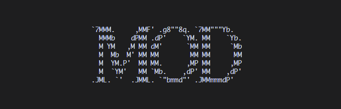

   # 游戏包制作规范

# 文档信息

1. 更新日期：2026年5月13日
2. 本文档旨在为游戏包开发者提供完整的规范化指引与教程，涵盖游戏包结构、最佳实践及常见问题。

---

# 文档导航

- [README](../../README-i18n/README-zh-cn.md)
- [API 规范与查询](./API.md)
- [富文本指令](./RICH_TEXT.md)

---

# 目录

- [游戏包放置目录](#游戏包放置目录)
- [游戏包目录结构](#游戏包目录结构)
- [游戏包配置文件](#游戏包配置文件)
  - [目录结构](#目录结构1)
  - [命名空间](#命名空间)
  - [package.json](#packagejson)
  - [game.json](#gamejson)
  - [注册表格式](#注册表格式)
  - [UID](#uid)
- [游戏包脚本规范](#游戏包脚本规范)
  - [目录结构](#目录结构2)
  - [规范要求](#规范要求)
  - [沙箱限制](#沙箱限制禁用-api)
  - [不建议使用的 API](#不建议使用的-api)
  - [入口脚本规范](#入口脚本规范)
  - [辅助脚本规范](#辅助脚本规范)
- [游戏包资源目录](#游戏包资源目录)
  - [目录结构](#目录结构3)
  - [语言文件](#语言文件)
  - [其它资源文件](#其它资源文件)
- [其它](#其它)
  - [图标与头图](#图标与头图)
  - [绘制坐标](#绘制坐标)
- [附录](#附录)
  - [物理按键语义映射表](#物理按键语义映射表)
  - [默认图标](#默认图标)

---

# 游戏包制作注意事项

- **每个游戏包仅限实现一款游戏**（由配置层面约束）。
- **包与包之间完全独立**：不支持共享依赖，也不允许跨包调用。
- **游戏玩法建议从简设计，单次游玩时长控制在 1–15 分钟为佳**。

---

# 游戏包放置目录

所有游戏包文件必须放置在宿主执行目录下的 `data/mod/` 目录中，按命名空间组织。

```text
宿主执行目录/
└─ data/
    └─ mod/
        └─ <namespace>/    -- 命名空间
            └─ *           -- 该游戏包的所有文件
```

---

# 游戏包目录结构

一个合规的游戏包必须遵循以下目录结构，缺少部分内容宿主将无法识别和加载该游戏包。

```text
<namespace>/               -- 游戏包命名空间/根目录
├─ package.json            -- 游戏包信息（名称、作者、版本等）
├─ game.json               -- 游戏包游戏信息（配置、入口、权限等）
├─ scripts/                -- 脚本目录
│  ├─ main.lua             -- 脚本入口文件
│  └─ function/            -- 辅助脚本目录
│     └─ *.lua             -- 辅助脚本
└─ assets/                 -- 资源目录
   ├─ lang/                -- 语言资源目录
   │  ├─ en_us.json        -- 英语（美国）
   │  ├─ zh_cn.json        -- 简体中文
   │  └─ *.json            -- 其它语言文件
   └─ *                    -- 其它资源
```

---

# 游戏包配置文件

## 目录结构<font style="opacity:0;">1</font>

```text
<namespace>/               -- 游戏包命名空间/根目录
├─ package.json            -- 游戏包信息
└─ game.json               -- 游戏包游戏信息
```

## 命名空间

- 游戏包根目录为 `<namespace>/`，`<namespace>` 即为该游戏包的命名空间。
- 命名空间在全局必须唯一，宿主将优先加载首个遇到的同名命名空间游戏包。
- 命名空间仅允许包含以下字符：小写字母 `a-z`、大写字母 `A-Z`、数字 `0-9`、下划线 `_`。

## `package.json`

> 注：
> 
> - `key` 表示语言键，需配合语言文件使用。
> - `image` 表示图片路径，相对于 `assets/` 目录。

该文件用于声明游戏包的基本信息，格式如下：

```json
{
  "package": string,                -- 包名
  "package_name": string | key,     -- 游戏包显示名称
  "introduction": string | key,     -- 游戏包简介
  "author": string | key,           -- 作者
  "game_name": string | key,        -- 游戏显示名称
  "description": string | key,      -- 游戏简短描述
  "detail": string | key,           -- 游戏详细描述
  "version": string,                -- 包版本号
  "icon": Array | string | image,   -- 图标
  "banner": Array | string | image  -- 横幅
}
```

**字段说明**

| 字段             | 类型                                                                                                              | 说明                                           |
| -------------- | --------------------------------------------------------------------------------------------------------------- | -------------------------------------------- |
| `package`      | <font color="#92cddc">string</font>                                                                             | 包名，用于区分不同游戏包，包内全局唯一。仅允许字符串。                  |
| `package_name` | <font color="#92cddc">string</font> \| <font color="#92cddc">key</font>                                         | 游戏包显示名称，在游戏包列表展示的包名。可填写字符串或语言键。              |
| `introduction` | <font color="#92cddc">string</font> \| <font color="#92cddc">key</font>                                         | 游戏包简介，在游戏包列表中展示。可填写字符串或语言键。                  |
| `author`       | <font color="#92cddc">string</font> \| <font color="#92cddc">key</font>                                         | 作者名称。可填写字符串或语言键。                             |
| `game_name`    | <font color="#92cddc">string</font> \| <font color="#92cddc">key</font>                                         | 游戏展示名称，在游戏列表中展示。可填写字符串或语言键。                  |
| `description`  | <font color="#92cddc">string</font> \| <font color="#92cddc">key</font>                                         | 游戏简短描述，建议一句话概括玩法或目标。可填写字符串或语言键。              |
| `detail`       | <font color="#92cddc">string</font> \| <font color="#92cddc">key</font>                                         | 游戏详细描述，建议包含：游戏目标、核心机制、操作方式、特殊警告等。可填写字符串或语言键。 |
| `version`      | <font color="#92cddc">string</font>                                                                             | 游戏包版本号，由作者自行定义。推荐格式：主版本号.次版本号。仅允许字符串。        |
| `icon`         | <font color="#92cddc">Array</font> \| <font color="#92cddc">string</font> \| <font color="#92cddc">image</font> | 图标，在游戏包列表中展示。具体要求见『其它-[头图与图标](#图标和头图)』。      |
| `banner`       | <font color="#92cddc">Array</font> \| <font color="#92cddc">string</font> \| <font color="#92cddc">image</font> | 横幅，在游戏包详情页展示。具体要求见『其它-[头图与图标](#图标和头图)』。      |

## `game.json`

> 注：
> 
> - `key` 表示语言键。
> - `path` 表示脚本路径，相对于 `scripts/` 目录。
> - `低资源运行模式`：帧率限制为 10 FPS。

该文件用于声明游戏的核心配置，格式如下：

```json
{
  "api": Array | int,                -- 支持的 API 版本范围
  "entry": path,                     -- 入口脚本路径
  "save": boolean,                   -- 是否支持存档
  "best_none": string | key | null,  -- 最佳记录占位文本（null 表示禁用）
  "min_width": int,                  -- 最小终端宽度（终端字符列数）
  "min_height": int,                 -- 最小终端高度（终端字符行数）
  "write": boolean,                  -- 是否请求直写权限
  "case_sensitive": boolean,         -- 按键是否区分大小写
  "actions": object,                 -- 按键动作注册表
  "runtime": {
    "target_fps": int                -- 目标帧率
    "afk_time": int,                 -- 低资源运行时间阈值
  }
}
```

**字段说明**

| 字段                   | 类型                                                                                                           | 说明                                                                                                                  |
| -------------------- | ------------------------------------------------------------------------------------------------------------ | ------------------------------------------------------------------------------------------------------------------- |
| `api`                | <font color="#92cddc">Array</font> \| <font color="#92cddc">int</font>                                       | 支持的 API 版本。数组格式 $[min, max]$ 表示支持从 `min` 到 `max` 的版本（含端点）；整数表示仅支持该单一版本。                                             |
| `entry`              | <font color="#92cddc">path</font>                                                                            | 入口脚本路径，相对于 `scripts/` 目录。                                                                                           |
| `save`               | <font color="#92cddc">boolean</font>                                                                         | 是否支持存档。`true` 则需要实现声明式 API `save_game(state)`；`false` 则忽略相关调用。                                                      |
| `best_none`          | <font color="#92cddc">string</font> \| <font color="#92cddc">key</font> \| <font color="#92cddc">null</font> | 无最佳记录时显示的文本。若不为 `null`，需要实现声明式 API `save_best_score(state)`；若为 `null` 则忽略相关调用。                                      |
| `min_width`          | <font color="#92cddc">int</font>                                                                             | 游戏所需的最小终端宽度（终端字符列数）。终端尺寸不足时会显示提示。值≦0为无限制。                                                                           |
| `min_height`         | <font color="#92cddc">int</font>                                                                             | 游戏所需的最小终端高度（终端字符行数）。终端尺寸不足时会显示提示。值≦0为无限制。                                                                           |
| `write`              | <font color="#92cddc">boolean</font>                                                                         | 是否请求直写权限。`true` 表示游戏包需要文件写入权限，加载时会向用户申请；`false` 表示不需要权限，所有直写请求将被宿主忽略。<font color="red">直写操作为高风险操作，请最大程度避免使用！</font> |
| `case_sensitive`     | <font color="#92cddc">boolean</font>                                                                         | 按键是否区分大小写。`true` 表示字母按键区分大小写；`false` 表示字母按键不区分大小写。                                                                  |
| `actions`            | <font color="#92cddc">object</font>                                                                          | 按键动作注册表，格式见『游戏包配置文件-[注册表格式](#注册表格式)』。宿主会将物理按键映射为语义化动作。填写空对象代表不注册任何按键。                                               |
| `runtime`            | <font color="#92cddc">object</font>                                                                          | 运行时设置。                                                                                                              |
| `runtime.target_fps` | <font color="#92cddc">int</font>                                                                             | 目标帧率，支持 `30`、`60`、`120`。其它值将被忽略并回退为 `60`。实际帧率受机器性能影响，该值为上限。                                                         |
| `runtime.afk_time`   | <font color="#92cddc">int</font>                                                                             | 低资源运行时间阈值。填写正整数，单位为秒。值为 0 则表示永不进入低资源运行模式。                                                                           |

## 注册表格式

> 注：
> 
> - `#` 表示自定义或可变内容。
> - `[]` 表示字段可重复或扩展。
> - `key` 表示按键映射名，具体按键映射见『附录-[物理按键语义映射表](#物理按键语义映射表)』。

```json
"actions": {
  [#action]: {                -- 动作
    "key": Array | string,    -- 原始物理按键
    "key_name": string | key  -- 动作含义
  }
}
```

**示例**：

```json
"actions": {
  "jump": {
    "key": "space",
    "key_name": "跳跃"
  },
  "move": {
    "key": ["up", "down", "left", "right"],
    "key_name": "game.move"
  }
}
```

> 每个动作可绑定单个按键或最多 5 个按键。宿主会将按键事件转换为动作事件，通过 `handle_event` 传递给脚本（事件类型 `action`）。

## UID

UID 是宿主为每个游戏包生成的唯一标识码，用于内部区分不同游戏包，是最终的识别 ID。

**构成格式**：`mod_game_{编码}`

**编码生成规则**：

1. 将游戏包的 `来源（source）`、`命名空间（namespace）`、`包名（package）`、`游戏名（game_name）`、`作者（author）`、`入口（entry）` 按特定格式拼接成一个字符串。
2. 对该字符串进行特定运算编码。

上述过程可用以下伪代码表示：
```python
encoding = function(source + namespace + package + game_name + author + entry)
uid = "mod_game_" + encoding
```

**稳定性**：只要 `来源`、`命名空间`、`包名`、`游戏名`、`作者`、`入口` 保持不变，生成的 UID 就不会改变。

**符号**：由`0-9` `a-z` `A-Z`组成。

---

# 游戏包脚本规范

## 目录结构<font style="opacity:0;">2</font>

```text
<namespace>/               -- 游戏包命名空间/根目录
└─ scripts/                -- 脚本目录
   ├─ main.lua             -- 脚本入口文件
   └─ function/            -- 辅助脚本目录
      └─ *.lua             -- 辅助脚本
```

## 规范要求

1. 所有脚本文件必须放在 `scripts/` 目录下，且仅支持 `.lua` 扩展名。
2. 入口脚本建议直接放在 `scripts/` 目录下，由 `package.json` 中的 `entry` 字段指定，可自定义。
3. 辅助脚本必须放在 `scripts/function/` 目录下，用于组织可复用的模块化代码。

## 沙箱限制（禁用 API）

以下 Lua 内置 API 在脚本中**严格禁止使用**，宿主沙箱会阻止其执行：

- `os`库
- `io`库
- `debug`库
- `package`库
- `coroutine`库
- `bit`库
- `debug`库
- `dofile` API
- `loadfile` API
- `loadstring` API

## 不建议使用的 API

为保证游戏性能和宿主稳定性，以下 Lua 内置 API 不建议在脚本中使用，推荐使用宿主提供的替代方案：

| 不建议使用的 API | 推荐替代方案 | 说明 |
| --- | --- | --- |
| `math.random` | 直用式 API `random_*` 系列函数 | 支持可复现的随机序列，更安全可控 |

## 修改行为的 API

以下 Lua 内置 API 的输出重定向至日志文件：

| API      | 修改说明                          |
| -------- | ----------------------------- |
| `print`  | 输出内容写入日志文件，且需要开启调试模式          |
| `assert` | 断言信息写入日志文件，且需要开启调试模式（断言本身不需要） |
| `error`  | 错误信息写入日志文件，且需要开启调试模式（错误本身不需要） |

> 建议使用直用式 API `debug_*` 系列函数。

## 脚本运行规范

脚本中**禁止编写可能引发死循环或脚本卡死的代码**，例如：

```lua
while true do
  -- 无跳出条件的循环
end
```

宿主会对脚本执行**超时保护机制**。当检测到脚本执行时间过长时，将强制中断脚本运行，以保护宿主线程的稳定性。

> 使用直用式 API `handle_event`，宿主会以帧为单位循环调用该函数，脚本无需自行编写死循环。

## 入口脚本规范

入口脚本必须满足以下要求：

1. **必须实现**以下四个声明式 API：
	- `init_game(state)`
	- `handle_event(state, event)`
	- `render(state)`
	- `exit_game(state)`
2. **按需实现**以下两个声明式 API：
	- `save_best_score(state)`
	- `save_game(state)`
3. **至少存在一条可执行路径**能够调用直用式 API `request_exit()`，以确保游戏能够正常退出。
4. 其余游戏逻辑（如状态管理、事件响应、画面绘制、辅助函数调用等）由开发者自行编写，宿主不做额外限制。

## 辅助脚本规范

辅助脚本必须返回一个 Lua 表，表中可包含变量和函数。示例：

### 导出辅助函数和变量

`scripts/function/hello.lua`

```lua
local M = {}

M.name = "Function"

M.sayHello = function() -- 一种函数方式
    debug_log("Hello")
end

function M.sayAny(text) -- 另一种函数方式
    debug_log(text)
end

return M
```

### 在入口脚本中引用

`scripts/main.lua`

```lua
local hello = load_function("hello.lua")   -- 注意：路径相对于 function/ 目录

debug_log(hello.name)      -- 日志输出 "Function"
hello.sayHello()           -- 日志输出 "Hello"
hello.sayAny("tui game")   -- 日志输出 "tui game"
```

> 注：`load_function` 的参数为相对于 `scripts/function/` 的路径

---

# 游戏包资源目录

## 目录结构<font style="opacity:0;">3</font>

```text
<namespace>/               -- 游戏包命名空间/根目录
└─ assets/                 -- 资源目录
   ├─ lang/                -- 语言资源目录
   │  ├─ en_us.json        -- 英语（美国）
   │  ├─ zh_cn.json        -- 简体中文
   │  └─ *.json            -- 其它语言文件
   └─ *                    -- 其它资源（图片、字体、音频等）
```

## 语言文件

### 文件规范

- 所有语言文件必须存放在 `assets/lang/` 目录下。
- **`en_us.json` 必须提供**，作为默认回退语言。当宿主请求的语言游戏包未实现时，会自动使用 `en_us.json` 中的对应键值；若该键在 `en_us.json` 中也不存在，则返回  \[missing-i18n-key: `key` ]。
- **`zh_cn.json` 建议提供**（软规范）。由于仓库作者来自中文社区，提供简体中文支持有助于本地化体验，但非强制。
- 其它语言文件请按照 `{语言代码}.json` 的命名规则创建，确保宿主能够根据用户选择的语言正确加载。宿主支持的语言扩展详见 `LANGUAGE.md`。

### 键值规范

> 注：
> 
> - `#` 表示自定义或可变内容。
> - `[]` 表示字段可重复或扩展。

语言文件采用键值对结构，键可使用点号 `.` 进行语义化分隔，值必须为字符串。字符串中可包含：
- **动态变量**：使用 `{变量名}` 占位符，运行时由脚本传入实际值。
- **富文本标记**：支持宿主定义的富文本格式（如颜色、样式等），详细语法参见『文档-[富文本指令](./RICH_TEXT.md)』。

**结构示例**：

```json
{
  [#key]: string
}
```

**完整示例**：

```json
{
  "game.title": "推箱子",
  "game.score": "当前得分：{score}",
  "game.hint": "{tc:green}按 R 键重新开始{tc:clear}"
}
```

## 其它资源文件

### 支持的类型

| 类别    | 支持格式                                        | 说明                                |
| ----- | ------------------------------------------- | --------------------------------- |
| 文本文件  | `json`, `yaml`, `toml`, `csv`, `xml`, `txt` | 可通过 `read_*` 系列 API 读取并自动解析       |
| 图像文件  | `png`, `jpg`, `jpeg`                        | 用于 `icon`、`banner` 等字段，支持图片路径引用   |

> 注：其它资源文件可放置在 `assets/` 下的任意子目录中，使用 API 时需提供相对于 `assets/` 的路径。

---

# 其它

## 图标与头图

### 图标

图标用于在游戏包列表中展示，显示区域为 **4 行 × 8 列**（终端字符数）。

**支持参数类型**：数组 / 字符串 / 图片

#### 数组

- 传递一个二维数组，最多包含 4 个子数组，每个子数组最多包含 8 个元素。
- **行数处理**：
  - 若子数组不足 4 行，宿主会在上下交替补充空行补齐至 4 行（**先上后下**）。
  - 若子数组超过 4 行，仅保留前 4 行。
- **列数处理**：
  - 若子数组内元素不足 8 个，宿主会在左右交替补充空格补齐至 8 个元素（**先右后左**）。
  - 若子数组内元素超过 8 个，仅保留前 8 个。
- 完成上述填充后，已填写的图标元素会被**居中显示**。
- **推荐写法**：将所有元素长度设置一样，剩余对齐与填充工作交由宿主完成。

#### 字符串

- 传递一个单行字符串，使用 `\n` 表示换行。
- 宿主会根据 `\n` 将字符串拆分为二维数组，后续处理规则与数组一致。
- **不推荐使用**：可读性极差，有时会被误识别为图片路径。

#### 图片

- 格式：使用 `image:` 开头然后填写路径。
- 填写相对于 `assets/` 目录的路径。
- 建议图片比例为 **1:1**（宽 × 高）。
- 宿主会根据图片比例生成一个 1:1 的比例框进行截取，然后将图片符号化。
- 开头可添加 `color:`  参数让图片保留颜色，`color:image:`。
- **不推荐使用**：生成效果通常严重偏离预期，仅作为功能扩展保留。

#### 默认值

- 若该字段不填写或传递空数组，将使用默认图标，见『附录-[默认图标](#默认图标)』。

---

### 头图

头图用于在游戏包详情的详细信息展示，显示区域为 **13 行 × 86 列**（终端字符数）。

**支持参数类型**：数组 / 字符串 / 图片

#### 数组

- 传递一个二维数组，最多包含 13 个子数组，每个子数组最多包含 86 个元素。
- **行数处理**：
  - 若子数组不足 13 行，宿主会在上下交替补充空行补齐至 13 行（**先上后下**）。
  - 若子数组超过 13 行，仅保留前 13 行。
- **列数处理**：
  - 若子数组内元素不足 86 个，宿主会在左右交替补充空格补齐至 86 个元素（**先左后右**）。
  - 若子数组内元素超过 86 个，仅保留前 86 个。
- 完成上述填充后，已填写的头图元素会被**居中显示**。
- **推荐写法**：将所有元素长度设置一样，剩余对齐与填充工作交由宿主完成。

#### 字符串

- 传递一个单行字符串，使用 `\n` 表示换行。
- 宿主会根据 `\n` 将字符串拆分为二维数组，后续处理规则与数组一致。
- **不推荐使用**：可读性极差，有时会被误识别为图片路径。

#### 图片

- 格式：使用 `image:` 开头然后填写路径。
- 填写相对于 `assets/` 目录的路径。
- 建议图片比例为 **43:13**（宽 × 高）。
- 宿主会生成一个最大可被 43×13 整除的比例框进行截取，然后将图片符号化。
- 开头可添加 `color:`  参数让图片保留颜色，`color:image:`。
- **不推荐使用**：生成效果通常严重偏离预期，仅作为功能扩展保留。

#### 默认值

- 若该字段不填写或传递空数组，将使用默认头图，见『附录-[默认头图](#默认头图)』。

---

## 绘制坐标

绘制原点位于终端的**左上角**。坐标系定义如下：

- **X 轴**：水平向右为正方向
- **Y 轴**：垂直向下为正方向

示意图如下：


---

# 附录

## 物理按键语义映射表

> 键盘监听基于 `crossterm` 与 `rdev` 两库联合实现，尽可能覆盖绝大多数按键的检测。为确保兼容性，建议优先使用显式声明的键位，避免因特殊键无法匹配而导致输入失效。
>
> 按键监听**不支持组合键**（如 `Ctrl+C`、`Shift+A` 等）。所有与 `Shift` 键组合的输入，其语义仍会被解析为对应的单键（例如 `Shift + A` 映射为 `A`）。

### 字母键（小写）
| 物理按键      | 返回值       | 展示表（忽略大小写） | 展示表（区分大小写） |
| --------- | --------- | ---------- | ---------- |
| `A` ~ `Z` | `a` ~ `z` | `A` ~ `Z`  | `a` ~ `z`  |

### 字母键（大写）
| 物理按键                | 返回值       | 展示表       |
| ------------------- | --------- | --------- |
| `Shift` + `A` ~ `Z` | `A` ~ `Z` | `A` ~ `Z` |

### 数字键（主键盘）
| 物理按键      | 返回值       | 展示表       |
| --------- | --------- | --------- |
| `0` ~ `9` | `0` ~ `9` | `0` ~ `9` |

### 数字键（Shift 组合 / 符号上档）
| 物理按键          | 返回值 | 展示表 |
| ------------- | --- | --- |
| `Shift` + `1` | `!` | `!` |
| `Shift` + `2` | `@` | `@` |
| `Shift` + `3` | `#` | `#` |
| `Shift` + `4` | `$` | `$` |
| `Shift` + `5` | `%` | `%` |
| `Shift` + `6` | `^` | `^` |
| `Shift` + `7` | `&` | `&` |
| `Shift` + `8` | `*` | `*` |
| `Shift` + `9` | `(` | `(` |
| `Shift` + `0` | `)` | `)` |

### 符号键（无 Shift）
| 物理按键      | 返回值       | 展示表       |
| --------- | --------- | --------- |
| ``` ` ``` | ``` ` ``` | ``` ` ``` |
| `-`       | `-`       | `-`       |
| `=`       | `=`       | `=`       |
| `[`       | `[`       | `[`       |
| `]`       | `]`       | `]`       |
| `\`       | `\`       | `\`       |
| `;`       | `;`       | `;`       |
| `'`       | `'`       | `'`       |
| `,`       | `,`       | `,`       |
| `.`       | `.`       | `.`       |
| `/`       | `/`       | `/`       |

### 符号键（Shift 组合）
| 物理按键                | 返回值 | 展示表 |
| ------------------- | --- | --- |
| `Shift` + ``` ` ``` | `~` | `~` |
| `Shift` + `-`       | `_` | `_` |
| `Shift` + `=`       | `+` | `+` |
| `Shift` + `[`       | `{` | `{` |
| `Shift` + `]`       | `}` | `}` |
| `Shift` + `\`       | `\` | `\` |
| `Shift` + `;`       | `:` | `:` |
| `Shift` + `'`       | `"` | `"` |
| `Shift` + `,`       | `<` | `<` |
| `Shift` + `.`       | `>` | `>` |
| `Shift` + `/`       | `?` | `?` |

### 功能键（F1 ~ F12）
| 物理按键         | 返回值          | 展示表          |
| ------------ | ------------ | ------------ |
| `F1` ~ `F12` | `f1` ~ `f12` | `F1` ~ `F12` |

### 导航键
| 物理按键       | 返回值        | 展示表    |
| ---------- | ---------- | ------ |
| `↑`        | `up`       | `↑`    |
| `↓`        | `down`     | `↓`    |
| `←`        | `left`     | `←`    |
| `→`        | `right`    | `→`    |
| `Home`     | `home`     | `Home` |
| `End`      | `end`      | `End`  |
| `PageUp`   | `pageup`   | `PgUp` |
| `PageDown` | `pagedown` | `PgDn` |

### 编辑键
| 物理按键            | 返回值         | 展示表     |
| --------------- | ----------- | ------- |
| `Enter`         | `enter`     | `Enter` |
| `Backspace`     | `backspace` | `Bksp`  |
| `Delete`        | `del`       | `Del`   |
| `Insert`        | `ins`       | `Ins`   |
| `Tab`           | `tab`       | `Tab`   |
| `Shift` + `Tab` | `back_tab`  | `BTab`  |
| `Space`         | `space`     | `Space` |

### 修饰键
| 物理按键                 | 返回值           | 展示表      |
| -------------------- | ------------- | -------- |
| `左 Ctrl`             | `left_ctrl`   | `LCtrl`  |
| `右 Ctrl`             | `right_ctrl`  | `RCtrl`  |
| `左 Shift`            | `left_shift`  | `LShift` |
| `右 Shift`            | `right_shift` | `RShift` |
| `左 Alt`              | `left_alt`    | `LAlt`   |
| `右 Alt`              | `right_alt`   | `RAlt`   |
| `左 Meta` (Win / Cmd) | `left_meta`   | `LMeta`  |
| `右 Meta` (Win / Cmd) | `right_meta`  | `RMeta`  |

### 锁定键
| 物理按键         | 返回值          | 展示表    |
| ------------ | ------------ | ------ |
| `CapsLock`   | `capslock`   | `Caps` |
| `NumLock`    | `numlock`    | `Num`  |
| `ScrollLock` | `scrolllock` | `Scrl` |

### 系统功能键
| 物理按键          | 返回值           | 展示表     |
| ------------- | ------------- | ------- |
| `Esc`         | `esc`         | `Esc`   |
| `PrintScreen` | `printscreen` | `Prtsc` |
| `Pause`       | `pause`       | `Pause` |
| `Menu`        | `menu`        | `Menu`  |

### 小键盘
| 物理按键          | 返回值       | 展示表       |
| ------------- | --------- | --------- |
| 小键盘 `0` ~ `9` | `0` ~ `9` | `0` ~ `9` |
| 小键盘 `+`       | `+`       | `+`       |
| 小键盘 `-`       | `-`       | `-`       |
| 小键盘 `*`       | `*`       | `*`       |
| 小键盘 `/`       | `/`       | `/`       |
| 小键盘 `Del`     | `del`     | `Del`     |
| 小键盘 `Enter`   | `enter`   | `Enter`   |

### 未知键

> 注：该部分作为最后的未知键处理，但并非所有未知键都可以被捕获。

| 物理按键    | 返回值        | 展示表 |
| ------- | ---------- | --- |
| 无法识别的按键 | `key(扫描码)` | 不固定 |

---

## 默认图标

**代码**

```json
[
  "████████", 
  "██ ██ ██",
  "   ██   ",
  "  ████  "
]
```

**样图**


## 默认头图

**代码**

```json
[
  "`7MMM.     ,MMF' .g8\"\"8q. `7MM\"\"\"Yb.   ",
  "  MMMb    dPMM .dP'    `YM. MM    `Yb. ",
  "  M YM   ,M MM dM'      `MM MM     `Mb ",
  "  M  Mb  M' MM MM        MM MM      MM ",
  "  M  YM.P'  MM MM.      ,MP MM     ,MP ",
  "  M  `YM'   MM `Mb.    ,dP' MM    ,dP' ",
  ".JML. `'  .JMML. `\"bmmd\"' .JMMmmmdP'   ",
]
```

**样图**
