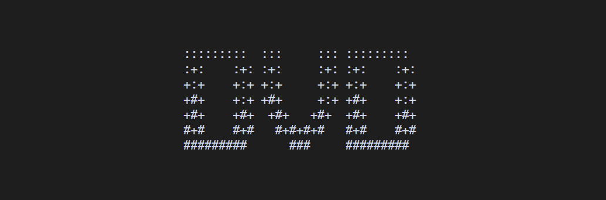

# 屏保包制作规范

# 文档信息

1. 更新日期：2026年5月13日
2. 本文档旨在为屏保包开发者提供完整的规范化指引与教程，涵盖屏保包结构、最佳实践及常见问题。

---

# 文档导航

- [README](../../README-i18n/README-zh-cn.md)
- [API 规范与查询](./API.md)
- [富文本指令](./RICH_TEXT.md)

---

# 目录

- [屏保包放置目录](#屏保包放置目录)
- [屏保包目录结构](#屏保包目录结构)
- [屏保包配置文件](#屏保包配置文件)
  - [目录结构](#目录结构1)
  - [命名空间](#命名空间)
  - [package.json](#packagejson)
  - [game.json](#gamejson)
  - [注册表格式](#注册表格式)
  - [UID](#uid)
- [屏保包脚本规范](#屏保包脚本规范)
  - [目录结构](#目录结构2)
  - [规范要求](#规范要求)
  - [沙箱限制](#沙箱限制禁用-api)
  - [不建议使用的 API](#不建议使用的-api)
  - [入口脚本规范](#入口脚本规范)
  - [辅助脚本规范](#辅助脚本规范)
- [屏保包资源目录](#屏保包资源目录)
  - [目录结构](#目录结构3)
  - [语言文件](#语言文件)
  - [其它资源文件](#其它资源文件)
- [其它](#其它)
  - [图标与头图](#图标与头图)
  - [绘制坐标](#绘制坐标)
- [附录](#附录)
  - [默认图标](#默认图标)

---

# 屏保包制作注意事项

- **每个屏保包仅限实现一个屏保界面**（由配置层面约束）。
- **包与包之间完全独立**：不支持共享依赖，也不允许跨包调用。
- **屏保界面仅用于装饰性暂停，不具备任何实际功能。**
- **屏保界面帧率锁定为 24 FPS。**

---
# 屏保包放置目录

所有 屏保包文件必须放置在宿主执行目录下的 `data/mod/screensaver/` 目录中，按命名空间组织。

```text
宿主执行目录/
└─ data/
   └─ mod/
      └─ screensaver/
         └─ <namespace>/    -- 命名空间
            └─ *            -- 该 屏保包的所有文件
```

---

# 屏保包目录结构

一个合规的屏保包必须遵循以下目录结构，缺少部分内容宿主将无法识别和加载该 屏保包。

```text
screensaver_package/
├─ package.json
├─ display.json
├─ screensaver.json
├─ scripts/main.lua
└─ assets/language/<code>/package.json
```

---

# 屏保包配置文件

当前宿主使用 schema 2 分文件格式。完整字段、默认值、i18n 和资源规则见[屏保包 schema 2](PACKAAGE_SCREENSAVER.md)。旧版单文件示例不再是有效包格式。

```text
screensaver_package/
├─ package.json
├─ display.json
├─ screensaver.json
├─ scripts/main.lua
└─ assets/language/<code>/package.json
```

# 屏保包脚本规范

## 目录结构<font style="opacity:0;">2</font>

```text
<namespace>/               -- 屏保包命名空间/根目录
└─ scripts/                -- 脚本目录
   ├─ main.lua             -- 脚本入口文件
   └─ function/            -- 辅助脚本目录
      └─ *.lua             -- 辅助脚本
```

## 规范要求

1. 所有脚本文件必须放在 `scripts/` 目录下，且仅支持 `.lua` 扩展名。
2. 入口脚本建议直接放在 `scripts/` 目录下，由 `screensaver.json` 中的 `entry` 字段指定，可自定义。
3. 辅助脚本必须放在 `scripts/function/` 目录下，用于组织可复用的模块化代码。

## 沙箱限制（禁用 API）

以下 Lua 内置 API 在脚本中**严格禁止使用**，宿主沙箱会阻止其执行：

- `os`库
- `io`库
- `debug`库
- `package`库
- `coroutine`库
- `bit`库
- `debug`库
- `dofile` API
- `loadfile` API
- `loadstring` API

## 不建议使用的 API

为保证游戏性能和宿主稳定性，以下 Lua 内置 API 不建议在脚本中使用，推荐使用宿主提供的替代方案：

| 不建议使用的 API | 推荐替代方案 | 说明 |
| --- | --- | --- |
| `math.random` | 直用式 API `random_*` 系列函数 | 支持可复现的随机序列，更安全可控 |

## 修改行为的 API

`print`、`warn` 和 `collectgarbage` 当前会返回明确的“暂未支持”错误。`assert` 与 `error` 保持 Lua 标准语义，错误由宿主记录到 Lua 日志。

## 脚本运行规范

脚本中**禁止编写可能引发死循环或脚本卡死的代码**，例如：

```lua
while true do
  -- 无跳出条件的循环
end
```

宿主会对脚本执行**超时保护机制**。当检测到脚本执行时间过长时，将强制中断脚本运行，以保护宿主线程的稳定性。

> 宿主会以固定步长调用 `Update`，脚本无需自行编写死循环。

## 入口脚本规范

当前 Lua Runtime 要求屏保入口实现 `Init(ctx)`、`HandleEvent(event)`、`Update(dt)`、`UpdateFrame(dt, alpha)`、`Render()`。

屏保不注册保存或主动退出能力。屏保激活时，键盘动作和鼠标输入只供宿主全局按键处理，不会进入游戏或屏保 Session；窗口大小和聚焦变化会同时投递给两者。完整协议详见 [Lua Runtime 协议](LUA_RUNTIME.md)。

当前阶段不支持 `require`、`load_function`、辅助 Lua 文件、绘制函数、存储 API、资源 API、音频、动画或 Lua 异步 API。

---

# 屏保包资源目录

## 目录结构<font style="opacity:0;">3</font>

```text
<namespace>/               -- 屏保包命名空间/根目录
└─ assets/                 -- 资源目录
   ├─ lang/                -- 语言资源目录
   │  ├─ en_us.json        -- 英语（美国）
   │  ├─ zh_cn.json        -- 简体中文
   │  └─ *.json            -- 其它语言文件
   └─ *                    -- 其它资源（图片、字体、音频等）
```

## 语言文件

### 文件规范

- 所有语言文件必须存放在 `assets/lang/` 目录下。
- 屏保包不对语言需要做强制要求。
- 若需要，语言文件请按照 `{语言代码}.json` 的命名规则创建，确保宿主能够根据用户选择的语言正确加载。宿主支持的语言扩展详见 `LANGUAGE.md`。

### 键值规范

> 注：
> 
> - `#` 表示自定义或可变内容。
> - `[]` 表示字段可重复或扩展。

语言文件采用键值对结构，键可使用点号 `.` 进行语义化分隔，值必须为字符串。字符串中可包含：
- **动态变量**：使用 `{变量名}` 占位符，运行时由脚本传入动态变量替换表。
- **富文本标记**：支持宿主定义的富文本格式（如颜色、样式等），详细语法参见『文档-[富文本指令](./RICH_TEXT.md)』。

**结构示例**：

```json
{
  [#key]: string
}
```

**完整示例**：

```json
{
  "screensaver.title": "DVD",
  "screensaver.collision": "碰撞次数：{times}",                  -- 提供score替换内容
  "screensaver.exit": "f%<fg:green>按 {key:exit} 键返回</fg>" -- 使用可以解析富文本的相关 API
}
```

## 其它资源文件

### 支持的类型

| 类别   | 支持格式                                        | 说明                              |
| ---- | ------------------------------------------- | ------------------------------- |
| 文本文件 | `json`, `yaml`, `toml`, `csv`, `xml`, `txt` | 可通过 `read_*` 系列 API 读取并自动解析     |
| 图像文件 | `png`, `jpg`, `jpeg`                        | 用于 `icon`、`banner` 等字段，支持图片路径引用 |

> 注：其它资源文件可放置在 `assets/` 下的任意子目录中，使用 API 时需提供相对于 `assets/` 的路径。

---

# 其它

## 图标与头图

### 图标

图标用于在屏保包列表中展示，显示区域为 **4 行 × 8 列**（终端字符数）。

**支持参数类型**：数组 / 字符串 / 图片

#### 数组

- 传递一个二维数组，最多包含 4 个子数组，每个子数组最多包含 8 个元素。
- **行数处理**：
  - 若子数组不足 4 行，宿主会在上下交替补充空行补齐至 4 行（**先上后下**）。
  - 若子数组超过 4 行，仅保留前 4 行。
- **列数处理**：
  - 若子数组内元素不足 8 个，宿主会在左右交替补充空格补齐至 8 个元素（**先右后左**）。
  - 若子数组内元素超过 8 个，仅保留前 8 个。
- 完成上述填充后，已填写的图标元素会被**居中显示**。
- **推荐写法**：将所有元素长度设置一样，剩余对齐与填充工作交由宿主完成。

#### 字符串

- 传递一个单行字符串，使用 `\n` 表示换行。
- 宿主会根据 `\n` 将字符串拆分为二维数组，后续处理规则与数组一致。
- **不推荐使用**：可读性极差，有时会被误识别为图片路径。

#### 图片

- 格式：使用 `image:` 开头然后填写路径。
- 填写相对于 `assets/` 目录的路径。
- 建议图片比例为 **1:1**（宽 × 高）。
- 宿主会根据图片比例生成一个 1:1 的比例框进行截取，然后将图片符号化。
- 开头可添加 `color:`  参数让图片保留颜色，`color:image:`。
- **不推荐使用**：生成效果通常严重偏离预期，仅作为功能扩展保留。

#### 默认值

- 若该字段不填写或传递空数组，将使用默认图标，见『附录-[默认图标](#默认图标)』。

---

### 头图

头图用于在屏保包详情的详细信息展示，显示区域为 **13 行 × 86 列**（终端字符数）。

**支持参数类型**：数组 / 字符串 / 图片

#### 数组

- 传递一个二维数组，最多包含 13 个子数组，每个子数组最多包含 86 个元素。
- **行数处理**：
  - 若子数组不足 13 行，宿主会在上下交替补充空行补齐至 13 行（**先上后下**）。
  - 若子数组超过 13 行，仅保留前 13 行。
- **列数处理**：
  - 若子数组内元素不足 86 个，宿主会在左右交替补充空格补齐至 86 个元素（**先左后右**）。
  - 若子数组内元素超过 86 个，仅保留前 86 个。
- 完成上述填充后，已填写的头图元素会被**居中显示**。
- **推荐写法**：将所有元素长度设置一样，剩余对齐与填充工作交由宿主完成。

#### 字符串

- 传递一个单行字符串，使用 `\n` 表示换行。
- 宿主会根据 `\n` 将字符串拆分为二维数组，后续处理规则与数组一致。
- **不推荐使用**：可读性极差，有时会被误识别为图片路径。

#### 图片

- 格式：使用 `image:` 开头然后填写路径。
- 填写相对于 `assets/` 目录的路径。
- 建议图片比例为 **43:13**（宽 × 高）。
- 宿主会生成一个最大可被 43×13 整除的比例框进行截取，然后将图片符号化。
- 开头可添加 `color:`  参数让图片保留颜色，`color:image:`。
- **不推荐使用**：生成效果通常严重偏离预期，仅作为功能扩展保留。

#### 默认值

- 若该字段不填写或传递空数组，将使用默认头图，见『附录-[默认头图](#默认头图)』。

---

## 绘制坐标

绘制原点位于终端的**左上角**。坐标系定义如下：

- **X 轴**：水平向右为正方向
- **Y 轴**：垂直向下为正方向

示意图如下：


---

# 附录

## 默认图标

**代码**

```json
[
  "████████", 
  "██ ██ ██",
  "   ██   ",
  "  ████  "
]
```

**样图**


## 默认头图

**代码**

```json
[
  ":::::::::  :::     ::: ::::::::: ",
  ":+:    :+: :+:     :+: :+:    :+:",
  "+:+    +:+ +:+     +:+ +:+    +:+",
  "+#+    +:+ +#+     +:+ +#+    +:+",
  "+#+    +#+  +#+   +#+  +#+    +#+",
  "#+#    #+#   #+#+#+#   #+#    #+#",
  "#########      ###     ######### "
]
```

**样图**

