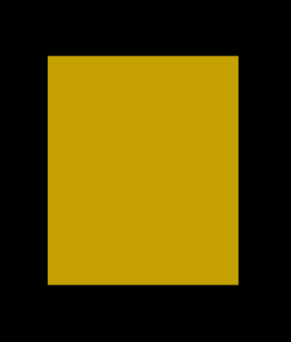
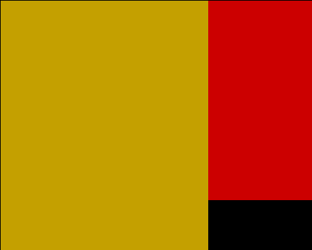

# slice 库

## 基本库说明

`slice` 提供图层切片对象管理。

---

## 目录

| 方法名           | 说明                     | 索引                              |
| ---------------- | ------------------------ | --------------------------------- |
| `create`         | 创建一个图层切片对象     | [create](#create)                 |
| `delete`         | 删除指定图层切片         | [delete](#delete)                 |
| `clear`          | 删除所有图层切片         | [clear](#clear)                   |
| `list`           | 获取所有图层切片信息     | [list](#list)                     |
| `count`          | 返回当前图层切片的总数   | [count](#count)                   |
| `draw`           | 绘制图层切片             | [draw](#draw)                     |
| `set`            | 修改生成器的参数         | [set](#set)                       |
| `set_size`       | 修改图层切片的宽度和高度 | [set_size](#set_size)             |
| `set_width`      | 修改图层切片的宽度       | [set_width](#set_width)           |
| `set_height`     | 修改图层切片的高度       | [set_height](#set_height)         |
| `set_layer`      | 修改图层切片的图层层级   | [set_layer](#set_layer)           |
| `set_background` | 修改图层切片的背景颜色   | [set_background](#set_background) |
| `get_size`       | 获取图层切片的宽度和高度 | [get_size](#get_size)             |
| `get_width`      | 获取图层切片的宽度       | [get_width](#get_width)           |
| `get_height`     | 获取图层切片的高度       | [get_height](#get_height)         |
| `get_layer`      | 获取图层切片的图层层级   | [get_layer](#get_layer)           |
| `get_background` | 获取图层切片的背景颜色   | [get_background](#get_background) |
| `get_info`       | 获取图层切片的完整信息表 | [get_info](#get_info)             |
| `exists`         | 检查图层切片是否存在     | [exists](#exists)                 |

---

## `create`

创建一个图层切片对象。

### 调用

```lua
-- 表参数
slice.create{}
```

### 参数

| 参数名   | 类型                 | 必填 | 默认值       | 说明         |
| -------- | -------------------- | ---- | ------------ | ------------ |
| `width`  | integer              | 是   | -            | 图层切片宽度 |
| `height` | integer              | 是   | -            | 图层切片高度 |
| `bg`     | string / const-color | 否   | `color.NONE` | 图层切片背景 |
| `layer`  | integer              | 否   | 自动向上递增 | 图层层级     |

### 返回

直接返回一个值。

| 类型   | 说明        |
| ------ | ----------- |
| string | 图层切片 ID |

### 示例

```lua
function Init(ctx)
  s = slice.create { width = 20, height = 10, bg = color.YELLOW }
  debug.print { message = table.pretty(slice.get_info(s)) }
end

function Render()
  slice.draw { id = s, x = 5, y = 2 }
end
```

输出：

```lua
{
  id = "slice_001",
  bg = "yellow",
  height = 10,
  width = 20,
  layer = 1
}
```



### 额外补充

- 图层层级之间不允许空洞图层，参数 `layer` 超过最大层级时自动修正为置顶。
- 插入层级会自动将后面的图层切片层级向上递增。
- 创建只保存图层切片对象及其配置，不会自动将其绘制到画布。
- 图层切片仅在当前帧显式调用 `slice.draw` 后参与该帧合成；下一帧需要再次调用。

---

## `delete`

删除指定图层切片。

### 调用

```lua
-- 单参数
slice.delete()
```

### 参数

| 参数名 | 类型   | 必填 | 默认值 | 说明            |
| ------ | ------ | ---- | ------ | --------------- |
| `id`   | string | 是   | -      | 图层切片对象 ID |

### 返回

直接返回一个值。

| 类型    | 说明         |
| ------- | ------------ |
| boolean | 是否删除成功 |

### 示例

```lua
local s = slice.create { width = 20, height = 10, bg = color.YELLOW }
debug.print { message = s }

debug.print { message = slice.delete(s) }

debug.print { message = table.pretty(slice.list()) }
```

输出：

```lua
slice_001
true
{
  n = 0
}
```

---

## `clear`

删除所有图层切片。

### 调用

```lua
-- 单参数
slice.clear()
```

### 参数

无。

### 返回

直接返回一个值。

| 类型    | 说明         |
| ------- | ------------ |
| boolean | 是否删除成功 |

### 示例

```lua
slice.create { width = 20, height = 10, bg = color.YELLOW }
slice.create { width = 30, height = 8, bg = color.RED }
slice.create { width = 40, height = 6, bg = color.GREEN }
slice.create { width = 50, height = 4, bg = color.BLUE }

debug.print { message = slice.clear() }

debug.print { message = table.pretty(slice.list()) }
```

输出：

```lua
true
{
  n = 0
}
```

---

## `list`

获取所有图层切片信息。

### 调用

```lua
-- 单参数
slice.list()
```

### 参数

无。

### 返回

返回一个混合表。

| 类型  | 说明             |
| ----- | ---------------- |
| table | 所有图层切片信息 |

### 示例

```lua
local s1 = slice.create { width = 20, height = 10, bg = color.YELLOW }
local s2 = slice.create { width = 30, height = 8, bg = color.RED }

debug.print { message = table.pretty(slice.list()) }
```

输出：

```lua
{
  {
    id = "slice_001",
    width = 20,
    height = 10,
    layer = 1,
    bg = "yellow"
  },
  {
    id = "slice_002",
    width = 30,
    height = 8,
    layer = 2,
    bg = "red"
  },
  n = 2
}
```

### 额外补充

- 返回值混合表结构如下：

```lua
{
  {
    id = ...,     -- string
    width = ...,  -- integer
    height = ..., -- integer
    layer = ...,  -- integer
    bg = ... ,    -- string
  },
  ...
  n = x,      -- integer
} -- 共有 x+1 个元素，所有返回值连续排序，最后 n 为返回值个数
```

- 返回值数组表按照图层切片层级依次排序。
- 返回值数组表不包含 `"base"` 图层。

---

## `count`

返回当前图层切片的总数。

### 调用

```lua
-- 单参数
slice.count()
```

### 参数

无。

### 返回

直接返回一个值。

| 类型    | 说明         |
| ------- | ------------ |
| integer | 图层切片总数 |

### 示例

```lua
slice.create { width = 20, height = 10, bg = color.YELLOW }
slice.create { width = 30, height = 8, bg = color.RED }

debug.print { message = slice.count() }
```

输出：

```text
2
```

---

## `draw`

绘制图层切片。

### 调用

```lua
-- 表参数
slice.draw{}
```

### 参数

| 参数名 | 类型    | 必填 | 默认值 | 说明                        |
| ------ | ------- | ---- | ------ | --------------------------- |
| `id`   | string  | 是   | -      | 图层切片 ID                 |
| `x`    | integer | 是   | -      | 图层切片左上角位置的 x 坐标 |
| `y`    | integer | 是   | -      | 图层切片左上角位置的 y 坐标 |

### 返回

无。

### 示例

```lua
function Init(ctx)
  s = slice.create { width = 20, height = 10, bg = color.YELLOW }
end

function Render()
  slice.draw { id = s, x = 5, y = 2 }
end
```

输出：


### 额外补充

- `slice.draw` 的提交仅对当前帧有效。需要持续显示的图层切片应当每帧调用一次。

---

## `set`

修改生成器的参数。

### 调用

```lua
-- 表参数
slice.set{}
```

### 参数

| 参数名   | 类型                 | 必填 | 默认值   | 说明         |
| -------- | -------------------- | ---- | -------- | ------------ |
| `id`     | string               | 是   | -        | 图层切片 ID  |
| `width`  | integer              | 否   | 保持原值 | 图层切片宽度 |
| `height` | integer              | 否   | 保持原值 | 图层切片高度 |
| `bg`     | string / const-color | 否   | 保持原值 | 图层切片背景 |
| `layer`  | integer              | 否   | 保持原值 | 图层层级     |

### 返回

直接返回一个值。

| 类型    | 说明         |
| ------- | ------------ |
| boolean | 是否修改成功 |

### 示例

```lua
local s1 = slice.create { width = 20, height = 10, bg = color.YELLOW }
local s2 = slice.create { width = 30, height = 8, bg = color.RED }

debug.print { message = slice.set { id = s1, width = 25, height = 5, bg = color.BLUE } }

debug.print { message = table.pretty(slice.get_info(s1)) }
```

输出：

```lua
true
{
  id = "slice_001",
  bg = "blue",
  height = 5,
  width = 25,
  layer = 1
}
```

### 额外补充

- `"base"` 图层不可修改。

---

## `set_size`

修改图层切片的宽度和高度。

### 调用

```lua
-- 表参数
slice.set_size{}
```

### 参数

| 参数名   | 类型    | 必填 | 默认值   | 说明         |
| -------- | ------- | ---- | -------- | ------------ |
| `id`     | string  | 是   | -        | 图层切片 ID  |
| `width`  | integer | 否   | 保持原值 | 图层切片宽度 |
| `height` | integer | 否   | 保持原值 | 图层切片高度 |

### 返回

直接返回一个值。

| 类型    | 说明         |
| ------- | ------------ |
| boolean | 是否修改成功 |

### 示例

```lua
local s = slice.create { width = 20, height = 10, bg = color.YELLOW }

debug.print { message = slice.set_size { id = s, width = 30, height = 6 } }

debug.print { message = table.pretty(slice.get_info(s)) }
```

输出：

```lua
true
{
  id = "slice_001",
  bg = "yellow",
  height = 6,
  width = 30,
  layer = 1
}
```

### 额外补充

- `"base"` 图层不可修改。

---

## `set_width`

修改图层切片的宽度。

### 调用

```lua
-- 表参数
slice.set_width{}
```

### 参数

| 参数名  | 类型    | 必填 | 默认值   | 说明         |
| ------- | ------- | ---- | -------- | ------------ |
| `id`    | string  | 是   | -        | 图层切片 ID  |
| `width` | integer | 否   | 保持原值 | 图层切片宽度 |

### 返回

直接返回一个值。

| 类型    | 说明         |
| ------- | ------------ |
| boolean | 是否修改成功 |

### 示例

```lua
local s = slice.create { width = 20, height = 10, bg = color.YELLOW }

debug.print { message = slice.set_width { id = s, width = 30 } }

debug.print { message = slice.get_width(s) }
```

输出：

```text
true
30
```

### 额外补充

- `"base"` 图层不可修改。

---

## `set_height`

修改图层切片的高度。

### 调用

```lua
-- 表参数
slice.set_height{}
```

### 参数

| 参数名   | 类型    | 必填 | 默认值   | 说明         |
| -------- | ------- | ---- | -------- | ------------ |
| `id`     | string  | 是   | -        | 图层切片 ID  |
| `height` | integer | 否   | 保持原值 | 图层切片高度 |

### 返回

直接返回一个值。

| 类型    | 说明         |
| ------- | ------------ |
| boolean | 是否修改成功 |

### 示例

```lua
local s = slice.create { width = 20, height = 10, bg = color.YELLOW }

debug.print { message = slice.set_height { id = s, height = 6 } }

debug.print { message = slice.get_height(s) }
```

输出：

```text
true
6
```

### 额外补充

- `"base"` 图层不可修改。

---

## `set_layer`

修改图层切片的图层层级。

### 调用

```lua
-- 表参数
slice.set_layer{}
```

### 参数

| 参数名  | 类型    | 必填 | 默认值   | 说明        |
| ------- | ------- | ---- | -------- | ----------- |
| `id`    | string  | 是   | -        | 图层切片 ID |
| `layer` | integer | 否   | 保持原值 | 图层层级    |

### 返回

直接返回一个值。

| 类型    | 说明         |
| ------- | ------------ |
| boolean | 是否修改成功 |

### 示例

```lua
function Init(ctx)
  s1 = slice.create { width = 20, height = 10, bg = color.YELLOW }
  s2 = slice.create { width = 30, height = 8, bg = color.RED }

  debug.print { message = slice.set_layer { id = s1, layer = 2 } }

  debug.print { message = table.pretty(slice.list()) }
end

function Render()
  slice.draw { id = s1, x = 0, y = 0 } -- 绘制顺序不影响图层顺序
  slice.draw { id = s2, x = 0, y = 0 }
end
```

输出：

```lua
true
{
  {
    id = "slice_002",
    width = 30,
    height = 8,
    layer = 1,
    bg = "red"
  },
  {
    id = "slice_001",
    width = 20,
    height = 10,
    layer = 2,
    bg = "yellow"
  },
  n = 2
}
```



### 额外补充

- 图层层级之间不允许空洞图层，参数 `layer` 超过最大层级时自动修正为置顶。
- 插入层级会自动将后面的图层切片层级向上递增。
- `"base"` 图层不可修改。

---

## `set_background`

修改图层切片的背景颜色。

### 调用

```lua
-- 表参数
slice.set_background{}
```

### 参数

| 参数名 | 类型                 | 必填 | 默认值   | 说明         |
| ------ | -------------------- | ---- | -------- | ------------ |
| `id`   | string               | 是   | -        | 图层切片 ID  |
| `bg`   | string / const-color | 否   | 保持原值 | 图层切片背景 |

### 返回

| 类型    | 说明         |
| ------- | ------------ |
| boolean | 是否修改成功 |

### 示例

```lua
function Init(ctx)
  s = slice.create { width = 20, height = 10, bg = color.YELLOW }

  debug.print { message = slice.set_background { id = s, bg = color.RED } }

  debug.print { message = slice.get_background(s) }
end

function Render()
  slice.draw { id = s, x = 0, y = 0 }
end
```

输出：

```text
true
red
```


### 额外补充

- `"base"` 图层不可修改。

---

## `get_size`

获取图层切片的宽度和高度。

### 调用

```lua
-- 单参数
slice.get_size()
```

### 参数

| 参数名 | 类型   | 必填 | 默认值 | 说明        |
| ------ | ------ | ---- | ------ | ----------- |
| `id`   | string | 是   | -      | 图层切片 ID |

### 返回

返回一个对象表。

| 字段     | 类型    | 说明         |
| -------- | ------- | ------------ |
| `width`  | integer | 图层切片宽度 |
| `height` | integer | 图层切片高度 |

### 示例

```lua
local s = slice.create { width = 20, height = 10, bg = color.YELLOW }

debug.print { message = table.pretty(slice.get_size(s)) }
```

输出：

```lua
{
  width = 20,
  height = 10
}
```

---

## `get_width`

获取图层切片的宽度。

### 调用

```lua
-- 单参数
slice.get_width()
```

### 参数

| 参数名 | 类型   | 必填 | 默认值 | 说明        |
| ------ | ------ | ---- | ------ | ----------- |
| `id`   | string | 是   | -      | 图层切片 ID |

### 返回

直接返回一个值。

| 类型    | 说明         |
| ------- | ------------ |
| integer | 图层切片宽度 |

### 示例

```lua
local s = slice.create { width = 20, height = 10, bg = color.YELLOW }

debug.print { message = slice.get_width(s) }
```

输出：

```text
20
```

---

## `get_height`

获取图层切片的高度。

### 调用

```lua
-- 单参数
slice.get_height()
```

### 参数

| 参数名 | 类型   | 必填 | 默认值 | 说明        |
| ------ | ------ | ---- | ------ | ----------- |
| `id`   | string | 是   | -      | 图层切片 ID |

### 返回

直接返回一个值。

| 类型    | 说明         |
| ------- | ------------ |
| integer | 图层切片高度 |

### 示例

```lua
local s = slice.create { width = 20, height = 10, bg = color.YELLOW }

debug.print { message = slice.get_height(s) }
```

输出：

```text
10
```

---

## `get_layer`

获取图层切片的图层层级。

### 调用

```lua
-- 单参数
slice.get_layer()
```

### 参数

| 参数名 | 类型   | 必填 | 默认值 | 说明        |
| ------ | ------ | ---- | ------ | ----------- |
| `id`   | string | 是   | -      | 图层切片 ID |

### 返回

直接返回一个值。

| 类型    | 说明     |
| ------- | -------- |
| integer | 图层层级 |

### 示例

```lua
local s = slice.create { width = 20, height = 10, bg = color.YELLOW }

debug.print { message = slice.get_layer(s) }
```

输出：

```text
1
```

### 额外补充

- `"base"` 图层层级为 `0`。

---

## `get_background`

获取图层切片的背景颜色。

### 调用

```lua
-- 单参数
slice.get_background()
```

### 参数

| 参数名 | 类型   | 必填 | 默认值 | 说明        |
| ------ | ------ | ---- | ------ | ----------- |
| `id`   | string | 是   | -      | 图层切片 ID |

### 返回

直接返回一个值。

| 类型   | 说明     |
| ------ | -------- |
| string | 背景颜色 |

### 示例

```lua
local s = slice.create { width = 20, height = 10, bg = color.YELLOW }

debug.print { message = slice.get_background(s) }
```

输出：

```text
yellow
```

### 额外补充

- `"base"` 图层背景颜色为 `color.TRANSPARENT`。

---

## `get_info`

获取图层切片的完整信息表。

### 调用

```lua
-- 单参数
slice.get_info()
```

### 参数

| 参数名 | 类型   | 必填 | 默认值 | 说明        |
| ------ | ------ | ---- | ------ | ----------- |
| `id`   | string | 是   | -      | 图层切片 ID |

### 返回

返回一个对象表。

| 字段     | 类型    | 说明         |
| -------- | ------- | ------------ |
| `id`     | string  | 图层切片 ID  |
| `width`  | integer | 图层切片宽度 |
| `height` | integer | 图层切片高度 |
| `bg`     | string  | 图层切片背景 |
| `layer`  | integer | 图层层级     |

### 示例

```lua
local s = slice.create { width = 20, height = 10, bg = color.YELLOW }

debug.print { message = table.pretty(slice.get_info(s)) }
```

输出：

```lua
{
  id = "slice_001",
  bg = "yellow",
  height = 10,
  width = 20,
  layer = 1
}
```

---

## `exists`

检查图层切片是否存在。

### 调用

```lua
-- 单参数
slice.exists()
```

### 参数

| 参数名 | 类型   | 必填 | 默认值 | 说明        |
| ------ | ------ | ---- | ------ | ----------- |
| `id`   | string | 是   | -      | 图层切片 ID |

### 返回

直接返回一个值。

| 类型    | 说明     |
| ------- | -------- |
| boolean | 是否存在 |

### 示例

```lua
local s = slice.create { width = 20, height = 10, bg = color.YELLOW }
debug.print { message = slice.exists(s) }

slice.delete(s)
debug.print { message = slice.exists(s) }
```

输出：

```text
true
false
```
