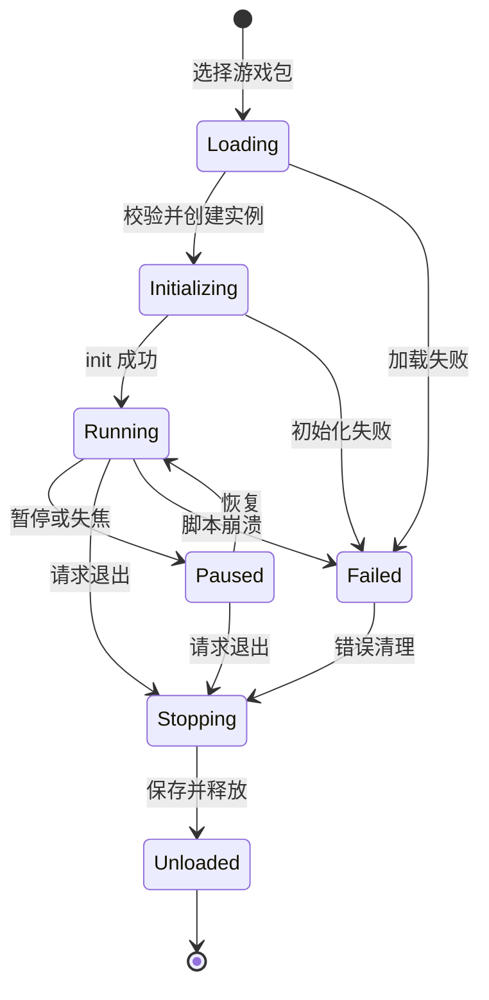
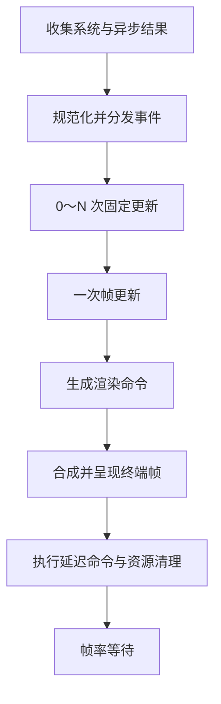

先修正一个很重要的心智模型：

> **事件队列、回调、手动查询是“服务如何与游戏交互”；多线程/异步是“服务在哪里、以何种执行方式工作”。**

它们不是四个互斥分类。一个网络服务可以在工作线程异步执行，通过事件通知完成，同时允许游戏手动查询任务状态；一个时间服务也可以同时提供时间查询、定时事件和回调。

# 一、单人游戏的完整运行生命周期

建议区分三个层次：

1. **宿主生命周期**：TUI Game 从启动到退出。
    
2. **游戏实例生命周期**：一个游戏从加载到卸载。
    
3. **单帧生命周期**：运行期间每一帧的输入、更新与渲染顺序。
    

这三个生命周期不要混在同一个状态机里。

## 1. 游戏实例生命周期



## 2. Loading：加载阶段

这一阶段主要由 Rust 宿主完成，不建议直接暴露为 Lua 回调。

宿主执行：

1. 获取选中的 `PackageInfo`；
    
2. 检查包是否启用；
    
3. 检查 API 版本；
    
4. 检查终端尺寸、鼠标、真彩等能力；
    
5. 确定安全模式和授权能力；
    
6. 验证入口脚本路径；
    
7. 创建 `GameInstanceId`；
    
8. 创建游戏独占的对象池和资源作用域；
    
9. 创建独立 Lua 环境；
    
10. 注册当前游戏允许使用的 Lua API；
    
11. 加载入口脚本。
    

加载阶段应当可以失败，并产生明确错误：

```text
ManifestInvalid
ApiVersionMismatch
PermissionDenied
EntryNotFound
ScriptSyntaxError
TerminalCapabilityMissing
```

如果这一阶段失败，不应进入游戏主循环，也不应产生部分残留对象。

---

## 3. Initializing：初始化阶段

推荐的 Lua API：

```lua
function game.init(ctx, saved_state)
end
```

参数：

- `ctx`：受控的游戏上下文；
    
- `saved_state`：恢复存档时传入数据，新游戏为 `nil`。
    

`ctx` 不应该直接暴露 Rust 的 `EngineServices`，而是能力网关：

```lua
ctx.input
ctx.render
ctx.time
ctx.random
ctx.storage
ctx.audio
ctx.world
ctx.i18n
ctx.log
```

`init` 负责：

- 建立初始游戏状态；
    
- 创建玩家、地图等游戏对象；
    
- 加载或引用资源；
    
- 创建定时器；
    
- 初始化随机种子；
    
- 根据存档恢复状态；
    
- 设置初始场景。
    

不建议每帧把完整 Lua `state` 返回给 Rust再传回来。Lua 模块或游戏实例可以持有运行状态，只有保存时才进行序列化。

初始化阶段应禁止：

- 无限期阻塞；
    
- 直接访问任意系统路径；
    
- 创建脱离游戏实例所有权的对象；
    
- 启动无法取消的后台线程；
    
- 进入自己的死循环。
    

---

## 4. Running：运行阶段

游戏进入 Running 后，由宿主主循环持续驱动。



普通引擎通常区分可变帧更新和固定更新：可变更新跟随实际渲染帧率，固定更新按稳定频率执行。Godot 也将 `_process()` 与 `_physics_process()` 分开，后者默认以固定频率运行。[Godot 帧更新与固定更新](https://docs.godotengine.org/en/stable/tutorials/scripting/idle_and_physics_processing.html)

### 4.1 `event`：接收离散事件

```lua
function game.event(ctx, event)
end
```

负责接收“发生了一次”的事情：

- 动作按下、释放；
    
- 窗口尺寸变化；
    
- 焦点变化；
    
- 定时器到期；
    
- 网络请求完成；
    
- 文件读取完成；
    
- 资源加载完成；
    
- 音频播放结束；
    
- 安全模式或终端能力变化。
    

例如：

```lua
{
    type = "input.action",
    action = "move_left",
    state = "pressed"
}
```

或者：

```lua
{
    type = "timer.finished",
    timer_id = 12,
    tag = "spawn_enemy"
}
```

`event` 适合处理瞬时变化，但不适合表达“按键现在是否仍然按住”。输入系统中的事件和状态查询通常会同时存在：按下一次用事件，持续移动用状态查询。[Godot：事件与轮询的区别](https://docs.godotengine.org/en/stable/tutorials/inputs/input_examples.html)

### 4.2 `fixed_update`：固定逻辑更新

```lua
function game.fixed_update(ctx, fixed_dt)
end
```

执行频率由游戏配置或宿主决定，例如：

```text
simulation_hz = 20
fixed_dt = 0.05 秒
```

适合：

- 移动；
    
- 碰撞；
    
- 子弹推进；
    
- 敌人行为；
    
- 规则模拟；
    
- 需要确定性的游戏逻辑；
    
- 回放与同步。
    

一帧中可能调用：

- 0 次：上一帧刚结束，还没积累足够时间；
    
- 1 次：正常情况；
    
- 多次：宿主需要追赶落后的模拟时间。
    

典型算法：

```text
accumulator += real_dt

while accumulator >= fixed_dt:
    fixed_update(fixed_dt)
    accumulator -= fixed_dt
```

必须设置每帧最大追赶次数，例如最多 4～8 次，避免性能下降后出现“更新越追越多”的死亡螺旋。

对数独、2048、扫雷等事件驱动游戏，`fixed_update` 可以完全不实现。它不是所有游戏的必需 API。

### 4.3 `update`：每帧更新

```lua
function game.update(ctx, dt)
end
```

每个渲染帧调用一次。

适合：

- 非关键视觉状态；
    
- UI 动画；
    
- 补间；
    
- 光标闪烁；
    
- 逐字显示；
    
- 相机平滑移动；
    
- 根据事件结果整理状态；
    
- 提交延迟命令。
    

`dt` 是距离上一帧的真实时间，应进行上限钳制，例如最多按照 100～250ms 处理，避免程序断点恢复后一次推进几十秒。

### 4.4 `render`：生成游戏画面

```lua
function game.render(ctx, renderer, alpha)
end
```

负责向当前游戏画布提交绘制命令：

- 字符精灵；
    
- 文本；
    
- 边框；
    
- 图块地图；
    
- 游戏内 UI；
    
- 粒子或动画字符；
    
- 状态栏。
    

`alpha` 是固定更新之后剩余时间的插值比例：

```text
alpha = accumulator / fixed_dt
```

终端游戏未必需要插值，可以先固定传入 `0` 或省略。

重要约束：

> `render` 原则上不修改核心游戏状态。

原因是以后宿主可能：

- 跳过没有变化的渲染；
    
- 一次更新后渲染多次；
    
- 在截图、预览时额外调用渲染；
    
- 使用无头测试模式，不调用渲染。
    

如果玩法逻辑写在 `render` 里，游戏速度会与渲染频率绑定。

---

## 5. Paused：暂停阶段

推荐两个可选 API：

```lua
function game.pause(ctx, reason)
end

function game.resume(ctx, reason)
end
```

`reason` 可以是：

```text
user
focus_lost
host_overlay
terminal_suspended
system_sleep
```

暂停时需要明确三种时钟：

|时钟|暂停时是否继续|用途|
|---|--:|---|
|游戏时间|否|游戏移动、技能、敌人、游戏内计时|
|UI 时间|通常是|暂停菜单、加载动画、光标闪烁|
|真实时间|是|网络超时、系统时间、后台下载|

不能只存在一个全局 `delta_time`，否则暂停游戏后，网络超时和宿主动画也会一起停止。

暂停期间一般：

- 不调用游戏 `fixed_update`；
    
- 可选择不调用游戏 `update`；
    
- 仍可调用宿主 UI 更新；
    
- 仍处理退出、恢复、窗口变化；
    
- 网络和文件任务可以继续；
    
- 游戏时间定时器冻结；
    
- 真实时间定时器继续。
    

---

## 6. Saving：保存阶段

推荐：

```lua
function game.save(ctx)
    return {
        version = 1,
        player = {...},
        world = {...}
    }
end
```

`save` 只负责生成可序列化快照，不负责直接写文件。

正确边界是：

```text
Lua 游戏
  生成存档数据
      ↓
宿主验证数据
      ↓
StorageService 序列化
      ↓
原子写入文件
```

这样宿主可以统一处理：

- 包专属存储目录；
    
- 安全模式；
    
- 存档版本；
    
- 数据大小限制；
    
- 备份；
    
- 原子写入；
    
- 导出；
    
- 错误日志。
    

`save` 可能在以下时机调用：

- 用户主动保存；
    
- 自动保存；
    
- 游戏退出；
    
- 宿主关闭；
    
- 进入后台；
    
- 崩溃恢复检查点。
    

脚本崩溃后是否调用 `save` 要谨慎。游戏状态可能已经损坏，通常应保留上一个有效快照，而不是覆盖它。

---

## 7. Stopping：停止阶段

推荐：

```lua
function game.shutdown(ctx, reason)
end
```

负责：

- 停止游戏内部状态机；
    
- 取消游戏注册的临时监听；
    
- 提交最后的统计信息；
    
- 完成不会阻塞的清理；
    
- 记录退出原因。
    

`reason` 例如：

```text
user_exit
host_exit
script_error
permission_revoked
package_reloaded
```

`shutdown` 不应该负责释放所有底层资源。真正的资源释放必须由宿主按所有权自动完成，因为脚本可能崩溃，导致 `shutdown` 根本无法正常执行。

宿主随后：

1. 取消该游戏的异步任务；
    
2. 删除其定时器；
    
3. 删除 UI 对象；
    
4. 删除画布和宿主区域；
    
5. 释放资源句柄；
    
6. 注销回调；
    
7. 关闭 Lua 环境；
    
8. 清空游戏事件队列；
    
9. 返回游戏列表。
    

## 建议的 Lua 生命周期 API

|API|必需|调用次数|作用|
|---|--:|--:|---|
|`init(ctx, saved)`|是|一次|初始化或恢复游戏|
|`event(ctx, event)`|否|每个事件一次|处理离散事件|
|`fixed_update(ctx, dt)`|否|每帧 0～N 次|稳定推进玩法逻辑|
|`update(ctx, dt)`|否|每帧一次|帧动画和非固定逻辑|
|`render(ctx, renderer, alpha)`|是|每次渲染一次|生成终端画面|
|`pause(ctx, reason)`|否|状态切换时|暂停游戏|
|`resume(ctx, reason)`|否|状态切换时|恢复游戏|
|`save(ctx)`|按需|保存时|生成可序列化快照|
|`shutdown(ctx, reason)`|否|最多一次|脚本侧收尾|
